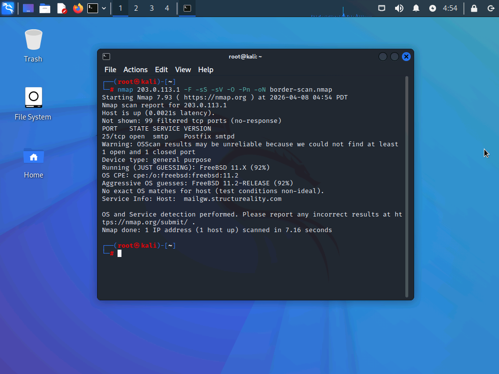
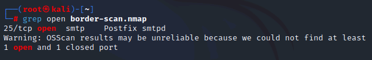
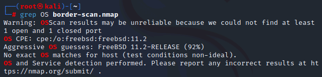
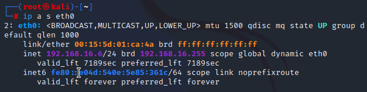
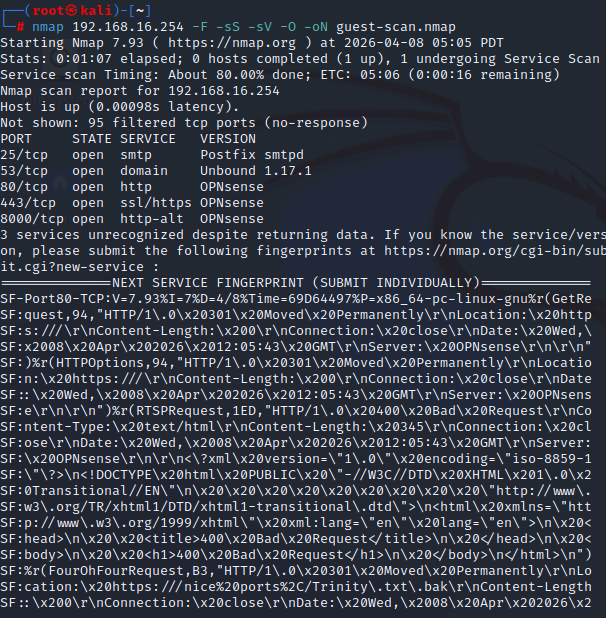
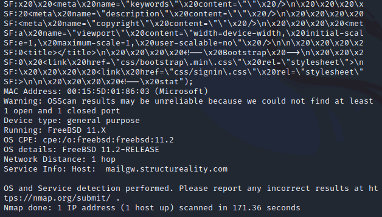
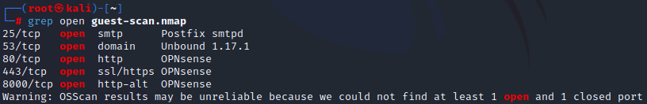
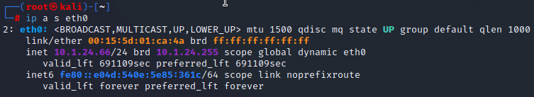
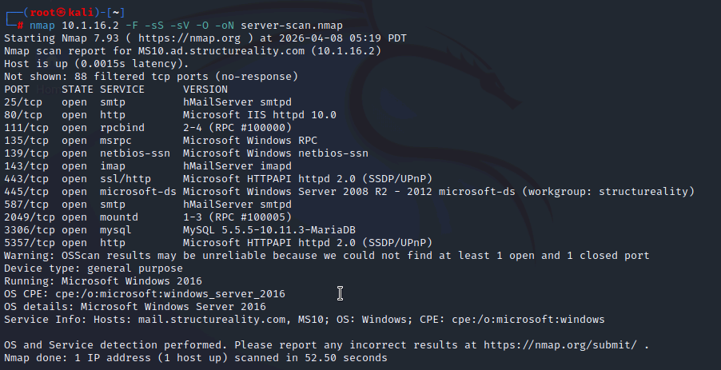
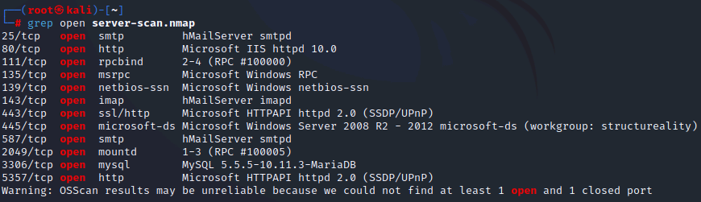

# 🔍 Lab 01 – Finding Open Service Ports


---

## 📋 Overview

As a security team member at Structureality Inc., the goal of this lab is to evaluate the organization's attack surface by performing network discovery and enumeration scans from three different network positions - external internet, guest network, and internal client network. Open service ports are a direct threat vector; any port discoverable from a given position is a potential entry point for an adversary.

---

## 🎯 Objectives

- Perform nmap SYN scans against targets from multiple network positions
- Enumerate open service ports and identify running services
- Detect operating system information from scan results
- Evaluate threat vectors and attack surface exposure at each network boundary
- Understand the implications of insufficient network segmentation

---

## 🛠️ Tools Used

| Tool | Purpose |
|------|---------|
| `nmap 7.93` | Port scanning, service enumeration, OS detection |
| `grep` | Filtering scan output |
| `dhclient` | Releasing and renewing IP address across network changes |
| `ip` | Verifying network interface configuration |

---

## 🗂️ Repository Structure

```
lab-01-finding-open-service-ports/
├── README.md
└── screenshots/
    ├── 01-border-scan-full.png
    ├── 02-border-grep-open.png
    ├── 03-border-grep-os.png
    ├── 04-guest-ip-config.png
    ├── 05-guest-scan-full-pt1.png
    ├── 06-guest-scan-full-pt2.png
    ├── 07-guest-grep-open.png
    ├── 08-dhclient-release.png
    ├── 09-client-ip-config.png
    ├── 10-server-scan-full.png
    ├── 11-server-grep-open.png
```

---

## 🌐 Exercise 1 – External Border Router Scan

**Target:** `203.0.113.1` (Structureality border firewall, internet-facing interface)  
**Position:** External subnet (internet simulation)

### Command Used

```bash
nmap 203.0.113.1 -F -sS -sV -O -Pn -oN border-scan.nmap
```

| Flag | Purpose |
|------|---------|
| `-F` | Scan top 100 common ports only |
| `-sS` | SYN scan - most reliable TCP scan, never completes the full handshake |
| `-sV` | Service version detection |
| `-O` | OS detection |
| `-Pn` | Skip host discovery, assume host is up |
| `-oN` | Save output to file |

### Full Scan Output

Here I can see the scan completed in just over 7 seconds. Of the top 100 ports tested, 99 came back filtered and only one port returned as open.



### Open Ports

```bash
grep open border-scan.nmap
```

Here I can see that only a single port was discovered as open on the border router from the external network:



| Port | State | Service | Version |
|------|-------|---------|---------|
| 25/tcp | open | smtp | Postfix smtpd |

> **Note:** The lab's suggested answers included ports like 80, 443, 22, and 3389 - this instance only exposed port 25. This is actually a better security posture than expected, though SMTP on port 25 still being accessible from the internet is a valid concern and a potential attack vector.

### OS Detection

```bash
grep OS border-scan.nmap
```



| Field | Value |
|-------|-------|
| Device Type | General Purpose |
| OS Guess | FreeBSD 11.X (92% confidence) |
| OS Details | FreeBSD 11.2-RELEASE |

> **Security Implication:** OS fingerprinting from outside the network gives an adversary a head start in selecting targeted exploits. Minimizing OS information leakage to external entities is a recommended hardening step.

---

## 🏨 Exercise 2 – Guest Network Scan

**Target:** `192.168.16.254` (guest network gateway/firewall)  
**Position:** vGUEST network

### Network Repositioning

I switched the Kali interface to the vGUEST network via the lab's Resources tab, then released and renewed the IP address:

```bash
dhclient -r && dhclient
ip a s eth0
```



Here I can see the interface obtained a new IP of `192.168.16.6/24`, confirming I am now positioned on the guest network.

### Command Used

```bash
nmap 192.168.16.254 -F -sS -sV -O -oN guest-scan.nmap
```

> Note: `-Pn` was not needed here since the host was already confirmed reachable from this subnet.

### Full Scan Output

This scan took significantly longer (~2 minutes) due to service fingerprinting on the open ports. The output was too long for a single screen - both parts are captured below.




### Open Ports

```bash
grep open guest-scan.nmap
```



| Port | State | Service | Version |
|------|-------|---------|---------|
| 25/tcp | open | smtp | Postfix smtpd |
| 53/tcp | open | domain | Unbound 1.17.1 |
| 80/tcp | open | http | OPNsense |
| 443/tcp | open | ssl/https | OPNsense |
| 8000/tcp | open | http-alt | OPNsense |

> **Critical Finding:** Ports 80, 443, and 8000 are all serving **OPNsense** - the firewall's management interface. Here I can see that a guest network member has direct access to the company firewall's admin panel. This is a serious misconfiguration. A guest should have no visibility into or access to internal network management infrastructure.

### OS Detection

The OS results were visible at the bottom of the full scan output (screenshot 06):

| Field | Value |
|-------|-------|
| Device Type | General Purpose |
| OS | FreeBSD 11.X |
| OS Details | FreeBSD 11.2-RELEASE |

> The same firewall device detected from the outside is also the guest network gateway, and its OS is identifiable from both positions.

---

## 🖥️ Exercise 3 – Internal Server Scan

**Target:** `10.1.16.2` (legacy server in the Server subnet)  
**Position:** vLAN_CLIENTS network

### Network Repositioning

```bash
dhclient -r && dhclient
```


```bash
ip a s eth0
```



Here I can see my interface is now assigned `10.1.24.66/24`, placing me on the client VLAN. The target server sits in the `10.1.16.0/24` server subnet - a different segment entirely.

### Command Used

```bash
nmap 10.1.16.2 -F -sS -sV -O -oN server-scan.nmap
```

### Full Scan Output



### Open Ports

```bash
grep open server-scan.nmap
```



| Port | State | Service | Version |
|------|-------|---------|---------|
| 25/tcp | open | smtp | hMailServer smtpd |
| 80/tcp | open | http | Microsoft IIS httpd 10.0 |
| 111/tcp | open | rpcbind | 2-4 (RPC #100000) |
| 135/tcp | open | msrpc | Microsoft Windows RPC |
| 139/tcp | open | netbios-ssn | Microsoft Windows netbios-ssn |
| 143/tcp | open | imap | hMailServer imapd |
| 443/tcp | open | ssl/http | Microsoft HTTPAPI httpd 2.0 |
| 445/tcp | open | microsoft-ds | Windows Server 2008 R2 – 2012 |
| 587/tcp | open | smtp | hMailServer smtpd |
| 2049/tcp | open | mountd | NFS 1-3 |
| 3306/tcp | open | mysql | MySQL 5.5.5-10.11.3-MariaDB |
| 5357/tcp | open | http | Microsoft HTTPAPI httpd 2.0 |

> **Critical Finding:** Here I can see 12 open service ports discovered from a client network position, with no firewall in between. This is a clear indicator of **insufficient network segmentation**. Sensitive services like MySQL (3306), NFS/mountd (2049), and unencrypted IMAP (143) have no business being reachable from a client VLAN. An insider threat or compromised client machine could directly interact with all of these services.

### OS Detection

The OS information was returned in the full scan output:

| Field | Value |
|-------|-------|
| Device Type | General Purpose |
| OS | Microsoft Windows Server 2016 |
| OS CPE | `cpe:/o:microsoft:windows_server_2016` |

> **EOL Notice:** Windows Server 2016 reached End of Life on **January 11, 2022**. It may receive security patches until **January 12, 2027**, at which point it will reach End of Service Life (EOSL). This system should be scheduled for replacement before that date.

---

## 💡 Key Takeaways

- **Open ports = attack surface.** Every discoverable open port from any network position is a potential entry point for an attacker.
- **Threats are not only external.** The internal server scan revealed the most dangerous exposure - a client can directly reach a legacy server running a dozen services with no filtering in between.
- **Network segmentation matters.** The absence of a firewall between Client and Server VLANs is a critical gap. East-west traffic should be controlled just as strictly as north-south.
- **OS fingerprinting is a real threat.** FreeBSD and Windows Server 2016 were both identifiable from multiple scan positions, giving an adversary a precise target for exploit selection.
- **Guest networks need strict controls.** Exposing the firewall's management interface to guest network members is a serious misconfiguration that could allow a visitor to compromise the entire network boundary.

---

## ❓ Comprehensive Questions

**1. What is a threat vector?**  
A pathway that could support an intrusion attempt.

**2. What is an attack surface?**  
The collection of exposed vulnerabilities.

**3. What nmap parameter performs a scan which displays service identification?**  
`-sV`

**4. Where can threats originate?**  
All of the above - externally, internally, and through third-party software.

**5. What are two primary response options to the discovery of an open port hosting an insecure service?**  
Close the exposed port, and configure service encryption.

---

## 📚 References

- [Nmap Official Documentation](https://nmap.org/docs.html)
- CompTIA Security+ Objectives 2.2 & 2.3