# 🔐 Lab 03 – Using Storage Encryption


---

## 📋 Overview

As a security team member at Structureality Inc., I was tasked with evaluating and implementing file-level encryption using the Windows Encrypting File System (EFS). This lab covers the full lifecycle of EFS - setting up a Data Recovery Agent before encrypting anything, encrypting files as a standard user, simulating the loss of an EFS private key by changing a user's password, and then recovering access to those encrypted files using the DRA.

---

## 🎯 Objectives

- Create an EFS Data Recovery Agent (DRA) certificate before encrypting any files
- Encrypt and decrypt files using both the GUI and the `cipher` CLI command
- Demonstrate how an admin password change discards a user's EFS private key
- Use the DRA to recover access to files the original user can no longer open
- Understand the relationship between EFS, symmetric encryption, and asymmetric key storage

---

## 🛠️ Tools Used

| Tool | Purpose |
|------|---------|
| `cipher` | Windows CLI tool for encrypting, decrypting, and viewing EFS file status |
| `net user` | Creating and managing local user accounts via Command Prompt |
| `certmgr` / Certificate Import Wizard | Importing the DRA private key |
| Local Security Policy (gpedit) | Adding the EFS DRA certificate to policy |
| File Explorer | GUI-based encryption and decryption |

---

## 🗂️ Repository Structure

```
lab-03-storage-encryption/
├── README.md
└── screenshots/
    ├── 01-certificates-dir-created.png
    ├── 02-local-security-policy-dra.png
    ├── 03-pat-user-created.png
    ├── 04-cipher-status-efs-encrypted.png
    ├── 05-file-explorer-encrypted-green.png
    ├── 06-pat-password-changed.png
    ├── 07-notepad-access-denied.png
    ├── 08-cipher-decrypt-failed.png
    ├── 09-certificate-import-wizard.png
    ├── 10-cipher-decrypt-success.png
    ├── 11-feb-security-gui-decrypt.png
    ├── 12-pat-all-files-accessible.png
```

---

## 🛡️ Part 1 - Setting Up the EFS Data Recovery Agent

Before encrypting any files, a Data Recovery Agent must be defined. Without one, any files encrypted by a user become permanently inaccessible if that user loses their EFS private key. The DRA acts as a safety net.

### Creating the DRA Certificate

Signed in as Admin on PC10, I created a new directory and used the `cipher` command to generate the DRA certificate files:

```cmd
mkdir c:\certificates
cd c:\certificates
cipher /r:EFSRA
```

The `/r` parameter generates both a `.CER` file (public certificate) and a `.PFX` file (password-protected private key).

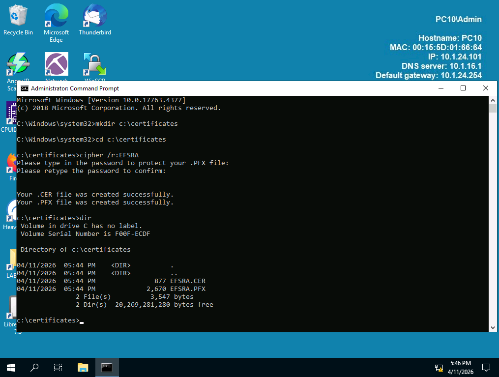

Here I can see both `EFSRA.CER` (877 bytes) and `EFSRA.PFX` (2,670 bytes) were created successfully in `c:\certificates`. The `.CER` file will be added to Local Security Policy. The `.PFX` file holds the private key and must be kept secure - it is what allows the DRA to actually decrypt files later.

### Adding the DRA Certificate to Local Security Policy

I opened Local Group Policy Editor and navigated to:

```
Computer Configuration > Windows Settings > Security Settings >
Public Key Policies > Encrypting File System
```

Then added `EFSRA.CER` as the designated recovery certificate.

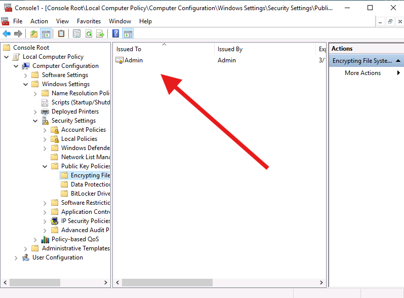

Here I can see the Admin account is now listed as the Encrypting File System recovery agent. Any files encrypted from this point forward will include the DRA's public key, allowing the DRA to decrypt them later if needed.

### Creating the Pat User Account

```cmd
net user pat Password1 /add
```

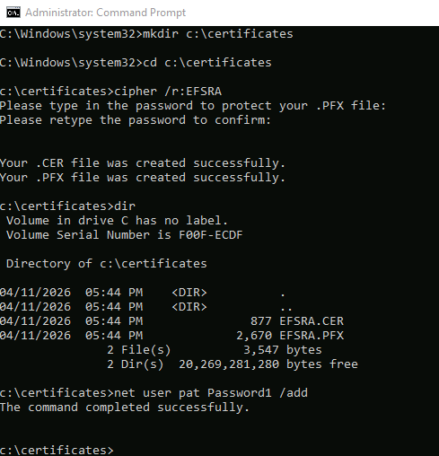

Here I can see the command completed successfully. Pat will be the standard user whose files get encrypted and later recovered.

---

## 🔒 Part 2 - Encrypting Files with EFS

Signed in as Pat, I created three text files in `C:\SecReports` - `Jan-Security.txt`, `Feb-Security.txt`, and `Mar-Security.txt` - each containing the text `This is a security report.`

### Encrypting via GUI and CLI

I encrypted `Jan-Security.txt` through File Explorer's Advanced Attributes, then used the `cipher` command to encrypt `Feb-Security.txt` and leave `Mar-Security.txt` unencrypted for comparison.

### Checking Encryption Status

```cmd
cd c:\SecReports
cipher
```

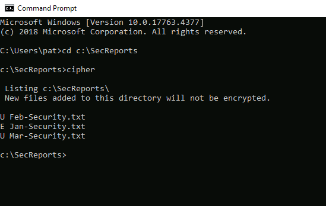

Here I can see the `cipher` command output showing:

| File | Status |
|------|--------|
| Feb-Security.txt | U - Unencrypted (not yet at this point) |
| Jan-Security.txt | E - Encrypted |
| Mar-Security.txt | U - Unencrypted |

> `E` = Encrypted, `U` = Unencrypted. The cipher command is the fastest way to audit EFS status across a directory.

### File Explorer View

After configuring File Explorer to display encrypted files in alternate colors, the visual difference becomes immediately clear.

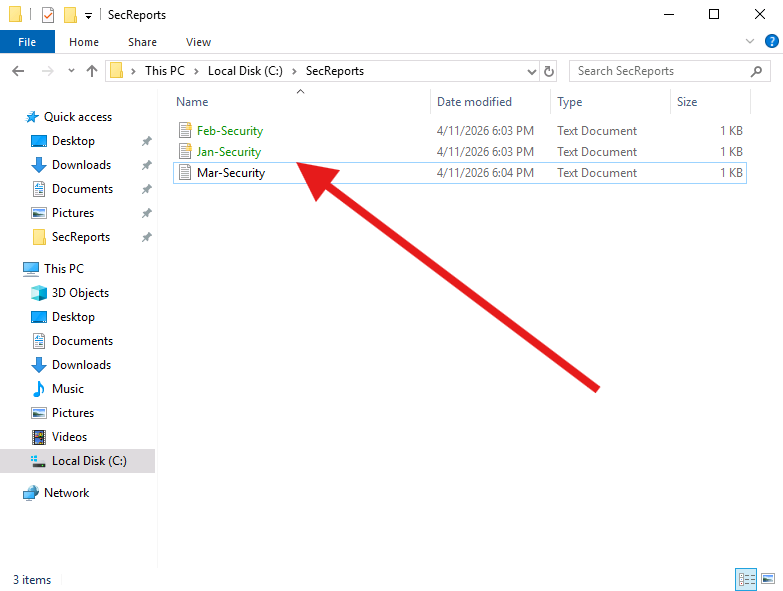

Here I can see Jan-Security and Feb-Security displayed in green indicating encryption, while Mar-Security remains in standard black text. EFS does not hide the existence or name of encrypted files - only their contents.

---

## 💥 Part 3 - Breaking Access via Password Change

When an administrator changes a local user's password, Windows discards that user's EFS private key. This means the user loses access to their own encrypted files - even after signing back in with the new password.

### Changing Pat's Password

Signed back in as Admin:

```cmd
net user Pat Password123
```

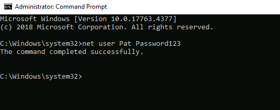

Here I can see the command completed successfully. Pat's password is now `Password123` and the EFS private key tied to the old credentials has been discarded.

### Pat Attempts to Open Encrypted Files

After signing in as Pat with the new password and attempting to open Jan-Security:

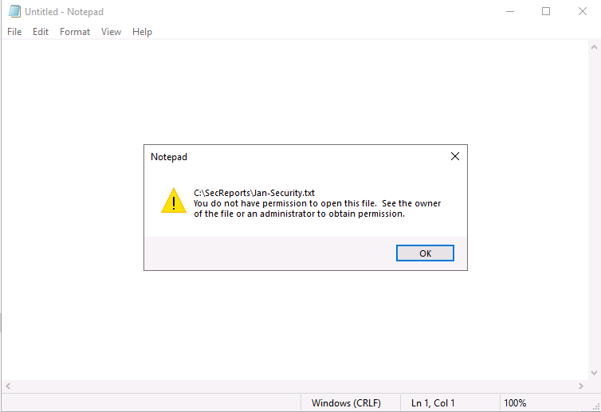

Here I can see Windows returning a clear access denied message - `You do not have permission to open this file`. The file belongs to Pat, but without the original EFS private key, even the file's owner cannot decrypt it. Mar-Security.txt opened fine since it was never encrypted.

> **Why this happens:** EFS uses asymmetric encryption to store the symmetric file encryption key. When the password changes on a local account, the asymmetric key pair is replaced, and the old private key is gone. Without it, the encrypted symmetric key stored with the file cannot be unlocked.

---

## 🔑 Part 4 - DRA Recovery

### Failed Decrypt Attempt Without the Private Key

Signed back in as Admin, I attempted to decrypt Jan-Security before importing the DRA private key:

```cmd
cd c:\\SecReports
cipher /d Jan-Security.txt
```

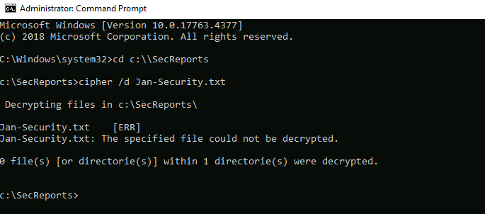

Here I can see the decrypt attempt returned `[ERR]` - `The specified file could not be decrypted`. Even though Admin is listed as the DRA in policy, the private key from `EFSRA.PFX` has not been imported yet, so the DRA function cannot work.

### Importing the EFSRA.PFX Private Key

I navigated to `c:\certificates` and double-clicked `EFSRA.PFX` to launch the Certificate Import Wizard, accepting the defaults and entering the password set during certificate creation.

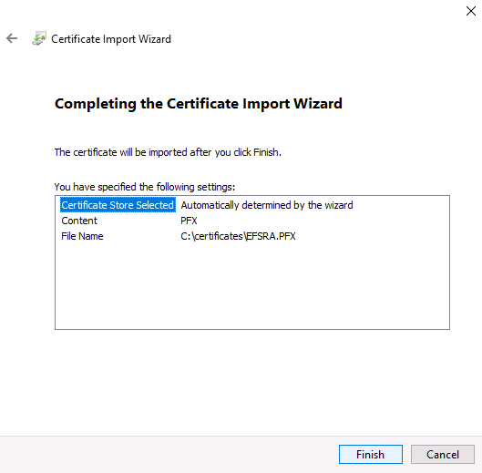

Here I can see the final confirmation screen of the import wizard showing `EFSRA.PFX` from `c:\certificates` is ready to be imported into the automatically determined certificate store.

### Successful Decryption as DRA

With the private key now installed, I ran the decrypt command again:

```cmd
cipher /d Jan-Security.txt
cipher
```

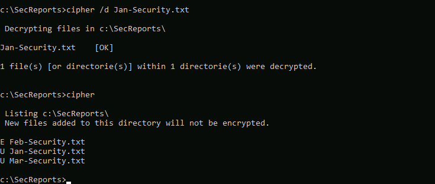

Here I can see `Jan-Security.txt [OK]` - `1 file(s) within 1 directorie(s) were decrypted`. The subsequent `cipher` command confirms Jan-Security is now marked `U` while Feb-Security remains `E`.

### Decrypting Feb-Security via GUI

Through File Explorer I right-clicked Feb-Security, opened Properties > Advanced Attributes, and unchecked `Encrypt contents to secure data`.

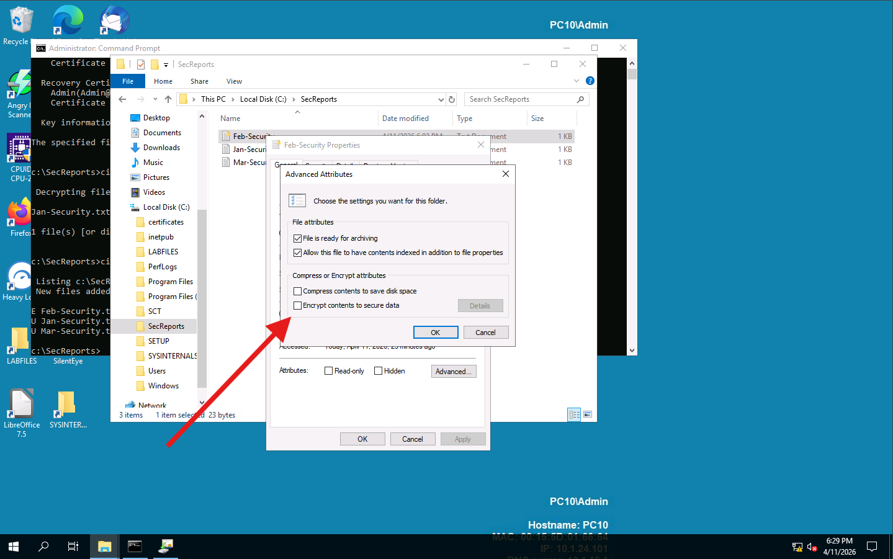

Here I can see the Advanced Attributes dialog with the encryption checkbox unchecked for Feb-Security, confirming the GUI decryption path works the same as the CLI approach.

### Pat Regains Access

After signing back in as Pat with the new password `Password123`:

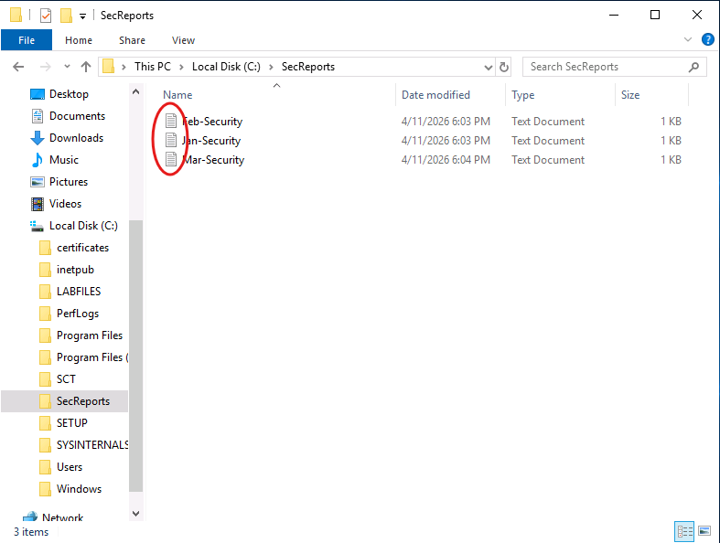

Here I can see all three files in `C:\SecReports` are now accessible and unencrypted. The DRA successfully restored access to files that the original user had permanently lost access to.

---

## 💡 Key Takeaways

- **Define a DRA before encrypting anything.** A DRA defined after files are encrypted cannot recover those files - it only applies to files encrypted after the DRA was established.
- **Admin password changes destroy EFS keys on local accounts.** This is by design - it prevents admins from using a password reset to snoop on encrypted files. The side effect is that the user also loses access.
- **EFS hides content, not existence.** File names, sizes, and metadata are still visible to anyone with access to the directory. Only the contents are protected.
- **The DRA private key must be protected.** The `EFSRA.PFX` file is the master key for recovery. If it is lost or compromised, recovery is impossible and an attacker with it could decrypt any protected file.
- **EFS uses both symmetric and asymmetric encryption.** The file itself is encrypted with a symmetric key for performance. That symmetric key is then encrypted with the user's public key and stored with the file. The DRA's public key is also stored with the file, which is how recovery is possible.

---

## ❓ Comprehensive Questions

**1. What can a DRA do?**
Recover access to data that a user had encrypted with EFS.

**2. What is the command used to encrypt a file from the Windows CLI?**
`cipher /e`

**3. Where can a user encrypt a file in Windows?**
File Explorer and Command Prompt.

**4. Can a DRA be defined after a file is encrypted and still recover it?**
False - the DRA must be defined before the file is encrypted.

**5. What does the EFSRA.PFX file contain?**
The private key of the DRA.

---

## 📚 References

- [Microsoft EFS Documentation](https://docs.microsoft.com/en-us/windows/security/information-protection/encrypting-file-system/encrypting-file-system-overview)
- CompTIA Security+ Objectives 1.4, 2.5, 3.3 & 5.1
