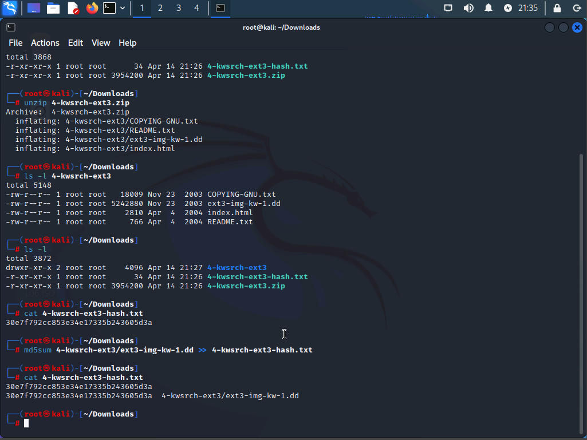
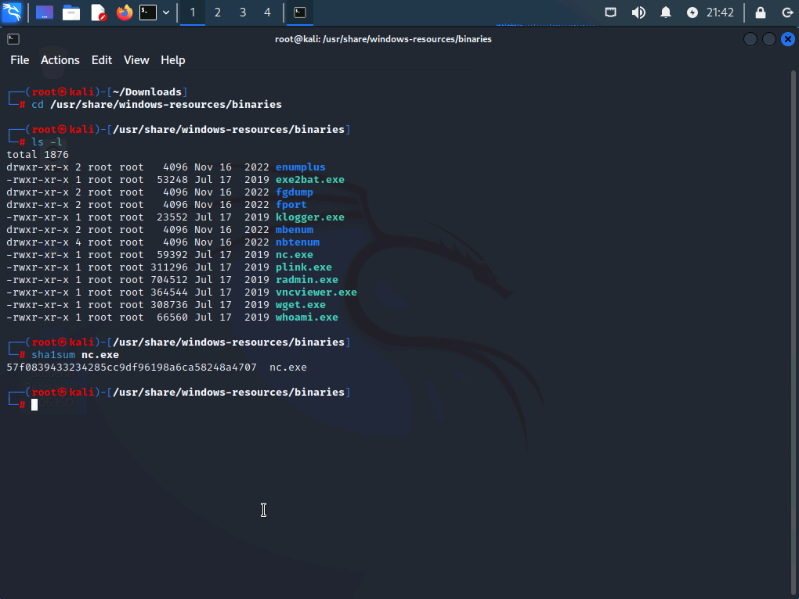
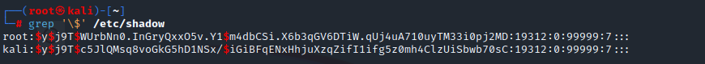
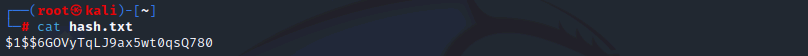
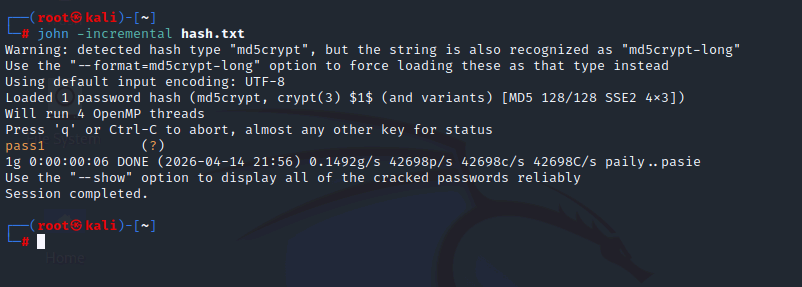
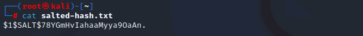
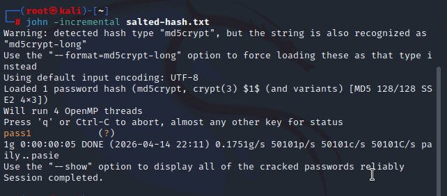
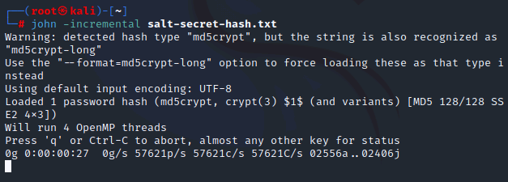

# #️⃣ Lab 04 – Using Hashing and Salting


---

## 📋 Overview

In this lab I worked through three practical exercises covering how hashing is used in the real world: verifying forensic image integrity with md5sum, performing a hash-based threat intelligence lookup for a known dual-use tool, and hands-on password cracking with John the Ripper to demonstrate exactly how much salting changes the attack math.

---

## 🎯 Objectives

- Use md5sum to verify the integrity of a forensic disk image
- Submit a file hash to MetaDefender to identify known-malicious files without executing them
- Read and interpret the Linux /etc/shadow hash format
- Crack MD5crypt hashes with and without salts using John the Ripper
- Demonstrate why unknown salts make brute force attacks exponentially harder

---

## 🛠️ Tools Used

| Tool | Purpose |
|------|---------|
| `md5sum` | Generate and verify MD5 file hashes |
| `sha1sum` | Generate SHA1 hash for MetaDefender lookup |
| `MetaDefender` | OPSWAT online platform for multi-engine hash lookups |
| `grep` | Filter /etc/shadow for hashed account entries |
| `openssl passwd` | Generate MD5crypt hashes with and without salts |
| `John the Ripper` | Open-source password auditing and hash cracking tool |

---

## 🗂️ Repository Structure

```
lab-04-hashing-and-salting/
├── README.md
└── screenshots/
    ├── 01-md5sum-forensic-image.png
    ├── 02-metadefender-nc-search.png
    ├── 03-metadefender-nc-results.png
    ├── 04-shadow-file-grep.png
    ├── 05-hash-txt-unsalted.png
    ├── 06-john-unsalted-crack.png
    ├── 07-salted-hash-txt.png
    ├── 08-john-salted-crack.png
    ├── 09-john-secret-salt-running.png
```

---

## 🔍 Part 1 – File Integrity Verification with md5sum

I mounted the forensic disk image from [dftt.sourceforge.net](http://dftt.sourceforge.net), extracted the zip archive, and ran md5sum against the image file.

```bash
unzip 4-kwsrch-ext3.zip
md5sum 4-kwsrch-ext3.img
```



Here I can see the full sequence -- the zip extraction followed by the md5sum command producing a 32-character hexadecimal string. 32 hex digits at 4 bits each equals 128 bits total, which confirms this is an MD5 hash. Comparing this value against the hash published by the image source tells me whether the file was modified or corrupted in transit.

File integrity verification is foundational to digital forensics. Every evidence image gets hashed at acquisition, and that hash is re-verified at every step of the chain of custody. A single changed bit produces a completely different hash, making tampering immediately detectable.

---

## 🔎 Part 2 – Threat Intelligence Lookup with MetaDefender

Netcat (nc.exe) ships with Kali Linux in the Windows resources directory. Here I located it in the file manager, generated its SHA1 hash, and submitted it to [MetaDefender](https://metadefender.opswat.com) for a threat intelligence lookup.




Here I can see MetaDefender cross-references the hash against multiple antivirus engines simultaneously and returns a verdict for each one. Netcat is a dual-use tool -- legitimate for network diagnostics and testing, but flagged by many engines because it is a common component in attacker toolkits. Looking up a hash instead of submitting the file itself means I never have to execute a potentially malicious binary to determine whether it is dangerous.

Hash-based lookups are one of the fastest enrichment steps in alert triage. A single query to MetaDefender or VirusTotal immediately tells an L1 analyst whether a file is known-malicious without any detonation risk.

---

## 🔑 Part 3 – Salting and Its Impact on Password Cracking

### The /etc/shadow Format

Running grep against the shadow file shows how Linux stores password hashes:

```bash
grep '\$' /etc/shadow
```



Here I can see both the root and kali account hashes begin with `$y$`, which identifies **yescrypt** -- the default hashing algorithm on modern Kali Linux. The full format is `$id$parameters$salt$hash`, where the algorithm identifier, salt, and hash are all stored together in one string. This design means the system always knows how to verify a password without storing the salt separately.

---

### Unsalted Hash

```bash
cat hash.txt
```



The hash reads: `$1$$6G0VyTqLJ9ax5wt0qsQ780`

Here I can see `$1$` identifies this as **MD5crypt**. The second and third `$` signs appear back to back with nothing between them. That empty field is where the salt would be stored. No salt was used when this hash was generated.

```bash
john -incremental hash.txt
```



Here I can see John cracked it in **6 seconds**. Password: `pass1`.

---

### Salted Hash (Known Salt)

```bash
cat salted-hash.txt
```



The hash reads: `$1$SALT$78YGmHvIahaaMyya90aAn.`

Here I can see the salt `SALT` is explicitly embedded between the second and third `$` delimiters. Because MD5crypt stores the salt inside the hash string, John extracts it automatically and applies it to each candidate during the crack.

```bash
john -incremental salted-hash.txt
```



Here I can see John cracked it in **5 seconds**. Password: `pass1`. The crack time is nearly identical to the unsalted hash because John could read the salt directly from the format. Knowing the salt eliminates the added complexity -- John hashes each guess with the known salt and compares.

---

### Secret Salt Hash (Unknown Salt)

The third hash was generated with a salt that is not embedded in a readable format.

```bash
john -incremental salt-secret-hash.txt
```



Here I can see John has been running for **27 seconds** with **0 passwords cracked**. The same password that fell in 6 seconds without a salt is still uncracked. Without being able to extract the salt, John cannot verify any guess -- it has to brute force both the password and the salt simultaneously, which multiplies the search space dramatically.

---

## 📊 Crack Time Comparison

| Scenario | Hash | Time to crack |
|----------|------|--------------|
| No salt | `$1$$...` | ~6 seconds |
| Salt known and embedded | `$1$SALT$...` | ~5 seconds |
| Salt unknown | hidden | 27+ seconds, 0 cracked |

---

## 💡 Key Takeaways

- **Hashing is one-way.** You cannot reverse a hash -- you can only compare it against the hash of a known input. This is what makes it useful for both integrity verification and password storage.
- **MD5 is fast by design**, which makes it weak for password storage. A fast hashing algorithm means a fast brute force. Modern password hashing uses intentionally slow algorithms like bcrypt, scrypt, and yescrypt.
- **Salting defeats rainbow table attacks.** Precomputed hash tables become useless when every hash includes a unique random salt. An attacker would need a separate rainbow table for every possible salt.
- **The real protection of an unknown salt** is that it forces an attacker to brute force both the password and the salt simultaneously, multiplying the search space and cracking time exponentially.
- **Linux stores the salt in the hash string** using the `$id$salt$hash` format. The salt is not secret in this model, but it still defeats bulk cracking and precomputed attacks since every account hash is unique.
- **Hash lookups are a safe alternative to file execution.** Submitting a hash to MetaDefender gives a multi-engine verdict without ever running a potentially malicious binary.

---

## ❓ Comprehensive Questions

**1. What does the 32-character output of md5sum tell you about the hash algorithm in use?**
32 hex characters at 4 bits each equals 128 bits, which is the output size of MD5.

**2. Why is a hash-based threat intel lookup safer than submitting the file itself?**
The hash uniquely identifies the file without exposing the binary to the lookup service or requiring it to be executed.

**3. What does `$1$` mean in a Linux password hash?**
It identifies the hashing algorithm as MD5crypt.

**4. What does `$$` (back-to-back dollar signs) in a hash string indicate?**
The salt field is empty -- the hash was generated without a salt.

**5. Why did cracking the salted hash take roughly the same time as the unsalted hash?**
Because the salt was embedded in the hash string in a format John could read. Knowing the salt, John applies it to each candidate normally. The cracking speed only suffers when the salt is unknown.

**6. Why does an unknown salt increase cracking time so dramatically?**
Without the salt, John cannot verify any guess. It must test each password candidate against every possible salt value, multiplying the search space by the number of possible salts.

**7. What is a rainbow table and how does salting defeat it?**
A rainbow table is a precomputed database of hashes for common passwords. Salting defeats it because the attacker would need a separate table for every possible salt value -- making precomputation impractical.

---

## 📚 References

- [MetaDefender by OPSWAT](https://metadefender.opswat.com)
- [Digital Forensics Tool Testing (dftt.sourceforge.net)](http://dftt.sourceforge.net)
- [John the Ripper Documentation](https://www.openwall.com/john/doc/)
- CompTIA Security+ Objectives 2.4, 3.7
