# 🔐 Lab 05 – Managing Password Security


---

## 📋 Overview

After a rash of account breaches at Structureality Inc., I was tasked with evaluating the organization's password security posture. This lab covered four connected exercises: performing an online password spraying attack with Hydra against an SMB share, running an offline dictionary attack with John the Ripper against captured NTLM hashes, escalating to a brute force (incremental) attack, and then hardening the domain password policy in Active Directory using PowerShell. The goal was to understand each attack method from the inside before designing defenses against them.

---

## 🎯 Objectives

- Perform an online password spraying attack against SMB using Hydra
- Mount a Windows share from Kali to validate discovered credentials
- Run an offline dictionary attack against NTLM hashes with John the Ripper
- Run a brute force (incremental) attack and observe how password length destroys feasibility
- Harden the domain password policy through the Active Directory PowerShell module

---

## 🛠️ Tools Used

| Tool | Purpose |
|------|---------|
| `hydra-wizard` | Interactive wrapper for THC Hydra, used for SMB password spraying |
| `mount` (cifs) | Mount Windows SMB share from Kali to validate credentials |
| `John the Ripper` | Offline password cracker, used for both dictionary and incremental attacks |
| `seclists` | Collection of wordlists, including xato-net-10-million-passwords.txt |
| `PowerShell ActiveDirectory` | `Get-` and `Set-ADDefaultDomainPasswordPolicy` cmdlets |

---

## 🗂️ Repository Structure

```
lab-05-managing-password-security/
├── README.md
└── screenshots/
    ├── 01-users-txt-list.png
    ├── 02-pass-txt-built.png
    ├── 03-hydra-wizard-results.png
    ├── 04-jaime-mount-success.png
    ├── 05-ms10-hashes-file.png
    ├── 06-wordlist-directory.png
    ├── 07-john-dictionary-crack.png
    ├── 08-dict-cracked-tally.png
    ├── 09-john-show-left-dictionary.png
    ├── 10-john-incremental-running.png
    ├── 11-john-brute-cracked.png
    ├── 12-john-maxlen-eta.png
    ├── 13-password-policy-before.png
    └── 14-password-policy-after.png
```

---

## 🎯 Part 1 – Password Spraying with Hydra

Password spraying flips the conventional attack model. Instead of hammering one account with many passwords (which trips account lockout), you take one known or suspected password and try it against many user accounts. With a useful password in hand you only need one match to get a foothold.

### Reconnaissance

I had a list of user accounts from MS10 and a short list of passwords supposedly recovered from a trash can. First I verified the users file.

```bash
cat users.txt
```

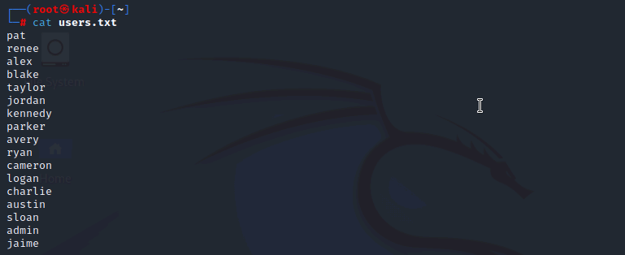

Here I can see 17 local accounts on MS10 including the default `admin` account and a handful of employees (pat, renee, alex, blake, taylor, jordan, and others).

### Building the Password List

```bash
echo abc123 > pass.txt
echo 123456 >> pass.txt
echo 'Pa$$w0rd' >> pass.txt
cat pass.txt
```

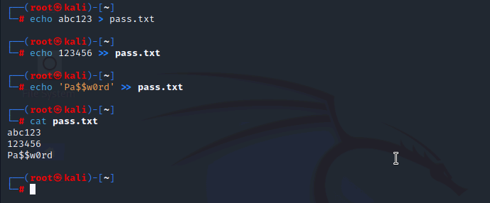

Here I can see all three discovered passwords in the file. Single quotes around `Pa$$w0rd` are non-optional -- bash will try to expand `$$` and `$w` otherwise, and the spray would fail silently against the intended password.

Before running Hydra I validated the approach manually against the `pat` account with the first two passwords. Both attempts returned `mount error`, confirming those passwords do not belong to that account. The manual workflow makes the point of why we need an automated tool: 17 users times 3 passwords is 51 attempts, and that is a small workload.

### Automated Spray with Hydra

```bash
hydra-wizard
```

I walked through the wizard with service `smb`, target `10.1.16.2`, username file `users.txt`, password file `pass.txt`, no test port, no module options.

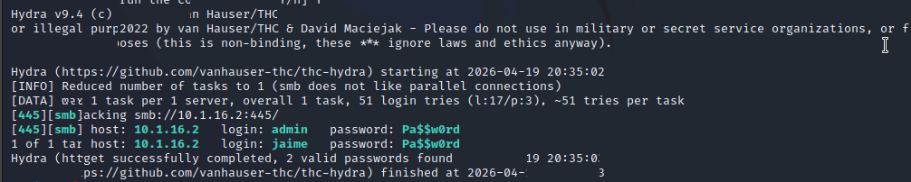

Here I can see Hydra completed all 51 login attempts and reported `2 valid passwords found`. Both the `admin` and `jaime` accounts use `Pa$$w0rd`. This is the textbook payoff of a spraying attack -- one shared weak password unlocks multiple accounts, including the default administrator.

### Validating the Credential

```bash
mount //10.1.16.2/HR /mnt/HR -o username=jaime
ls /mnt/HR
```

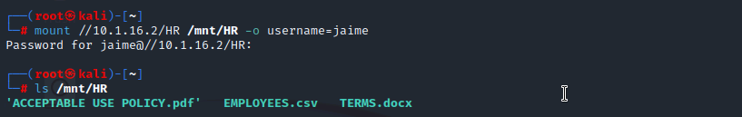

Here I can see the mount succeeded silently (no error means success with cifs), and the share contents are visible: `ACCEPTABLE USE POLICY.pdf`, `EMPLOYEES.csv`, and `TERMS.docx`. A standard user's leaked password just exposed an HR share containing an employee roster. Real impact, no zero-day required.

---

## 📖 Part 2 – Offline Dictionary Attack with John the Ripper

Spraying is an online attack -- it goes through the live authentication service, so it is slow and defensible with account lockout. Offline attacks work directly against captured hashes on the attacker's own hardware, which means lockout does not apply and cracking speed is limited only by the attacker's CPU or GPU.

### The Hash File

```bash
cat ms10-hashes.txt
```

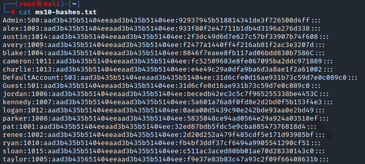

Here I can see the NTLM hash dump from MS10 in `username:RID:LMhash:NThash` format. RID 500 is the default `Admin` account, RID 501 is the default `Guest` (blank password by default), and the rest are the local user accounts. The LM hash portion is identical across every entry because LM has been disabled -- modern Windows sets LM to the fixed placeholder `aad3b435b51404eeaad3b435b51404ee` when it is not in use.

### Available Wordlists

```bash
ls -lSr /usr/share/seclists/Passwords
```

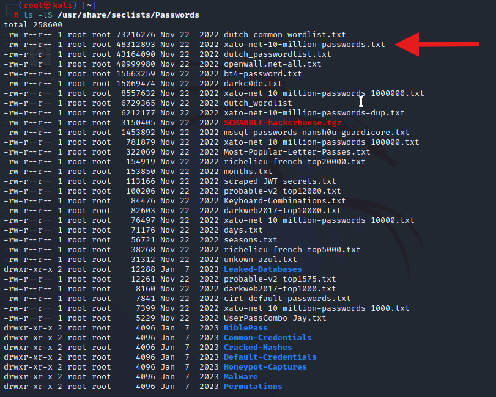

Here I can see dozens of wordlists available. The `-S` flag sorts by size, `-r` reverses that to smallest-first so the largest (and most useful) lists end up near the bottom of the terminal output. I marked the xato-net-10-million-passwords file in red -- that is the full list, not one of the smaller top-N subsets (`-10`, `-100`, `-1000`, `-10000`).

### Running the Dictionary Attack

```bash
john --format=NT --wordlist=/usr/share/seclists/Passwords/xato-net-10-million-passwords.txt ms10-hashes.txt
```

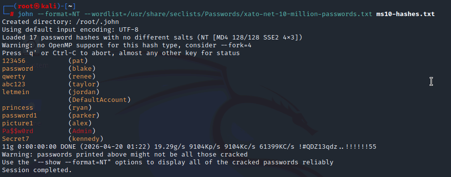

Here I can see John rip through the 10 million password list in a few seconds and produce eleven cracked passwords visible on screen, with more above the buffer. The warning at the bottom -- `passwords printed above might not be all those cracked` -- is why you always verify the final count with a second command.

### Exporting and Verifying the Tally

```bash
john --show --format=NT ms10-hashes.txt > dict-cracked.txt
less dict-cracked.txt
```

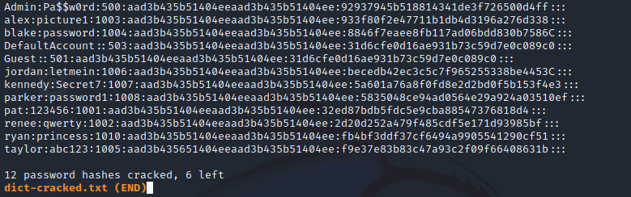

Here I can see the clean view: `12 password hashes cracked, 6 left`. Twelve out of eighteen accounts fell in seconds including `Admin:Pa$$w0rd`, `pat:123456`, `blake:password`, `renee:qwerty`, `taylor:abc123`, `jordan:letmein`, `kennedy:Secret7`, and both blank-password default accounts (`Guest` and `DefaultAccount`).

### What Is Still Left

```bash
john --show=left --format=NT ms10-hashes.txt
```

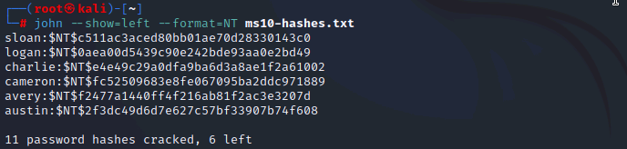

Here I can see six accounts the dictionary could not touch: sloan, logan, charlie, cameron, avery, and austin. Their passwords are not in the 10 million list, which means they are either long enough to be uncommon, random enough to avoid common substitutions, or both. These are the candidates for the next step.

---

## 💥 Part 3 – Offline Brute Force Attack (Incremental Mode)

Dictionary cracking only finds what is already in the wordlist. Brute force (John calls this `--incremental`) systematically attempts every possible character combination in order of probability. Given enough time it will find any password, but "enough time" grows exponentially with length.

### Resetting and Running Incremental

```bash
rm ~/.john/john.pot
john --format=NT --incremental ms10-hashes.txt
```

Clearing `john.pot` removes the dictionary hits from the previous step so the incremental run attacks the full set of 18 hashes and the output is not contaminated by already-cracked results.

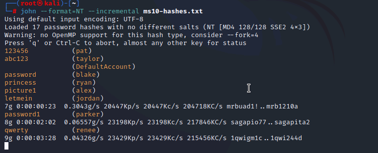

Here I can see the live status after pressing SPACEBAR: at the 23-second mark John had 7 passwords, at 2m02s it was at 8 (parker:password1), and at 3m28s it had 9 with renee's `qwerty` just landing. The status line shows a throughput of roughly 23 million NTLM hashes per second (`23198Kc/s`), which is not even pushing the CPU hard.

### Final Tally After ~5 Minutes

```bash
john --show --format=NT ms10-hashes.txt
```

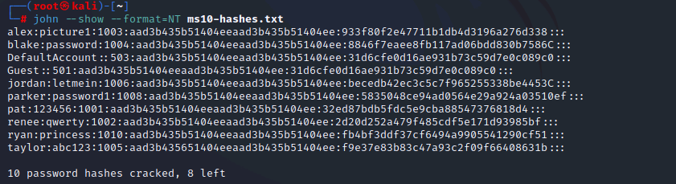

Here I can see `10 password hashes cracked, 8 left`. Brute force in a 5-minute window recovered ten accounts, including the entire short-password set. Notably, `Admin:Pa$$w0rd` and `kennedy:Secret7` -- both of which the dictionary attack cracked instantly -- were NOT cracked by brute force in this time window. `Pa$$w0rd` is 8 characters with symbols, and `Secret7` is 7 characters mixed-case with a digit. Both live in a search space that brute force could not reach in five minutes. That demonstrates why dictionary attacks run first in practice: they find the common-but-complex passwords that brute force would need weeks to grind through.

### The Length Problem – max-length Comparison

I ran two more incremental attacks, first capped at 6 characters, then at 7.

```bash
john --format=NT --incremental --max-length=6 ms10-hashes.txt
john --format=NT --incremental --max-length=7 ms10-hashes.txt
```

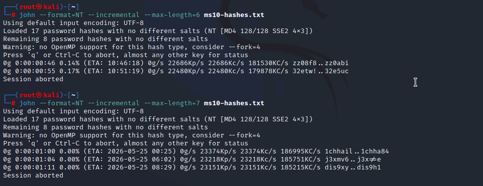

Here I can see the payoff moment of the whole lab. The 6-character run shows ETAs like `10:46:18` and `10:51:19` -- same-day timestamps, a few hours away. The 7-character run shows ETAs jumping to `2026-05-25` -- over a month in the future from the April 20 run date. **Adding a single character took the attack from hours to weeks.** Every additional character multiplies the search space by 95 (the full printable ASCII set). That one click-through image is the most compelling argument for length requirements I could hand to a policy committee.

---

## 📊 Attack Method Comparison

| Method | Type | Lockout Applies | Coverage vs Time Tradeoff | Cracked in this lab |
|--------|------|-----------------|----------------------------|---------------------|
| Password spraying (Hydra) | Online | Yes | Limited to a short password list, but tries many users | 2 of 17 users (`admin`, `jaime`) |
| Dictionary (John) | Offline | No | Fast, but limited to what is in the wordlist | 12 of 18 hashes |
| Brute force (John --incremental) | Offline | No | Eventually finds anything, but time grows exponentially with length | 10 of 18 hashes in ~5 min |

---

## 🛡️ Part 4 – Hardening the Domain Password Policy

With the attack picture clear, I moved to DC10 to tighten the `structureality.com` domain password policy. NIST SP 800-63B was the reference for the target settings.

### Current State

```powershell
Import-Module ActiveDirectory
Get-ADDefaultDomainPasswordPolicy
```

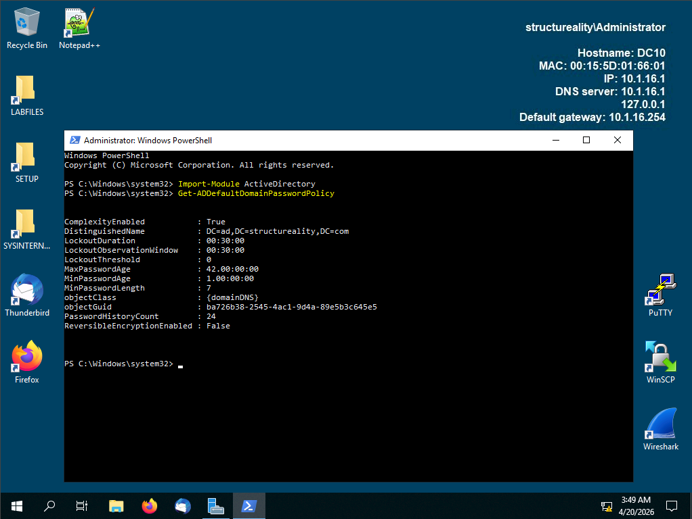

Here I can see the starting policy: `MinPasswordLength: 7`, `MaxPasswordAge: 42 days`, `MinPasswordAge: 1 day`, `LockoutThreshold: 0` (no lockout at all), `LockoutDuration: 00:30:00`, `LockoutObservationWindow: 00:30:00`, `ComplexityEnabled: True`. The most glaring issue is `LockoutThreshold: 0`, which disables lockout entirely -- an open door to the exact online spraying attack I ran in Part 1. The 7-character minimum is also below the 8-character floor Microsoft recommends, let alone NIST's longer-is-better stance.

### Applying the Policy Changes

```powershell
Set-ADDefaultDomainPasswordPolicy -Identity structureality -LockoutObservationWindow 00:15:00
Set-ADDefaultDomainPasswordPolicy -Identity structureality -LockoutDuration 00:15:00
Set-ADDefaultDomainPasswordPolicy -Identity structureality -LockoutThreshold 3
Set-ADDefaultDomainPasswordPolicy -Identity structureality -MaxPasswordAge 365.00:00:00
Set-ADDefaultDomainPasswordPolicy -Identity structureality -MinPasswordAge 3.00:00:00
Set-ADDefaultDomainPasswordPolicy -Identity structureality -MinPasswordLength 12
Get-ADDefaultDomainPasswordPolicy
```

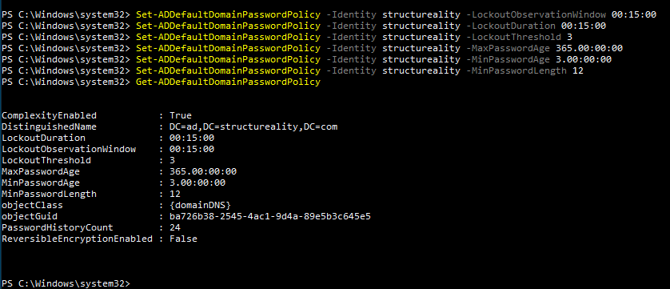

Here I can see every change applied cleanly. `MinPasswordLength` is now 12, `LockoutThreshold` is 3 attempts, and both `LockoutDuration` and `LockoutObservationWindow` sit at 15 minutes. The existing account passwords remain valid until users change them, but any new or reset password must meet the hardened requirements.

### Before and After

| Setting | Before | After | Why |
|---------|--------|-------|-----|
| MinPasswordLength | 7 | 12 | Every additional character multiplies brute force cost by 95 |
| LockoutThreshold | 0 (disabled) | 3 | Stops online spraying cold |
| LockoutDuration | 00:30:00 | 00:15:00 | Short enough to not frustrate legitimate users |
| LockoutObservationWindow | 00:30:00 | 00:15:00 | Rolling window for counting failed attempts |
| MaxPasswordAge | 42 days | 365 days | NIST moved away from frequent rotation for unchanged, strong passwords |
| MinPasswordAge | 1 day | 3 days | Prevents users cycling through history to return to a favorite |

The MaxPasswordAge increase is deliberate. NIST SP 800-63B explicitly recommends AGAINST frequent forced rotation -- it drives users toward predictable patterns like `Summer2024!` → `Summer2025!`. Long, strong, unchanged passwords are better than short passwords rotated often.

---

## 💡 Key Takeaways

- **Spraying inverts the attack model.** One password across many accounts bypasses lockout because no single account accumulates failed attempts. The only real defense is unique-per-account passwords and breached-password detection at the IdP.
- **Online and offline attacks live in different universes.** Lockout and rate limiting stop online attacks. They do nothing against offline hash cracking, where the attacker has the hashes on their own hardware.
- **Modern CPUs crack NTLM at ~23 million guesses per second** without hardware acceleration. A GPU rig pushes that into the billions. NTLM is fundamentally not a password-protection algorithm -- it is a network authentication algorithm that happens to store a hash. Treat any NTLM hash exfiltration as a full credential compromise.
- **Length beats complexity.** Going from max-length 6 to max-length 7 took the brute force ETA from hours to weeks. Going from 7 to 8 would push it into years. This is why modern guidance favors passphrases of 12-16+ characters over `P@ssw0rd!` style patterns.
- **Dictionary attacks catch the "common but complex" passwords** that brute force cannot reach in a practical window. `Pa$$w0rd` has uppercase, lowercase, symbols, and digits and passes most complexity filters, but it is in every password list on earth.
- **LockoutThreshold 0 is not a policy, it is a hole.** Any Active Directory environment without account lockout enabled is exposed to unlimited online password guessing. First thing to check in any AD hardening review.

---

## ❓ Comprehensive Questions

**1. What is password spraying?**
Trying a known password against many user accounts. It is the inverse of traditional brute-force guessing, which tries many passwords against one account.

**2. What security measure is password spraying attempting to avoid?**
Account lockout. By only trying one or two passwords per user before moving on, the attacker never trips the failed-attempt counter on any single account.

**3. What is the primary factor that determines the likelihood of success of dictionary password cracking?**
The size (and quality) of the dictionary file. A dictionary attack can only discover passwords that appear verbatim in the list. If the user's password is not in the wordlist, the attack will not find it regardless of complexity or length.

**4. What aspects of a target's password defend against brute force cracking?**
Longer length and increased complexity. Length adds the most value because the search space grows exponentially with each character. Complexity (mixed case, digits, symbols) expands the per-character alphabet, which also compounds with length.

**5. Which domain password policy setting has the greatest impact on resistance to brute force?**
`MinPasswordLength`. Length is the only variable that affects attack cost exponentially. Complexity settings help but give a roughly linear boost by comparison.

---

## 📚 References

- [NIST SP 800-63B: Digital Identity Guidelines](https://pages.nist.gov/800-63-3/sp800-63b.html)
- [THC Hydra Documentation](https://github.com/vanhauser-thc/thc-hydra)
- [John the Ripper Documentation](https://www.openwall.com/john/doc/)
- [SecLists Password Wordlists](https://github.com/danielmiessler/SecLists/tree/master/Passwords)
- [Microsoft Docs: Set-ADDefaultDomainPasswordPolicy](https://learn.microsoft.com/en-us/powershell/module/activedirectory/set-addefaultdomainpasswordpolicy)
- CompTIA Security+ Objectives 2.4, 2.5, 4.6, 5.1, 5.6
