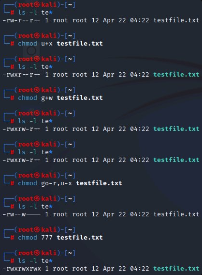
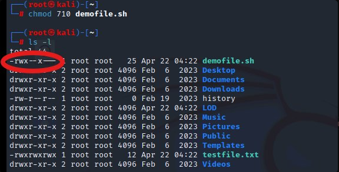
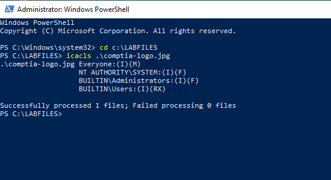
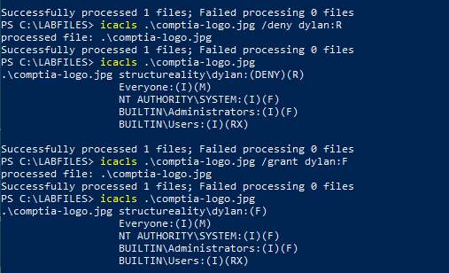
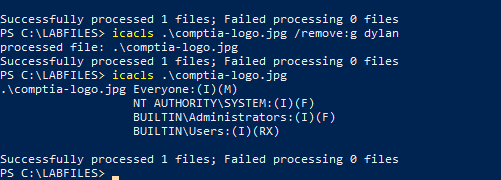
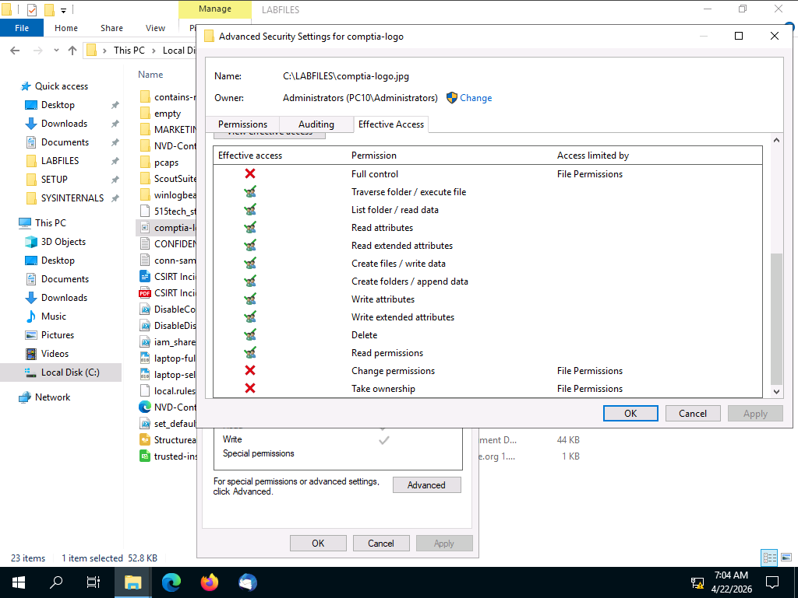
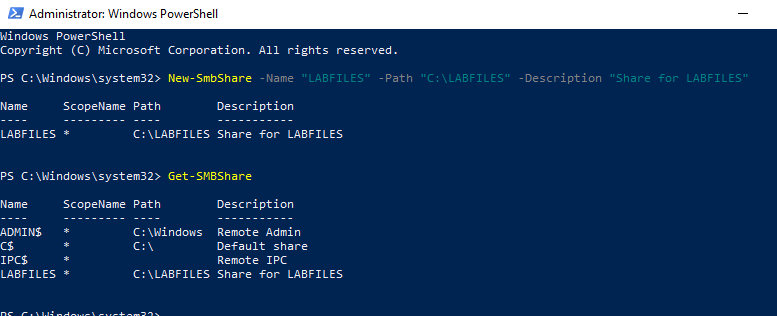
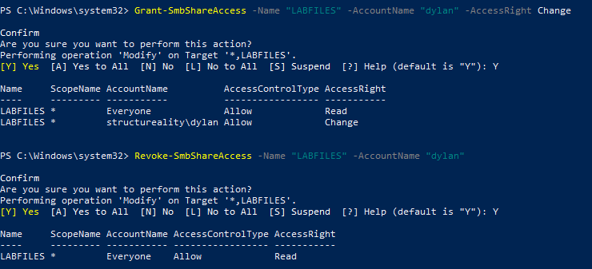

# 🔐 Lab 06 – Managing Permissions


---

## 📋 Overview

As a security team member at Structureality Inc., I was tasked with reviewing and correcting file permissions across both Linux and Windows environments. The lab covered four connected exercises: setting Linux file permissions using both symbolic and octal notation with `chmod`, managing Windows NTFS file permissions with `icacls`, exploring a user's effective permissions using Windows Advanced Security Settings, and managing Windows share permissions with PowerShell's SMB cmdlets.

---

## 🎯 Objectives

- View and modify Linux file permissions using symbolic notation
- View and modify Linux file permissions using octal notation
- View and modify Windows NTFS file permissions using `icacls`
- Evaluate a user's effective permissions using the Windows Effective Access tool
- Create a Windows SMB share and manage share-level permissions

---

## 🛠️ Tools Used

| Tool | Purpose |
|------|---------|
| `chmod` | Linux file permission management (symbolic and octal) |
| `ls -l` | Long-list directory view showing permission strings |
| `icacls` | Windows NTFS permission viewer and editor |
| Windows Advanced Security Settings | GUI tool for viewing effective permissions |
| `New-SmbShare` / `Get-SMBShare` | PowerShell cmdlets for creating and listing Windows shares |
| `Grant-SmbShareAccess` / `Revoke-SmbShareAccess` | PowerShell cmdlets for managing share permissions |

---

## 🗂️ Repository Structure

```
labs/06-managing-permissions/
├── README.md
└── screenshots/
    ├── 01-chmod-symbolic-progression.png
    ├── 02-chmod-demofile-result.png
    ├── 03-icacls-initial.png
    ├── 04-icacls-deny-and-grant.png
    ├── 05-icacls-remove.png
    ├── 06-effective-access-dylan.png
    ├── 07-smb-create-and-list.png
    └── 08-smb-grant-and-revoke.png
```

---

## 🐧 Part 1 – Linux File Permissions

Linux permissions are displayed in long-list format (`ls -l`) as a 10-character string. The first character indicates file type (dash for file, `d` for directory). The remaining nine characters are three groups of three: user owner, group owner, and others. Each group can have read (`r`), write (`w`), and execute (`x`); a dash means that permission is withheld.

There are two ways to express chmod changes: symbolic notation edits specific bits (`u+x` adds execute for the user owner), while octal notation sets all nine bits at once using values 0-7 where read=4, write=2, execute=1.

### Viewing and Modifying testfile.txt

Starting from the root home directory on KALI, I ran `ls -l te*` to see the initial state of both test files.

```bash
ls -l te*
chmod u+x testfile.txt
chmod g+w testfile.txt
chmod go-r,u-x testfile.txt
chmod 777 testfile.txt
```



Here I can see testfile.txt starting at `-rw-r--r--` (644 in octal: read/write for owner, read-only for group and others). I walked through a series of changes to understand how each notation works. The `chmod go-r,u-x` command is worth noting. Symbolic notation can chain multiple changes separated by a comma, modifying several permission bits in a single command. The final `chmod 777` sets all permissions for all three groups, which is the most permissive state possible and exactly what you would never leave a production file in.

### Setting the Correct Permissions on demofile.sh

The task was to lock down `demofile.sh` to full access for the owner, execute-only for the group, and no access for others. In octal that is 7 (rwx) for owner, 1 (--x) for group, and 0 (---) for others.

```bash
chmod 710 demofile.sh
ls -l
```



Here I can see `demofile.sh` now reads `-rwx--x---`, which matches the target. The owner retains full access, the group can execute the script but cannot read or modify it, and others have no access at all. Running `./demofile.sh` confirmed the permissions work. The script executed and printed the current system date and time (`echo $(date)`). A simple script, but it proved the execute permission is functional under the new settings.

---

## 🪟 Part 2 – Windows NTFS Permissions

NTFS permissions control access to files and folders at the Windows filesystem level. Unlike share permissions (which only apply to network access), NTFS permissions apply whether you access a file locally or over the network. The `icacls` command-line tool can both display and modify these permissions.

### Baseline Permissions

I connected to PC10 as jaime, opened an elevated PowerShell window, navigated to `C:\LABFILES`, and checked the current permissions on `comptia-logo.jpg`.

```powershell
cd c:\LABFILES
icacls .\comptia-logo.jpg
```



Here I can see four permission entries on the file. The `(I)` flag on each entry means the permission is inherited from the parent folder rather than set directly on this file. `Everyone:(I)(M)` grants Modify, `NT AUTHORITY\SYSTEM:(I)(F)` and `BUILTIN\Administrators:(I)(F)` grant Full Control, and `BUILTIN\Users:(I)(RX)` grants ReadAndExecute. Dylan has no individual entry at this point. His access comes entirely from group membership.

### Deny, Grant, and Remove

```powershell
icacls .\comptia-logo.jpg /deny dylan:R
icacls .\comptia-logo.jpg
icacls .\comptia-logo.jpg /grant dylan:F
icacls .\comptia-logo.jpg
```



Here I can see two distinct states in one view. After the deny, `structureality\dylan:(DENY)(R)` appears at the top of the ACL. Deny entries always take precedence over allow entries, regardless of where they appear in the list. After the grant, the deny is replaced with `structureality\dylan:(F)`, giving Dylan explicit Full Control. Notice the flag difference: the inherited entries show `(I)`, while Dylan's explicit entry has no `(I)` flag because it was applied directly to this file rather than inherited from a parent folder.

```powershell
icacls .\comptia-logo.jpg /remove:g dylan
icacls .\comptia-logo.jpg
```



Here I can see the permissions are back to the four inherited entries from the baseline. Dylan's name is gone from the ACL. The key nuance: removing an explicit NTFS entry does not strip all of a user's access. Dylan still inherits ReadAndExecute through `BUILTIN\Users` group membership. The `/remove:g` flag only strips the customized entry that was set directly on this file. If the goal were to fully block access, an explicit deny would be the correct tool.

---

## 🔍 Part 3 – Effective Permissions

Effective permissions answer the question "what can this user actually do right now?" by combining all sources of access (direct assignments, group memberships, and inheritance) into one calculated view. The Windows Advanced Security Settings dialog includes an Effective Access tab that does this without requiring manual tracing through every group membership.

From File Explorer on PC10, I right-clicked `comptia-logo.jpg` in `C:\LABFILES`, went to Properties, then the Security tab, clicked Advanced, and selected the Effective Access tab. I selected Dylan as the target user and clicked View effective access.



Here I can see Dylan's calculated permissions on the file. Most standard permissions are granted: Traverse folder, List folder/read data, Read attributes, Create files/write data, Delete, and others all show green checkmarks. However, Full control, Change permissions, Take ownership, and Read permissions all show red X marks with "File Permissions" listed as the limiting factor. This tells me Dylan is not a member of any group with those elevated rights, specifically not in the Administrators or Power Users groups. The "Access limited by" column is the most useful part of this tool for troubleshooting: instead of just showing what is blocked, it identifies which layer of the permission stack is doing the blocking.

---

## 🌐 Part 4 – Windows Share Permissions

Share permissions are a second layer of access control that only applies to network access. When a user connects to a resource over the network, Windows evaluates both share permissions and NTFS permissions. The most restrictive result wins. A user with Full Control on the NTFS side but only Read on the share side can only read over the network.

### Creating the Share and Viewing the Pre-existing Shares

```powershell
New-SmbShare -Name "LABFILES" -Path "C:\LABFILES" -Description "Share for LABFILES"
Get-SMBShare
Get-SmbShareAccess -Name "LABFILES"
```



Here I can see the LABFILES share was created and `Get-SMBShare` lists it alongside three pre-existing shares: `ADMIN$` (Remote Admin), `C$` (Default share), and `IPC$` (Remote IPC). These three are Windows administrative shares created automatically by the OS. The `$` suffix makes them invisible to casual network browsing. They cannot be permanently removed without registry edits. The default permission on the new LABFILES share is `Everyone: Allow Read`, a conservative starting point before assigning granular access.

### Granting and Revoking Dylan's Share Access

```powershell
Grant-SmbShareAccess -Name "LABFILES" -AccountName "dylan" -AccessRight Change
Revoke-SmbShareAccess -Name "LABFILES" -AccountName "dylan"
```



Here I can see the share permission lifecycle for Dylan. After the grant, `structureality\dylan: Allow Change` appears alongside Everyone's Read access. Change permission at the share level allows read, write, and delete over the network. It sits one step below Full Control, roughly equivalent to Modify in NTFS terms. After the revoke, Dylan's entry is removed and the share returns to Everyone read-only. The confirmation prompts (`[Y] Yes [A] Yes to All...`) are standard for SMB cmdlets that modify ACLs.

### Share vs. NTFS: How They Interact

| Permission Type | Applies To | Configured With |
|---|---|---|
| Share permissions | Network access only | `Grant-SmbShareAccess` / Share Properties |
| NTFS permissions | Local and network access | `icacls` / Security tab |
| Effective access | Combined result (read-only view) | Advanced Security Settings → Effective Access |

When both layers exist, Windows applies the more restrictive result. This means a permission audit after any change should check both the share ACL and the NTFS ACL. Checking just one gives an incomplete picture.

---

## 💡 Key Takeaways

- **Symbolic and octal notation solve different problems.** Symbolic is precise for targeted changes (`g+w` adds one bit without touching the rest). Octal is faster when you want to set the full permission set in one command without tracking the current state first.
- **Linux permission strings are nine bits across three groups.** Once you read rwx as 4/2/1, the octal math is immediate. `chmod 710` is rwx=7, --x=1, ---=0. No ambiguity.
- **NTFS deny entries always win.** A `(DENY)` ACE overrides any allow entry, including inherited ones. Use deny carefully. It can silently block access that a user should have through group membership.
- **Removing an explicit NTFS entry is not the same as revoking all access.** `/remove:g` strips the customization but leaves group-inherited permissions intact. An explicit deny is the only reliable way to fully block a user who has group-based access.
- **Effective permissions are diagnostic, not prescriptive.** The Effective Access view shows what a user can do right now based on all their memberships. It changes nothing. It is a read-only troubleshooting tool.
- **Share + NTFS = double lock.** Network access requires both layers to allow the action. When a user cannot access something they appear to have rights to, checking both the share ACL and the NTFS ACL should be the first two steps.

---

## ❓ Comprehensive Questions

**1. What command would return testfile.txt to its original permission settings of `-rw-r--r--`?**
`chmod 644 testfile.txt`. The octal value 644 breaks down as: user owner = 6 (rw-), group owner = 4 (r--), others = 4 (r--), which matches the initial `-rw-r--r--` state.

**2. What is the NTFS permission that grants a user complete access over a file object?**
Full Control. It includes read, write, modify, execute, delete, and the ability to change permissions and take ownership. It sits at the top of the NTFS permission hierarchy.

**3. Windows Effective Access (effective permissions) are calculated based on what options or conditions?**
Share permissions and group membership. The Effective Access tool combines direct user assignments, group-inherited permissions, and share-level permissions (when the file is accessed through a network share) to show the final calculated access.

**4. If a user has read, write, and modify on a file that they access through a share, what level of share permissions must they have to be able to alter the file's contents?**
Change. Share-level Change permission allows read, write, and delete over the network. A Read-only share permission blocks write operations regardless of what the NTFS side permits. The more restrictive layer wins.

**5. What command line tool can be used to view and set Windows file permissions?**
`icacls`. It displays the current ACL of a file or folder and supports `/grant`, `/deny`, `/remove`, and `/reset` flags for modifying entries. The older `cacls` tool served the same purpose but has been deprecated in favor of `icacls`.

---

## 📚 References

- [Microsoft Docs: icacls](https://learn.microsoft.com/en-us/windows-server/administration/windows-commands/icacls)
- [Microsoft Docs: Grant-SmbShareAccess](https://learn.microsoft.com/en-us/powershell/module/smbshare/grant-smbshareaccess)
- [Microsoft Docs: New-SmbShare](https://learn.microsoft.com/en-us/powershell/module/smbshare/new-smbshare)
- [Linux man page: chmod](https://man7.org/linux/man-pages/man1/chmod.1.html)
- CompTIA Security+ Objectives 2.5, 3.3, 4.6
