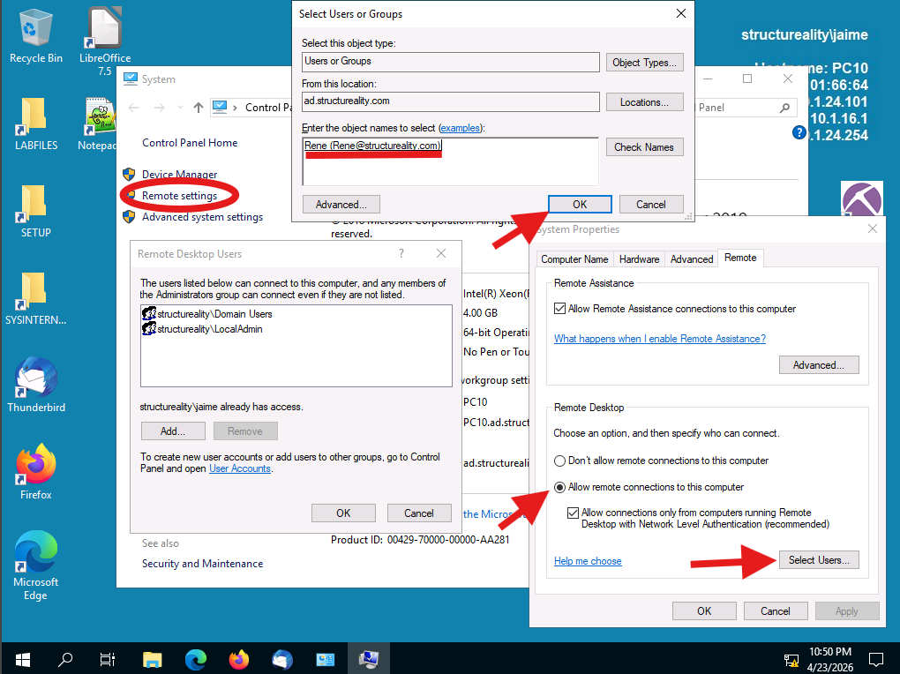
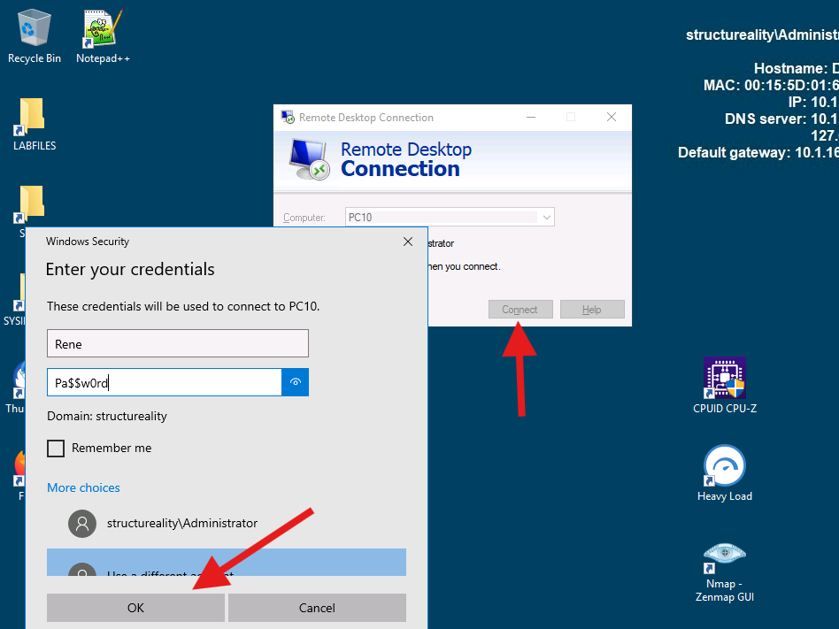
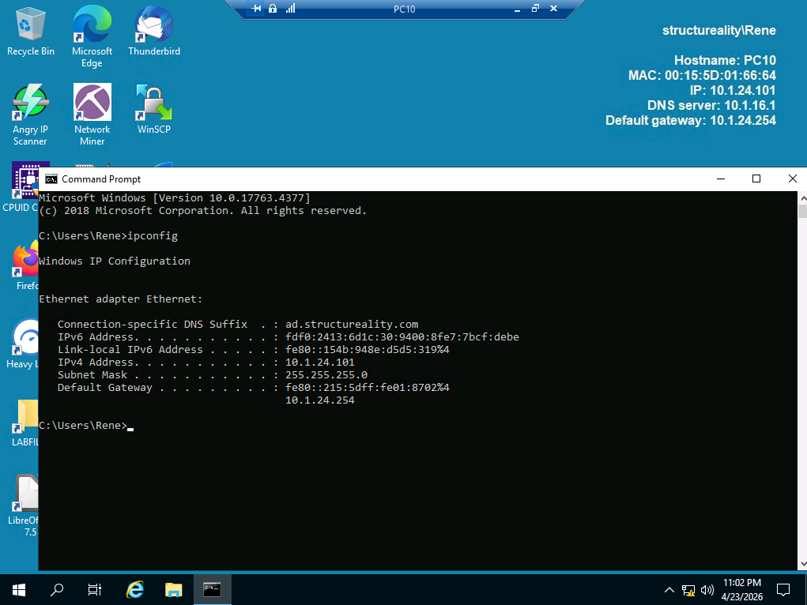
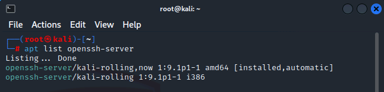
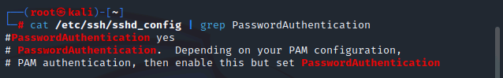
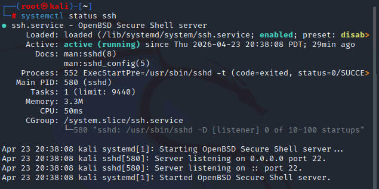
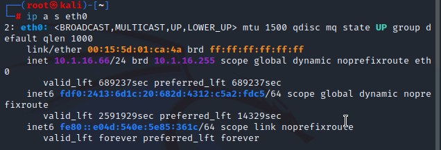
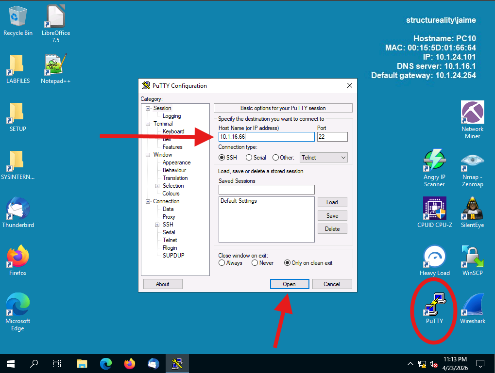
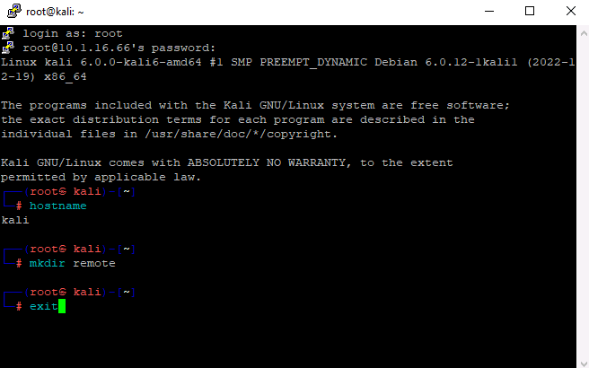
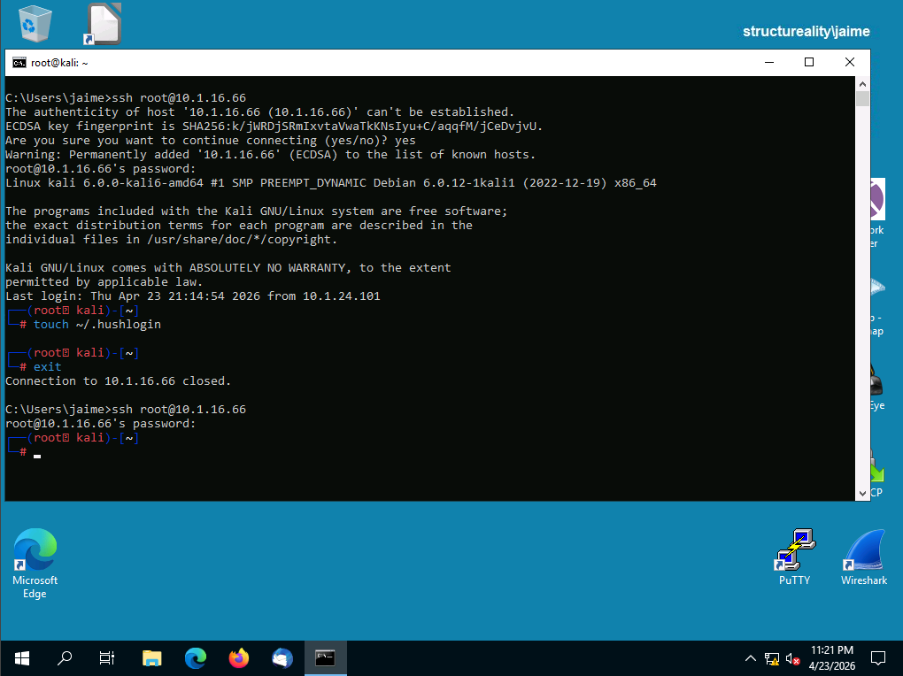

# 🌐 Lab 07 – Setting Up Remote Access


---

## 📋 Overview

As a security team member at Structureality Inc., I was tasked with setting up remote access between lab systems and verifying that the underlying services were configured correctly. The lab covered three connected exercises: enabling Microsoft Remote Desktop between two Windows servers, confirming the pre-installed SSH service on Kali Linux and checking its authentication method, then establishing SSH sessions from Windows to Kali using both a GUI client (PuTTY) and the built-in CLI client.

---

## 🎯 Objectives

- Enable and configure Remote Desktop on a Windows Server 2019 host
- Add a specific domain user to the Remote Desktop Users group
- Establish an RDP session between two Windows systems and confirm the remote hostname
- Verify that the OpenSSH server is installed, running, and listening on a Linux host
- Determine which authentication method the SSH service is using
- Connect to a Linux SSH server from Windows using PuTTY (GUI) and the built-in `ssh` client (CLI)
- Suppress the SSH login banner on repeat connections using `~/.hushlogin`

---

## 🛠️ Tools Used

| Tool | Purpose |
|------|---------|
| Windows Remote Desktop | Full-GUI remote session between Windows hosts (TCP/3389) |
| `apt list` | Verify package install state on Debian-family Linux |
| `systemctl status` | Check whether a systemd service is active and listening |
| `ip a s` | Display interface configuration on Linux |
| PuTTY | Windows GUI SSH/serial/telnet terminal emulator |
| OpenSSH `ssh` client | Built-in Windows CLI client for SSH connections |
| `touch ~/.hushlogin` | Suppress the SSH login banner on subsequent sessions |

---

## 🗂️ Repository Structure

```
labs/07-setting-up-remote-access/
├── README.md
└── screenshots/
    ├── 01-pc10-rdp-enable-users.png
    ├── 02-dc10-rdp-connect-credentials.png
    ├── 03-rdp-session-pc10-ipconfig.png
    ├── 04-kali-apt-list-openssh.png
    ├── 05-kali-password-auth-grep.png
    ├── 06-kali-systemctl-status-ssh.png
    ├── 07-kali-ip-eth0.png
    ├── 08-putty-configuration.png
    ├── 09-putty-session-kali.png
    └── 10-cmd-ssh-hushlogin-before-after.png
```

---

## 🖥️ Part 1 – Microsoft Remote Desktop (Windows to Windows)

Remote Desktop Protocol is Microsoft's full-session remote access protocol. It pushes the entire graphical desktop of the target machine to the client and listens on TCP port 3389 by default. RDP is disabled out of the box on Windows Server, and even after it's enabled, only members of the local Administrators group can connect unless additional users are explicitly added to the Remote Desktop Users group.

### Enabling RDP on PC10 and Adding Rene

I signed into PC10 as `structureality\jaime`, opened System → Remote settings, selected **Allow remote connections to this computer**, then used Select Users to add Rene to the Remote Desktop Users group via the object picker.



Here I can see three related windows layered together: the System control panel with **Remote settings** selected on the left, the System Properties dialog on the right with the Remote tab active and "Allow remote connections to this computer" toggled on, the Remote Desktop Users dialog showing the current default members (`structureality\Domain Users` and `structureality\LocalAdmin`), and the Select Users or Groups object picker resolving `Rene (Rene@structureality.com)`. Jaime was already granted access because Administrators automatically inherit RDP rights. Rene, as a standard domain user, would not have been able to connect without this explicit membership.

### Connecting from DC10

After signing out of PC10, I switched to DC10 as `structureality\Administrator` and opened Remote Desktop Connection, targeting `PC10` by hostname. At the credential prompt I chose **Use a different account** and entered Rene's credentials rather than inheriting the Administrator context.



Here I can see Remote Desktop Connection targeting `PC10` and the Windows Security dialog prompting for credentials that will be passed to the remote host. "Use a different account" is the path that lets the client send a non-cached identity. This is the same click path used when jumping between multiple managed hosts under different service accounts.

### Inside the RDP Session

The initial login took about a minute because this was Rene's first interactive sign-in on PC10 and her user profile had to be created. After the session established, I opened a Command Prompt and ran `ipconfig` to confirm which machine I was actually on.



Here I can see several confirmations that I was fully inside PC10 rather than DC10: the RDP toolbar pinned at the top shows `PC10`, the system info overlay on the right reads `Hostname: PC10`, `IP: 10.1.24.101`, `MAC: 00:15:5D:01:66:64`, and the `ipconfig` output in the Command Prompt matches (`IPv4 Address: 10.1.24.101`, `Default Gateway: 10.1.24.254`). The user indicator shows `structureality\Rene`, confirming the session is running under Rene's identity. Notice also that the PC10 desktop has a completely different set of shortcuts than DC10 did (Thunderbird, WinSCP, Angry IP Scanner, Network Miner, PuTTY) — visual confirmation that the session is genuinely remote.

**PC10 IP address: `10.1.24.101`**

---

## 🐧 Part 2 – Confirming SSH on Kali Linux

SSH (Secure Shell) is the standard encrypted remote shell protocol on Linux, listening on TCP port 22 by default. Kali ships with OpenSSH pre-installed, but the service state and authentication method still need to be verified before relying on it. This section walks through the four checks: install state, authentication config, runtime status, and network interface.

### Verifying the Package is Installed

```bash
apt list openssh-server
```



Here I can see the `openssh-server/kali-rolling,now 1:9.1p1-1 amd64 [installed,automatic]` line. The `[installed,automatic]` tag confirms the package is present and was pulled in as a dependency (or pre-seed) rather than an explicit user install. Both amd64 and i386 architecture listings appear — only the amd64 build is installed since that matches the Kali VM.

### Checking the Authentication Method

```bash
cat /etc/ssh/sshd_config | grep PasswordAuthentication
```



Here I can see three references to `PasswordAuthentication`, all commented out with a leading `#`. The first line, `#PasswordAuthentication yes`, is the actual setting. Because it's commented, the OpenSSH daemon falls back to its built-in default — which is "allow password authentication" unless another method is configured. This is the behaviour the lab is relying on. Production hardening usually involves uncommenting this line and setting it to `no` after deploying key-based authentication, so the permissive fallback is removed.

### Confirming the Service is Running

```bash
systemctl status ssh
```



Here I can see `Active: active (running) since Thu 2026-04-23 20:38:08 PDT; 29min ago`, which confirms the service has been up and stable. The log lines at the bottom show `Server listening on 0.0.0.0 port 22.` and `Server listening on :: port 22.` — the `0.0.0.0` bind accepts IPv4 connections on all interfaces, and the `::` bind does the same for IPv6. The process is PID 580, running under the systemd-managed `ssh.service` unit.

### Getting the Interface Address

```bash
ip a s eth0
```



Here I can see the eth0 interface in the `UP,LOWER_UP` state with `inet 10.1.16.66/24` assigned via DHCP (`dynamic` flag, `preferred_lft 689237sec`). This is the IPv4 address I'll target from the Windows side in Part 3. The link-layer MAC is `00:15:5d:01:ca:4a`, which falls in Microsoft's Hyper-V OUI range — useful to recognize when sniffing the lab network later.

**Kali IP address: `10.1.16.66`**

---

## 🔐 Part 3 – SSH from Windows to Kali (GUI and CLI)

With the Kali SSH service confirmed, the next step was connecting from Windows. Windows has had a built-in OpenSSH client since Windows 10 1809, but PuTTY remains the ubiquitous GUI option and is installed on most lab images by default. Both get you to the same shell; they differ in session management, key handling, and how the initial host key prompt is presented.

### PuTTY (GUI)

I signed back into PC10 as Jaime and opened PuTTY from the desktop.



Here I can see the PuTTY Configuration dialog with Host Name set to `10.1.16.66`, Port `22`, and Connection type `SSH`. The Saved Sessions list is empty aside from the implicit `Default Settings` entry. Hitting Open triggers the SSH handshake; the first connection to a new host surfaces a PuTTY Security Alert showing the server's key fingerprint, which must be accepted to proceed.

After accepting the host key and authenticating as `root` with `Pa$$w0rd`, I was dropped into an interactive Kali shell.



Here I can see the full SSH welcome banner (`Linux kali 6.0.0-kali6-amd64`, the Kali copyright notice, and the warranty line), followed by `hostname` returning `kali` to confirm I'm on the correct host, `mkdir remote` creating a directory in `/root/`, and `exit` closing the session.

### Built-in OpenSSH Client (CLI)

PuTTY is fine for one-off sessions, but Windows ships with a native OpenSSH client that works from any cmd or PowerShell window. The next shot captures two sequential connections in a single Command Prompt view, showing what changes when `~/.hushlogin` is created between them.



Here I can see two distinct SSH sessions back-to-back. The **first connection** shows the complete first-contact experience: the "authenticity of host '10.1.16.66' can't be established" prompt with the ECDSA key fingerprint (`SHA256:k/jWRDjSRmIxvtaVwaTkKNsIyu+C/aqqfM/jCeDvjvU.`), the confirmation `yes`, the `Warning: Permanently added '10.1.16.66' (ECDSA) to the list of known hosts.` line (the host key is now pinned in `%USERPROFILE%\.ssh\known_hosts`), the full Kali banner, and the `Last login: Thu Apr 23 21:14:54 2026 from 10.1.24.101` line that confirms the previous PuTTY session was logged. Then I ran `touch ~/.hushlogin` to create an empty file in root's home directory and exited.

The **second connection**, reusing the exact same `ssh root@10.1.16.66` command, skips the host-key prompt (key is now cached) and skips the banner entirely. Only the password prompt appears, then the bare `#` shell prompt. The before/after comparison in one frame shows exactly what `.hushlogin` does: its existence alone is the signal — content is irrelevant, and the check happens per-user rather than system-wide.

---

## 💡 Key Takeaways

- **RDP and SSH aren't interchangeable.** RDP delivers a full graphical desktop session and targets Windows hosts on port 3389. SSH gives a text shell and is the Linux standard on port 22. Each protocol's defaults assume its native platform — RDP expects Active Directory users and NTLM/Kerberos; SSH expects Unix accounts and key or password auth. Picking the wrong one for the job usually means fighting the defaults.
- **"Allow remote connections" on Windows is not a user-level setting.** Enabling RDP opens the door for the local Administrators group by default. Non-admin users like Rene need an explicit add to the Remote Desktop Users group before they can connect, even after the feature toggle is on.
- **Commented-out SSH config relies on daemon defaults, not the written value.** The `#PasswordAuthentication yes` line in `sshd_config` looks like it's setting the value, but the `#` means it's not in effect. OpenSSH defaults to allowing passwords when the directive is absent, which is why the lab works. A hardening pass should uncomment the line and set it to `no` after keys are deployed, so the fallback doesn't stay permissive.
- **`systemctl status` is two checks in one.** The `Active: active (running)` line confirms the process is alive; the trailing log lines (`Server listening on 0.0.0.0 port 22`) confirm the network binding. Either can fail independently — a service can be "running" but stuck, or it can be running but not listening on the expected interface.
- **SSH host-key TOFU is a one-time verification, not ongoing.** The "authenticity of host can't be established" prompt on the first connection is Trust On First Use. Accepting it pins the key in `known_hosts`. Subsequent connections silently verify against the pin. If that prompt ever appears for a host you've already connected to, it means the key changed — which could be a server rebuild or a man-in-the-middle, and either way it deserves investigation before typing `yes`.
- **`.hushlogin` is a feature, not a workaround.** An empty file in a user's home directory is all that's needed to suppress the SSH login banner on subsequent connections. Unix tools regularly use file existence as a signal, independent of content. The same pattern shows up elsewhere — `.sudo_as_admin_successful` after the first successful sudo, `.gitkeep` to track empty directories in git.

---

## ❓ Comprehensive Questions

**1. The remote access tool SSH is limited to Linux systems only.**
**False.** SSH is a protocol, not a Linux-exclusive tool. OpenSSH has long-standing ports for BSDs, macOS, and modern Windows (the built-in OpenSSH client was added to Windows 10 in 2018 and is now installable as an optional component on Windows Server). SSH clients and servers run on network equipment (Cisco IOS, Arista EOS), embedded systems, and even IBM mainframes. The protocol itself is OS-agnostic.

**2. On a standard Windows system, Remote Desktop is by default enabled for all users.**
**False.** RDP is disabled by default on fresh Windows installs. Once enabled, only members of the local Administrators group and the Remote Desktop Users group can connect. Standard users get an access-denied error until they are explicitly added, which was the whole reason Rene had to be added in Part 1.

**3. What functions can the tool PuTTY be used for?**
**Serial console, network file transfer, and terminal emulator.** PuTTY is a multi-protocol terminal that handles SSH, Telnet, Rlogin, SUPDUP, and raw socket connections (terminal emulator). It supports serial connections over COM ports for console access to switches, routers, and embedded devices (serial console). The PuTTY suite includes `pscp` and `psftp` for file transfer over SSH (network file transfer). It is **not** a web browser.

**4. When initiating an SSH connection, what is the typical CLI syntax?**
**`ssh username@host`**, where `host` is an IP address or a hostname that resolves. The lab listed the answer as `ssh username@` — the truncated form of the same command. The other options (`ssh open 22`, `ssh:///username`, `ssh id=username`) are not valid SSH syntax.

**5. What is the form of authentication supported by SSH by default?**
**Password.** When no other authentication method is configured or the `PasswordAuthentication` directive is at its default (or commented out, as Part 2 showed), the OpenSSH daemon accepts password authentication. Key-based authentication is stronger and is the recommended production method, but it requires explicit setup (generating a keypair, deploying the public key to the server's `authorized_keys` file). Out of the box, password auth is what's running.

---

## 📚 References

- [Microsoft Docs: Remote Desktop Services](https://learn.microsoft.com/en-us/windows-server/remote/remote-desktop-services/welcome-to-rds)
- [Microsoft Docs: OpenSSH for Windows](https://learn.microsoft.com/en-us/windows-server/administration/openssh/openssh_overview)
- [OpenSSH: sshd_config(5) man page](https://man.openbsd.org/sshd_config)
- [OpenSSH: ssh(1) man page](https://man.openbsd.org/ssh)
- [PuTTY official site](https://www.chiark.greenend.org.uk/~sgtatham/putty/)
- CompTIA Security+ Objectives 3.2, 5.6

---

*CompTIA Security+ SY0-701 | CertMaster Learn | Lab 07 of 22*
