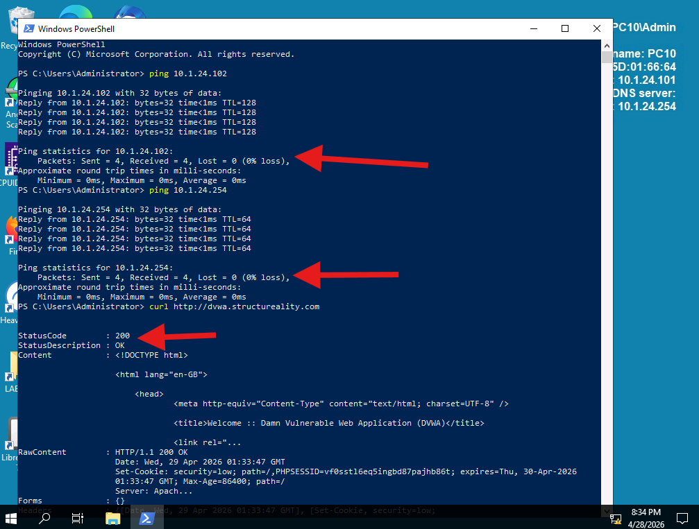
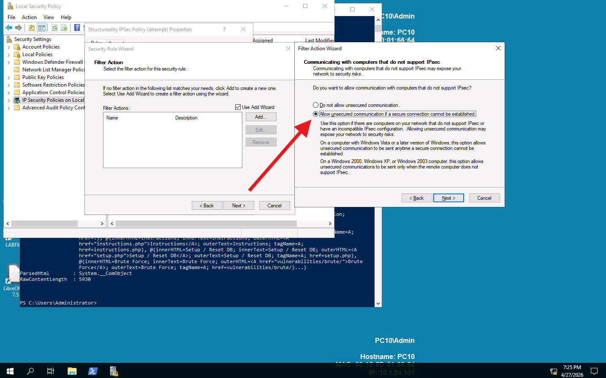
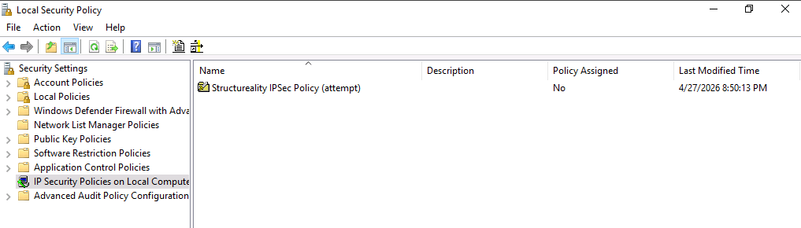
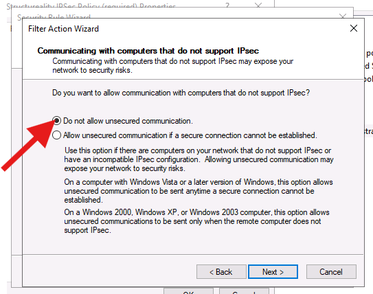
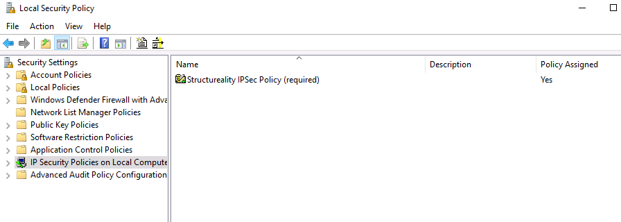
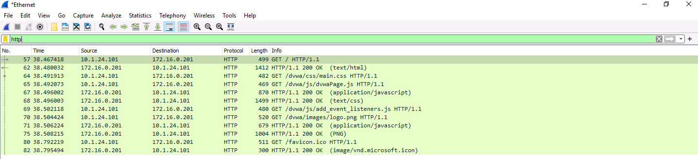
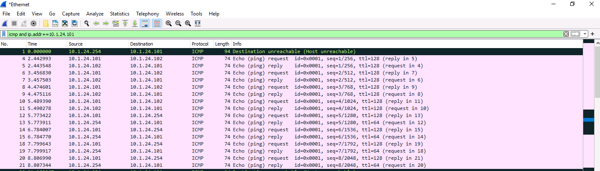
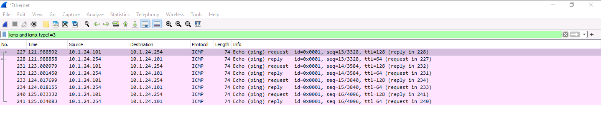
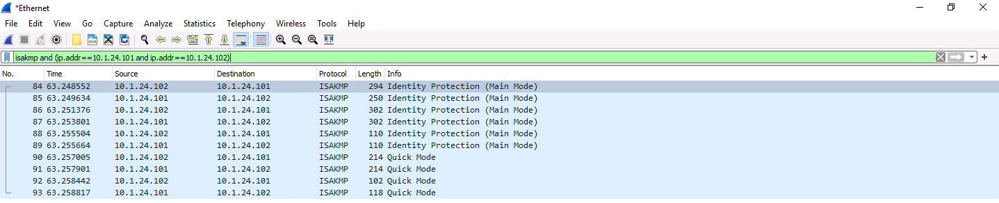
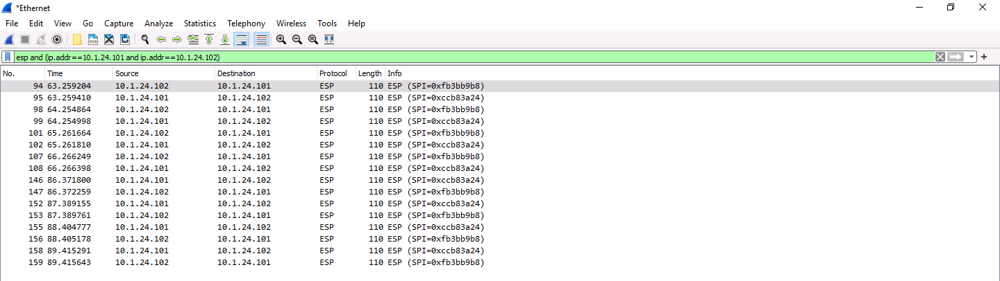

# 🔐 Lab 08 – Using IPsec Tunneling


---

## 📋 Overview

As a security team member at Structureality Inc., I was tasked with configuring and validating an IPsec tunnel between two internal Windows Server hosts. The lab covered three exercises: first verifying the unencrypted network baseline, then building IPsec policies on both machines (one configured to attempt encryption with fallback allowed, the other configured to require it with no fallback), and finally using Wireshark to capture traffic before and after the policies were assigned to confirm the tunnel was actually working.

---

## 🎯 Objectives

- Verify baseline network connectivity and capture plaintext ICMP and HTTP traffic before any IPsec policy is assigned
- Configure a Windows IPsec policy on PC10 to attempt encrypted sessions with fallback to plaintext if negotiation fails
- Configure a Windows IPsec policy on PC20 to require encrypted sessions with no fallback allowed
- Assign both IPsec policies and re-capture traffic to confirm ICMP between PC10 and PC20 disappears from the capture
- Identify ISAKMP key negotiation and ESP encrypted payload traffic in Wireshark to confirm tunnel establishment

---

## 🛠️ Tools Used

| Tool | Purpose |
|------|---------|
| Windows Local Security Policy | Create and assign IPsec policies on each host |
| IP Security Policy Wizard | Define filter lists, filter actions, and authentication for each policy |
| Wireshark | Capture and analyze network frames before and after IPsec assignment |
| PowerShell `ping` | Verify host-to-host and host-to-gateway reachability |
| PowerShell `curl` | Confirm HTTP connectivity to the DVWA web service |

---

## 🗂️ Repository Structure

```
labs/08-ipsec-tunneling/
├── README.md
└── screenshots/
    ├── 01-pc10-connectivity-verify.png
    ├── 02-pc10-filter-action-attempt.png
    ├── 03-pc10-local-security-policy.png
    ├── 04-pc20-filter-action-required.png
    ├── 05-pc20-local-security-policy.png
    ├── 06-wireshark-pre-ipsec-http.png
    ├── 07-wireshark-pre-ipsec-icmp.png
    ├── 08-wireshark-post-ipsec-icmp.png
    ├── 09-wireshark-isakmp.png
    └── 10-wireshark-esp.png
```

---

## 🔌 Part 0 – Verify Network Environment

Before touching any policy configuration, I confirmed that PC10 could reach PC20, the default gateway, and the DVWA web service hosted at `dvwa.structureality.com`. This baseline check matters because a failed IPsec negotiation and a broken network look identical from the application layer - both result in dropped traffic. Ruling out connectivity problems before the lab starts means any issues that show up later can be attributed to policy misconfiguration rather than infrastructure.

```powershell
ping 10.1.24.102   # PC20
ping 10.1.24.254   # Default gateway
curl http://dvwa.structureality.com
```



Here I can see all three checks pass: the ping to 10.1.24.102 (PC20) returned four replies with 0% packet loss, the ping to 10.1.24.254 (the default gateway) also returned four replies with 0% loss, and the `curl` command returned `StatusCode: 200` with `StatusDescription: OK` from the DVWA server. The system info overlay on the right of the screen confirms I'm on PC10 at 10.1.24.101. The same checks ran on PC20 before proceeding.

---

## 🛡️ Part 1 – Configure PC10 to Attempt IPsec

On PC10, I opened Local Security Policy, navigated to IP Security Policies on Local Computer, and used the IP Security Policy Wizard to create a new policy named **Structureality IPSec Policy (attempt)**. The wizard walks through several nested dialogs: the outer policy shell, then a Security Rule to define what traffic to match, then an IP Filter List to scope the traffic, and finally a Filter Action to define what to do with matched traffic.

The key decision in this policy was the Filter Action. I named it **Encrypt Some of The Things** and set it to negotiate security - but critically, selected **Allow unsecured communication if a secure connection cannot be established**. This is the "attempt" behavior: PC10 will always try to negotiate an IPsec session, but if the other side doesn't support it or the negotiation fails, the connection falls through to plaintext rather than being blocked. The filter covered any IP source to any IP destination, any protocol, and used a pre-shared key (`Password!Password!`) for key exchange authentication.



Here I can see the Filter Action Wizard open on the "Communicating with computers that do not support IPsec" page, with the lower radio button selected. The red arrow points directly to the selected option. This is the defining characteristic of the "attempt" policy - the fallback permission is what separates it from the "required" policy built on PC20 in Part 2. This option is explicitly warned against in the lab for most real-world scenarios: it means a misconfigured or non-IPsec-capable peer silently gets plaintext rather than a connection error.

After completing the wizard I right-clicked the policy and selected Assign to register it in the registry for scoring, then immediately Unassigned it to ensure no encryption was in effect during the initial Wireshark capture.



Here I can see the policy listed in the right pane of Local Security Policy under IP Security Policies on Local Computer. Policy Assigned reads No, which is the correct state going into Part 3 - the policy exists and is ready to be activated on demand, but traffic between PC10 and PC20 is still plaintext at this point.

---

## 🔒 Part 2 – Configure PC20 to Require IPsec

On PC20, I repeated the same wizard sequence to create a policy named **Structureality IPSec Policy (required)**. The filter list was identical - any source to any destination, any protocol - and the pre-shared key was the same. The only meaningful difference was in the Filter Action.

I named this one **Encrypt All The Things** and chose **Do not allow unsecured communications**. This is the "required" behavior: PC20 will negotiate IPsec with every host it talks to, and if the negotiation fails for any reason, the connection is dropped rather than falling back to plaintext. This is the stricter posture of the two. In practice, pairing a "require" policy on a server with an "attempt" policy on the clients is one way to enforce encryption on server-bound traffic while allowing clients to communicate with non-IPsec hosts on the broader network.



Here I can see the same Filter Action Wizard page, this time on PC20, with the upper radio button selected. The contrast with the PC10 screenshot is the entire point: same wizard, same page, one decision changed. The descriptions below each option make the stakes clear - "Do not allow" means any host that can't negotiate IPsec simply cannot communicate with PC20 at all while this policy is active.



Here I can see the PC20 Local Security Policy with the required policy listed. Policy Assigned reads Yes - this shot was captured during the scoring step before I un-assigned it to prepare for the baseline Wireshark capture in Part 3.

---

## 📡 Part 3 – Confirm Whether IPsec Encrypts Communications

With both policies built and un-assigned, I started a Wireshark capture on PC10's Ethernet interface. I then ran pings from PC10 to PC20 and the gateway, and visited `dvwa.structureality.com` in Edge. I also ran the same pings and DVWA visit from PC20. Then I stopped the first capture and filtered through it to establish the plaintext baseline before enabling any IPsec.

### Pre-IPsec Baseline

```
Filter: http
```



Here I can see the http filter applied and the full page load from PC10 (10.1.24.101) to the DVWA server (172.16.0.201) visible in plaintext. Packet 57 is the initial `GET / HTTP/1.1` request, packet 62 is the `200 OK (text/html)` response, and the subsequent packets are the CSS, JavaScript, and image assets loading. All of this is readable by anyone on the same network segment. No encryption in place yet.

```
Filter: icmp and ip.addr==10.1.24.101
```



Here I can see the ICMP filter showing all ping traffic involving PC10. Packets 4 through 11 are the echo request and reply pairs between 10.1.24.101 (PC10) and 10.1.24.102 (PC20) - four full request/reply cycles, fully readable. Packets 12 onward show the equivalent traffic between PC10 and the gateway at 10.1.24.254. Packet 1 (dark highlighted) is a Destination Unreachable message from the gateway, which the lab notes is unrelated Windows background noise - not intentional ping traffic. Importantly, there is no ICMP traffic from PC20 to the gateway or the DVWA server captured here, because those packets were never routed through PC10's network interface.

### Assigning the Policies and Re-Capturing

I started a new Wireshark capture on PC10, then switched to Local Security Policy and right-clicked Structureality IPSec Policy (attempt) and selected Assign. Over on PC20, I did the same for Structureality IPSec Policy (required). With both policies now active, I ran new pings from PC20 to PC10, then from PC10 to PC20, to the gateway, and reloaded the DVWA site in Edge. Then I stopped the second capture.

```
Filter: icmp and icmp.type!=3
```



Here I can see the ICMP filter applied to the second capture. The only visible traffic is between PC10 (10.1.24.101) and the default gateway (10.1.24.254) - four request/reply pairs in plaintext. There is zero ICMP traffic between 10.1.24.101 and 10.1.24.102. I ran those pings and confirmed they returned four replies, so the traffic crossed the network - it just did so inside an IPsec tunnel that Wireshark cannot decode at OSI Layer 3. The gateway pings appear in plaintext because the gateway doesn't support IPsec, and PC10's "attempt" policy allows fallback. PC20's "require" policy enforced the tunnel for PC10-PC20 traffic, which is why those packets vanished.

```
Filter: isakmp and (ip.addr==10.1.24.101 and ip.addr==10.1.24.102)
```



Here I can see ISAKMP (Internet Security Association and Key Management Protocol) traffic between PC10 and PC20. The first six packets are Identity Protection (Main Mode) - this is IKE Phase 1, where the two hosts negotiate a secure channel and authenticate each other using the pre-shared key. Packets 90 through 93 are Quick Mode - IKE Phase 2, where the specific encryption parameters for the data channel (the IPsec Security Association) are negotiated. Seeing this sequence confirms the full handshake happened. If this filter returned nothing, it would mean the tunnel never actually established.

```
Filter: esp and (ip.addr==10.1.24.101 and ip.addr==10.1.24.102)
```



Here I can see ESP (Encapsulating Security Payload) packets flowing in both directions between PC10 and PC20. Every packet shows one of two SPI values: `0xccb83a24` for the PC10-to-PC20 direction and `0xfb3bb9b8` for the return direction. The SPI (Security Parameter Index) is the identifier for each unidirectional Security Association - IPsec creates separate SAs for each direction rather than a shared one. Wireshark can see these frames on the wire and read the outer IP headers, but the payload inside each packet is encrypted. This is the traffic that was generating the ICMP echo requests and replies I saw from the command line - the pings were succeeding, but the contents were opaque to any observer who wasn't party to the key exchange.

---

## 💡 Key Takeaways

- **"Attempt" and "require" are not the same thing, and mixing them on a network has real consequences.** PC10's fallback permission meant its pings to the gateway stayed in plaintext even after IPsec was enabled - the gateway couldn't negotiate, so PC10 fell back silently. If you're relying on IPsec to protect traffic on a specific path, the "require" posture is the only one that guarantees it. "Attempt" is a transition tool, not a security control.
- **ISAKMP and ESP are the two stages you should look for in Wireshark to confirm a tunnel.** ISAKMP (IKE) is the negotiation - Phase 1 establishes a secure channel, Phase 2 negotiates the data SA. ESP is the delivery - every packet of actual user traffic wrapped in the encrypted container. If you see IKE but no ESP, negotiation succeeded but no data flowed. If you see ESP but no IKE, the SA was pre-established or negotiated before the capture started.
- **Absence of traffic in a capture is not the same as absence of traffic on the network.** The PC10-PC20 pings disappeared from the Wireshark results after IPsec was assigned, but they didn't fail - they were tunneled. The distinction matters when triaging a network problem: a capture that shows nothing isn't proof that traffic isn't flowing. It might just mean the traffic is encrypted or routed to an interface you're not watching.
- **IPsec operates at Layer 3, which means it's transparent to applications.** The DVWA website continued to load in plaintext after the policies were assigned because that traffic goes to 172.16.0.201, not 10.1.24.102. The any-to-any filter only successfully negotiated a tunnel with PC20, which was configured to require it. Everything else fell back to plaintext. Application-layer encryption like TLS is orthogonal to IPsec - they solve different problems at different layers of the stack.
- **Security Parameter Index values identify Security Associations, not tunnels.** The two SPI values in the ESP capture (one per direction) are references into each host's Security Association Database. Knowing the SPI doesn't help decrypt the traffic without the session keys - it's just the lookup key that tells the receiving host which SA to use for decryption. Seeing two SPIs confirms two unidirectional SAs were negotiated, which is normal IPsec behavior.
- **Pre-shared keys are operationally simple but don't scale.** Using `Password!Password!` as the PSK works fine in a two-host lab. In production it falls apart quickly: every host in the policy needs to share the same secret, rotating it requires touching every endpoint, and there's no way to revoke a single compromised host without changing the key everywhere. Certificate-based authentication via a PKI solves all of this, which is why enterprise IPsec deployments typically use it instead.

---

## ❓ Comprehensive Questions

**1. What are the three main types of IPsec policies that can be configured?**
Negotiate, Permit, and Block. Negotiate requests IPsec-encrypted communications, Permit allows traffic without requiring IPsec, and Block prevents IPsec negotiation entirely. Request and Enable are not IPsec policy types.

**2. What is the primary benefit of tunneling?**
Encryption. Tunneling wraps the original packet inside an encrypted container, hiding its contents from observers on the path. It does not improve routing performance, provide non-repudiation, or increase availability on its own.

**3. In the lab, why was PC10 unable to collect the packets from PC20 directed to the default gateway or the website?**
The packets from PC20 were not sent to the PC10 interface. PC20's traffic to the gateway or DVWA server follows its own routing path and never reaches PC10's adapter, so Wireshark on PC10 cannot capture it. The IPsec policy had no bearing on this; those packets were invisible to PC10 both before and after assignment.

**4. Which of the following are options for implementing encrypted tunnels for secure communications?**
TLS, SSH, and IPsec. All three create encrypted tunnels for data in transit. DNS, HTTP, ICMP, and FTP do not provide tunnel encryption on their own.

**5. Your company is implementing IPsec policies on all internal systems over a three-month rollout. What is the best choice during the initial phase?**
Allow fallback to unsecured communications if a secure connection cannot be established. During a phased rollout, not every system has IPsec on day one, so the fallback option keeps configured hosts reachable from unconfigured ones. The policy can be tightened to require encryption once the rollout is complete.

---

## 📚 References

- [Microsoft Docs: IP Security Policies Overview](https://learn.microsoft.com/en-us/windows/security/threat-protection/windows-firewall/ip-security-policies)
- [Microsoft Docs: How IPsec Works](https://learn.microsoft.com/en-us/previous-versions/windows/it-pro/windows-server-2003/cc776369(v=ws.10))
- [Microsoft Docs: Windows Defender Firewall with Advanced Security](https://learn.microsoft.com/en-us/windows/security/threat-protection/windows-firewall/windows-firewall-with-advanced-security)
- [Wireshark: ISAKMP dissector](https://wiki.wireshark.org/ISAKMP)
- CompTIA Security+ Objectives 1.4, 2.5, 3.2, 3.3

---

*CompTIA Security+ SY0-701 | CertMaster Learn | Lab 08 of 22*
