# 💉 Lab 09 – Exploiting and Detecting SQLi


---

## 📋 Overview

As a security team member at Structureality Inc., I was tasked with exploring SQL injection from both sides of the keyboard. The lab covered two connected exercises: first acting as the attacker against the DVWA running on a LAMP host, building a SQLi chain from a basic metacharacter probe through full database enumeration and credential exfiltration; then switching to the LAMP host as the defender, opening Apache's access.log, and walking the same attack path in reverse to identify the percent-encoded IoCs each query left behind. The goal was to understand the offense well enough to recognize its trail in production logs.

---

## 🎯 Objectives

- Probe a vulnerable web form for input filtering and fingerprint the backend DBMS through error-based SQLi
- Use a Boolean tautology to dump every row from a query intended to return one
- Determine the column query limit with ORDER BY iteration so UNION SELECT payloads match
- Enumerate database, table, and column names through the MySQL `information_schema` metadata
- Walk the Apache access.log to identify percent-encoded SQLi IoCs and tie each entry back to the attack step that generated it

---

## 🛠️ Tools Used

| Tool | Purpose |
|------|---------|
| Firefox | Browser on KALI used to interact with the DVWA SQL Injection page |
| DVWA | Damn Vulnerable Web Application running on the LAMP host, set to Low security |
| Apache (apache2) | LAMP web server hosting DVWA and writing the access.log used for investigation |
| `less` | Pager used on LAMP to step through `/var/log/apache2/access.log` |
| `sudo` / `su` | Privilege elevation on LAMP to read the Apache log directory |

---

## 🗂️ Repository Structure

```
labs/09-sql-injection/
├── README.md
└── screenshots/
    ├── 01-dvwa-id1-admin-result.png
    ├── 02-dvwa-id7-empty.png
    ├── 03-dvwa-single-quote-error.png
    ├── 04-dvwa-boolean-all-users.png
    ├── 05-dvwa-order-by-3-error.png
    ├── 06-dvwa-union-version.png
    ├── 07-dvwa-union-tables-dvwa.png
    ├── 08-dvwa-find-users-columns.png
    ├── 09-dvwa-union-user-password.png
    ├── 10-lamp-apache-log-directory.png
    └── 11-access-log-sqli-iocs.png
```

---

## 🔍 Part 1 – Probing the Form

Before injecting anything I used the form the way it was designed: typed `1` into the User ID field and submitted. The page returned `ID: 1`, `First name: admin`, `Surname: admin`. The URL bar updated to `?id=1&Submit=Submit#`, which is the first useful piece of recon. Form parameters appearing in the URL means the script is using GET, and that exposes both the parameter name (`id`) and the structure of every query I will send next.

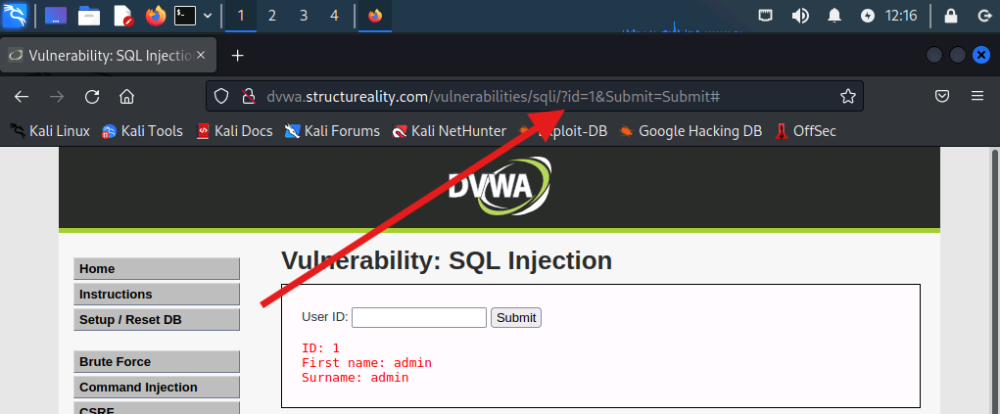

Here I can see the baseline working query. The body shows the admin row, and the red arrow points at the `?id=1&Submit=Submit#` portion of the URL. That URL structure is what every later injection payload piggy-backs on.

Next I tried `7`. There is no User ID 7 in the demo database, but the lab note pointed out the response: no row, no error, no message of any kind. Just the form re-rendered.

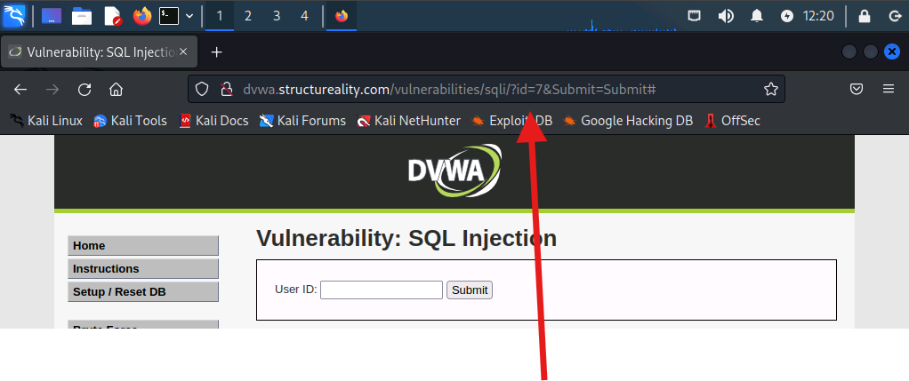

Here I can see the silent failure. The URL bar shows `?id=7&Submit=Submit#` but no row is rendered. That silence is informative: the script does not validate or report on missing IDs, which makes it unlikely to validate input formats either. That is exactly the kind of script that fails to filter metacharacters.

To test that filtering, I cleared the field and submitted a single apostrophe.

```
'
```

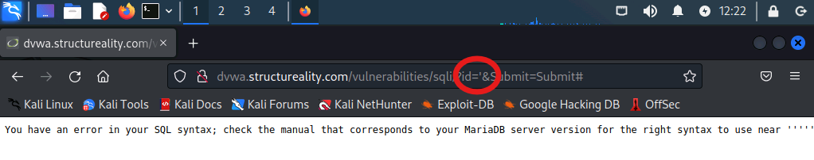

Here I can see two pieces of intelligence. First, the body text reads `You have an error in your SQL syntax; check the manual that corresponds to your MariaDB server version for the right syntax to use near '''''`. The DBMS just identified itself as MariaDB (a MySQL fork), which means MySQL syntax will work for everything that follows. Second, the red circle around `id='` confirms the quote went through unfiltered. Any site that displays a verbatim DBMS syntax error to an unauthenticated visitor is by definition not sanitizing input.

---

## 💥 Part 2 – Boolean Injection and Column Discovery

With the metacharacter unfiltered and the DBMS fingerprinted, the next move was a classic Boolean tautology: a logical condition that always evaluates to true.

```
1' or '1'='1
```

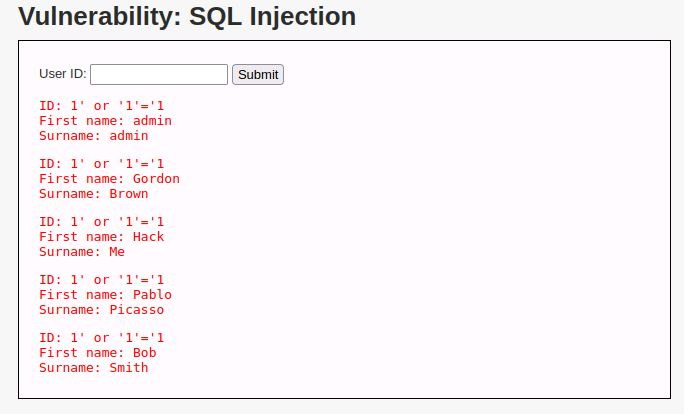

Here I can see the entire users table returned in a single response. The query was supposed to return one row matching User ID 1; instead it returned admin, Gordon Brown, Hack Me, Pablo Picasso, and Bob Smith. The script's underlying SELECT was something like `SELECT first_name, last_name FROM users WHERE id = '$input'`. By terminating the string with a quote, adding `or '1'='1`, and letting the trailing quote in the script close my injection cleanly, the WHERE clause became `WHERE id = '1' or '1'='1'`, which is true for every row in the table. The lab's question about which name was missing from the result is also answered here: Morgan never appears.

To do anything more advanced with UNION SELECT, I needed to know how many columns the target query was returning. That requires walking ORDER BY upward until the database complains.

```
' ORDER BY 1#
' ORDER BY 2#
' ORDER BY 3#
```

The first two returned no result and no error, which means columns 1 and 2 exist. The third hit the wall.

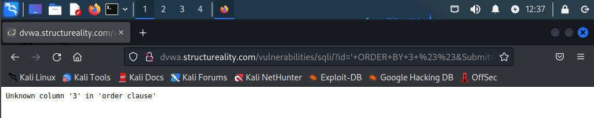

Here I can see the explicit error: `Unknown column '3' in 'order clause'`. That confirms the original query selects exactly two columns. Every UNION SELECT I craft from here forward must also project exactly two columns or it will be rejected. The trailing `#` in the payload is the MySQL end-of-line comment marker, which truncates whatever the script appended after my injection so it does not break my syntax.

---

## 📡 Part 3 – DBMS Reconnaissance via UNION SELECT

UNION SELECT lets me bolt my own SELECT statement onto the legitimate query, with the constraint that my SELECT must return the same number of columns. With the column count locked at two, the first useful UNION query was a version probe.

```
' UNION SELECT @@version, NULL#
```

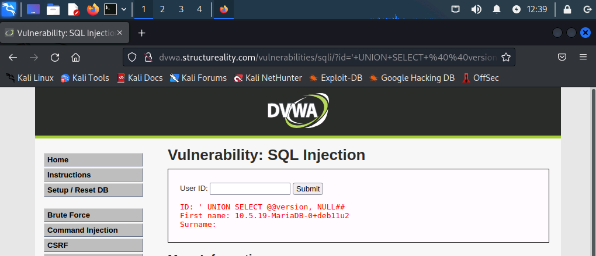

Here I can see `First name: 10.5.19-MariaDB-0+deb11u2` and an empty `Surname:` line. The MySQL session variable `@@version` returned the full DBMS version string, and `NULL` filled the second column position. This is the same DBMS family I identified from the syntax error in Part 1, but now I have an exact build number, which is what an attacker would feed into a CVE search to find known exploits for that release.

Next was the table enumeration. Every MySQL-compatible DBMS keeps its metadata in a database called `information_schema`, including a `tables` table that lists every database and table on the server.

```
' UNION SELECT table_schema, table_name FROM information_schema.tables#
```

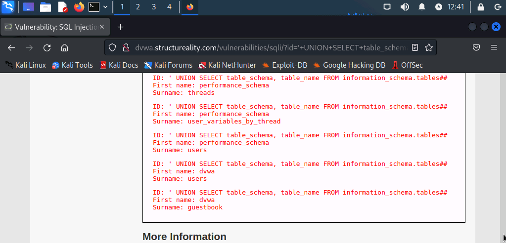

Here I can see the results scrolled to the relevant rows. Above the dvwa entries are several `performance_schema` rows (threads, user_variables_by_thread, users), and at the bottom of the visible frame are the two rows that matter: `First name: dvwa` / `Surname: users` and `First name: dvwa` / `Surname: guestbook`. Those are the two tables in the dvwa database. The lab's question about the first and second discovered tables resolves to `users` and `guestbook` in this run.

---

## 🔑 Part 4 – Column Enumeration and Credential Exfiltration

Knowing the database and table names is the setup. Pulling out actual data requires column names too, and the `information_schema.columns` view dumps every column from every table at once.

```
' UNION SELECT table_name, column_name FROM information_schema.columns#
```

The result is hundreds of rows. To find the columns of just the `users` table I used Firefox's find toolbar with `name: users` as the search term and Highlight All checked.

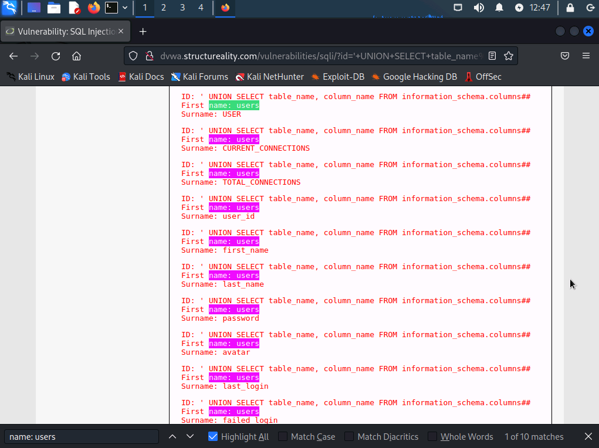

Here I can see the find toolbar at the bottom of the page reporting `1 of 10 matches`, with every `name: users` substring highlighted across the body. Of the ten matches, three are uppercase pseudo-columns the lab tells me to ignore (`USER`, `CURRENT_CONNECTIONS`, `TOTAL_CONNECTIONS`) because those are MySQL session metadata, not real user-table fields. The seven real columns visible in the highlighted rows are `user_id`, `first_name`, `last_name`, `password`, `avatar`, `last_login`, and `failed_login`. That seven-column list is the full schema of the dvwa.users table for this DVWA build.

A practical note for next time: the first attempt at this columns query failed with `The used SELECT statements have a different number of columns` because a previous payload was still partially in the User ID field. Clearing the field with Ctrl+A then Delete before pasting the next payload prevents that. The URL bar is the source of truth for what was actually submitted.

With column names in hand, the final attack query targeted the two columns that matter most for an attacker.

```
' UNION SELECT user, password FROM users#
```

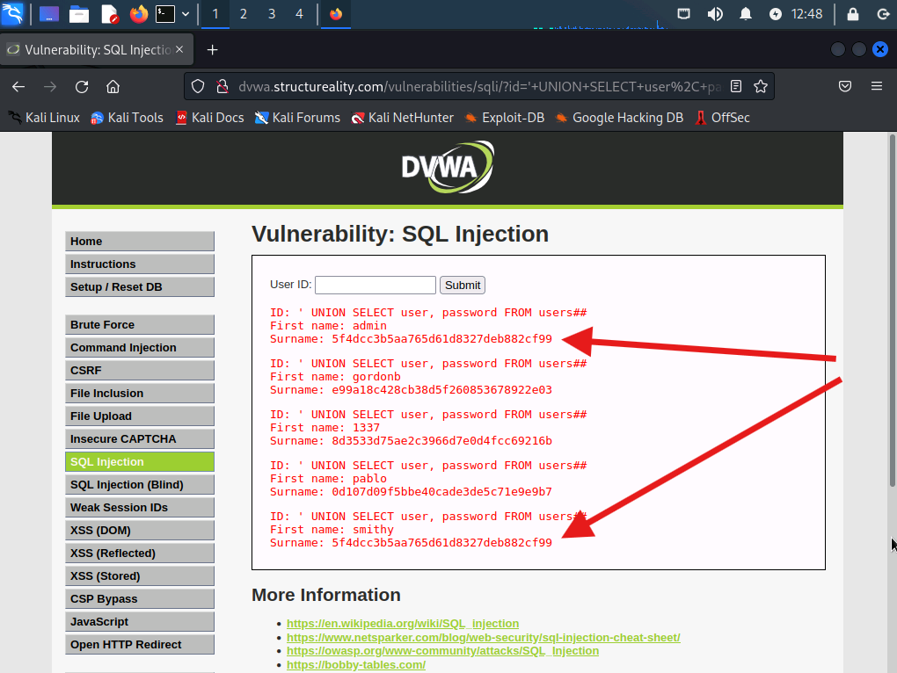

Here I can see the credential dump. Five accounts and five MD5 hashes:

| Username | Hash |
|----------|------|
| admin | `5f4dcc3b5aa765d61d8327deb882cf99` |
| gordonb | `e99a18c428cb38d5f260853678922e03` |
| 1337 | `8d3533d75ae2c3966d7e0d4fcc69216b` |
| pablo | `0d107d09f5bbe40cade3de5c71e9e9b7` |
| smithy | `5f4dcc3b5aa765d61d8327deb882cf99` |

The red arrows point at the admin and smithy rows specifically because their hashes are identical. `5f4dcc3b5aa765d61d8327deb882cf99` is the MD5 of the literal string `password`. Two different accounts, two different usernames, identical hashes, no salt. This is the exact failure mode Lab 04 demonstrated from the cracking side: unsalted hashes leak password reuse for free, and a rainbow table or even a single Google search resolves a known hash to its plaintext in under a second. From the defender's seat, this single screenshot is enough to justify mandating salted hashes (bcrypt, Argon2, or any modern KDF) at the application layer.

---

## 📜 Part 5 – Investigating the Web Server Logs

With the attack chain done from the KALI side, I switched to the LAMP host to see what the same activity looked like from the defender's seat. After signing in as `lamp`, elevating to root with `sudo su`, and changing into the Apache log directory, I listed the contents.

```bash
sudo su
cd /var/log/apache2
ls -l
```

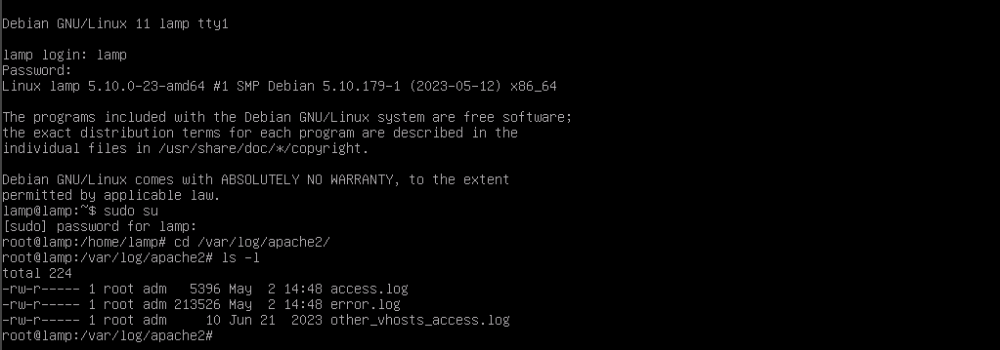

Here I can see the full elevation flow in one frame, ending with three log files: `access.log` at 5396 bytes (modified May 2 14:48), `error.log` at 213526 bytes (also May 2 14:48), and `other_vhosts_access.log` at 10 bytes from 2023. The recent timestamps and the size of access.log relative to a normal browsing session are the first hint that the request volume from KALI was unusual. For this lab the Apache instance is configured to use the Combined Log Format, so each entry includes the client IP, timestamp, request line, response code, response size, the HTTP referrer, and the User Agent string.

Opening the log with `less access.log` and stepping through it shows every request KALI sent during Part 1 through Part 4, in chronological order, all from `10.1.16.66`.

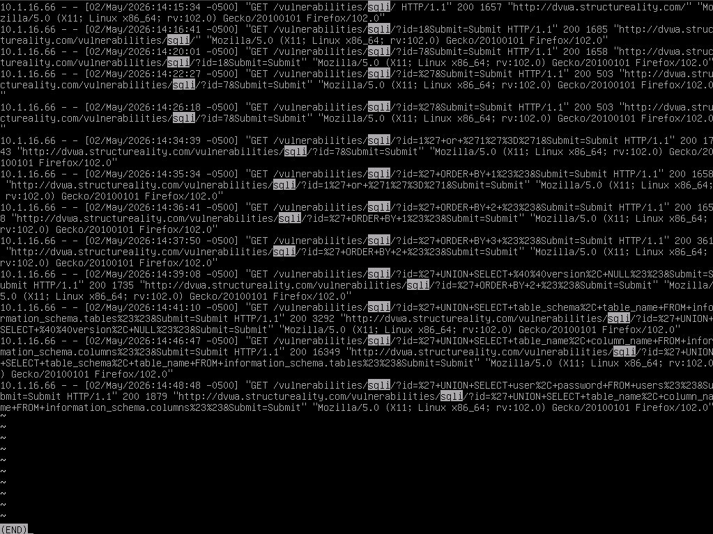

Here I can see the entire attack timeline rendered as eight distinct IoCs, top to bottom:

- `14:16:41` – `?id=1&Submit=Submit` – the baseline probe. The HTTP referrer for this entry is `/vulnerabilities/sqli/`, which answers the lab's question about the referrer for the first id=1 record.
- `14:22:27` – `?id=7&Submit=Submit` – the second probe. Same shape, different value, immediately after the first. Two integer probes in a row at this URL is the start of a recon pattern.
- `14:26:18` – `?id=%27&Submit=Submit` – the metacharacter test. `%27` is the percent-encoded single quote. The lab's encoding-table question resolves to %27 here.
- `14:34:39` – `?id=1%27+or+%271%27%3D%271&Submit=Submit` – the Boolean tautology. Fully decoded: `1' or '1'='1`. This is the first unambiguous SQLi IoC. Spaces in the payload show up as both `+` and `%20` in URL encoding; this entry shows the `+` form, which answers the lab's "select two encodings for space" question (`%20` and `+`).
- `14:35:34`, `14:36:41`, `14:37:50` – three `ORDER BY 1`, `2`, and `3` queries in rapid succession. That timing pattern, combined with the `+ORDER+BY+` substring, is itself an IoC: nobody legitimately submits incrementing ORDER BY values to a User ID field.
- `14:39:08` – `?id=%27+UNION+SELECT+%40%40version%2C+NULL%23%23` – DBMS recon. `+UNION+SELECT+` and `%40%40version` (the encoded `@@version`) make this recognizable at a glance. The trailing `%23%23` decodes to `##`, which is the end-of-line comment marker, answering the lab's octothorpe question.
- `14:41:10` – the `+UNION+SELECT+table_schema%2C+table_name+FROM+information_schema.tables` query. Table enumeration.
- `14:46:47` – `+UNION+SELECT+table_name%2C+column_name+FROM+information_schema.columns` – column enumeration.
- `14:48:48` – `+UNION+SELECT+user%2C+password+FROM+users%23%23` – the credential exfil. This is the entry that maps directly to the `5f4dcc3b5aa765d61d8327deb882cf99` hash leaking out.

Every entry's HTTP referrer is the previous SQLi response page, which produces a clear chronological chain. That referrer progression is itself a signal: an attacker working through a SQLi attack typically uses the result of each query to craft the next, so the referrers march in lockstep through one URL the way ordinary browsing does not.

---

## 💡 Key Takeaways

- **The single quote is the universal SQLi canary.** A site that returns a verbatim DBMS error from a single apostrophe is broadcasting two things at once: that input is not being filtered, and exactly which DBMS the backend is running. Both pieces of intelligence drive every payload that follows. Any SOC alert that fires on `%27` in URL parameters is catching this exact moment.
- **`information_schema` is MySQL's self-describing metadata, and SQLi turns it into a map of the entire database.** Once an attacker can run UNION SELECT against arbitrary tables, the path from "I can inject" to "I have everything" goes through `information_schema.tables` and `information_schema.columns`. Restricting the application's database user to only the tables it actually needs is one of the cheapest mitigations that breaks this chain.
- **The duplicate admin/smithy hash is the lab's silent finding.** Two unrelated accounts producing the same MD5 hash means both passwords are the same plaintext, which here is `password`. Without salt there is no way to hide that collision, and a single rainbow table lookup converts the hash to plaintext in under a second. Salted KDFs like bcrypt or Argon2 do not make passwords stronger, but they do make duplicate plaintext invisible at the storage layer.
- **The IoCs in the access.log are the SQL keywords themselves, not the request volume.** The lab's primary IoC list is `ORDER BY, UNION, SELECT, UPDATE, INSERT, DELETE, DROP`. A WAF or log-based detection that pattern-matches on those substrings inside URL parameters will catch most non-blind SQLi without needing to parse the SQL itself. The percent-encoding variations (`%20` vs `+` for space, `%23` for `#`, `%27` for the quote) are predictable enough to write into a single regex.
- **HTTP referrer chains are an underused signal during SQLi triage.** Walking the access.log entries in order, each SQLi request had the previous SQLi response page as its referrer. That is because the attacker needed to read the previous result to craft the next payload. Genuine application traffic jumps around to many endpoints; an attack chain marches in lockstep through one URL while the parameters get progressively weirder.

---

## ❓ Comprehensive Questions

**1. In SQLi, what is the most important character?**
The single quote (`'`). It terminates a string assignment in the underlying SQL statement, which lets injected code break out of the intended string context and execute as SQL.

**2. What is the SQL expression used to combine instructions or operations?**
`UNION`. It combines the results of two or more SELECT statements, which is what makes UNION-based SQLi possible.

**3. What is SQL Injection?**
Injecting code or commands into a script to manipulate a DBMS. The attacker abuses unfiltered metacharacters in user input to make the backend execute SQL the application's author never intended.

**4. Which of the following SQLi statements is used to return a result that includes the DBMS details?**
`' UNION SELECT @@version, NULL#`. The `@@version` MySQL session variable returns the full DBMS version string, and `NULL` fills the second column to satisfy the column-count match required by UNION.

**5. What evidence in a website's log is most clearly an IoC related to SQLi?**
SQL expressions inside HTTP requests: `ORDER BY, UNION, SELECT, UPDATE, INSERT, DELETE, or DROP`. HTTP response codes, referrer headers, and percent-encoding alone are not unique to SQLi, but those keywords inside a URL parameter almost always are.

---

## 📚 References

- [OWASP: SQL Injection](https://owasp.org/www-community/attacks/SQL_Injection)
- [OWASP: SQL Injection Prevention Cheat Sheet](https://cheatsheetseries.owasp.org/cheatsheets/SQL_Injection_Prevention_Cheat_Sheet.html)
- [DVWA Project](https://github.com/digininja/DVWA)
- [MariaDB Knowledge Base: Information Schema](https://mariadb.com/kb/en/information-schema/)
- [Apache HTTP Server: Log Files](https://httpd.apache.org/docs/2.4/logs.html)
- CompTIA Security+ Objectives 2.3, 4.9

---

*CompTIA Security+ SY0-701 | CertMaster Learn | Lab 09 of 22*
