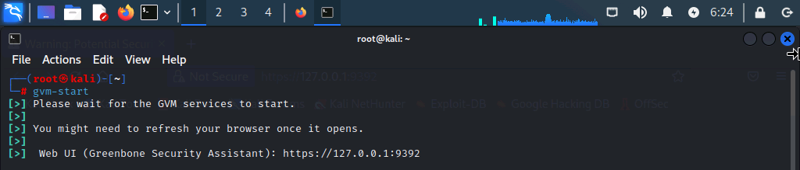
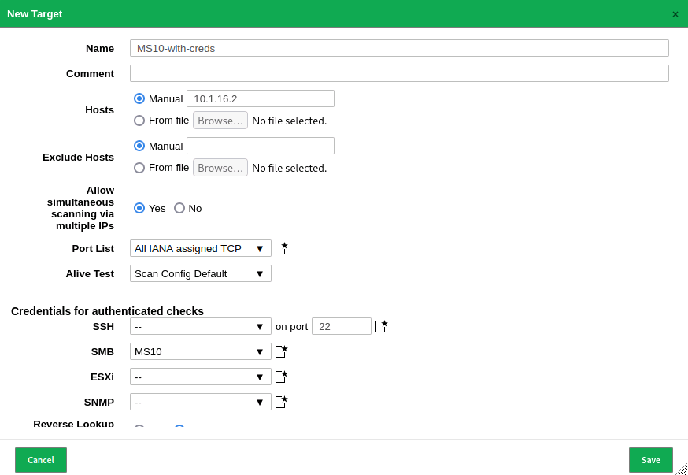
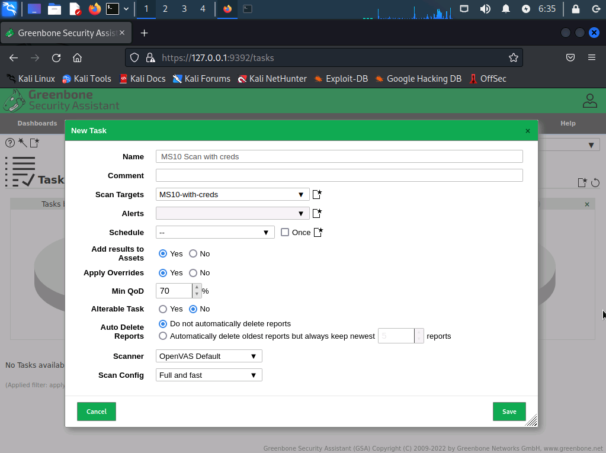
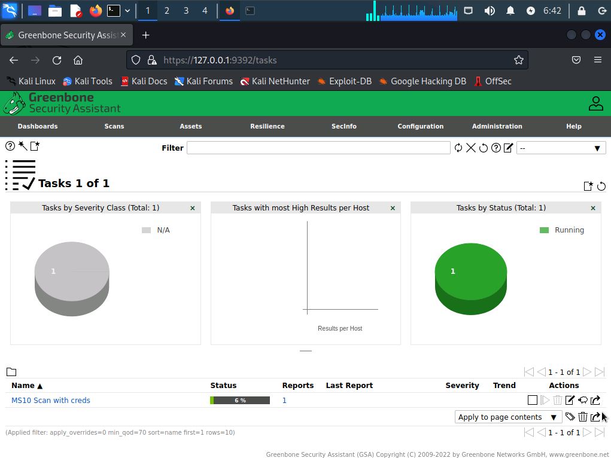
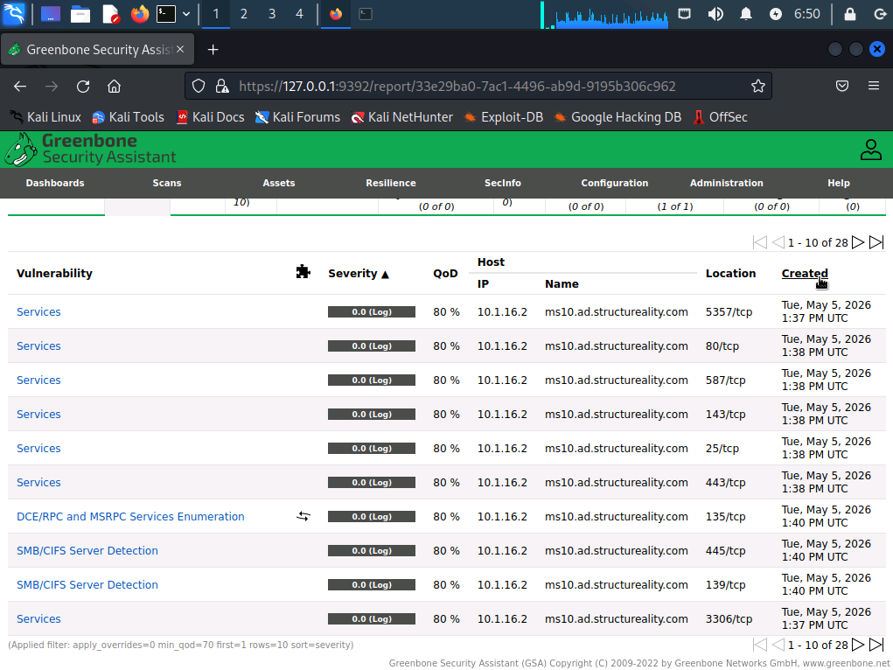
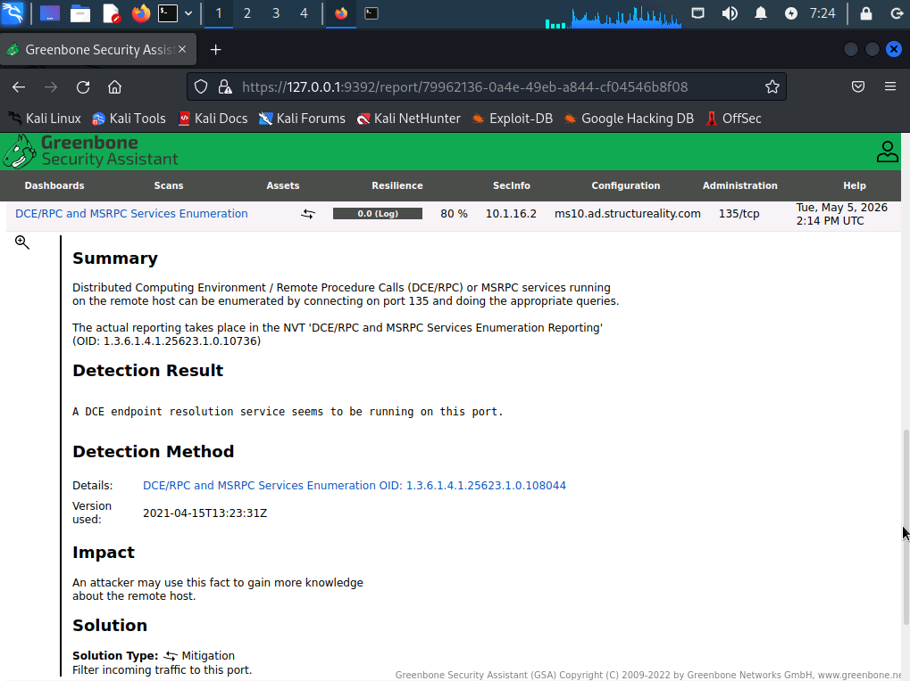
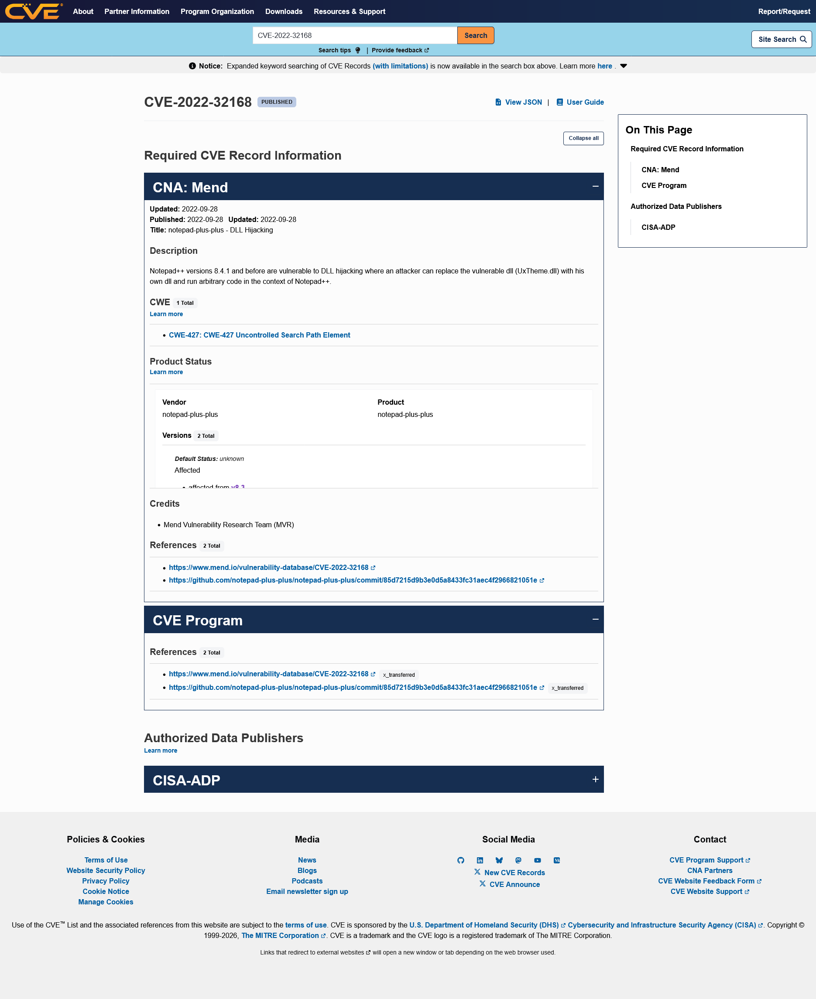
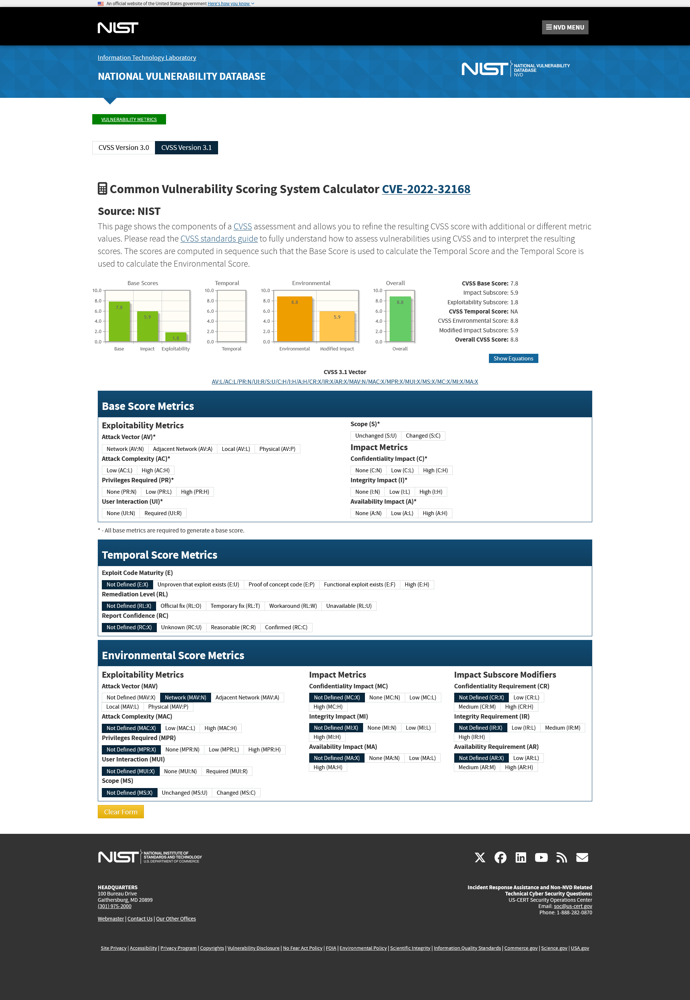
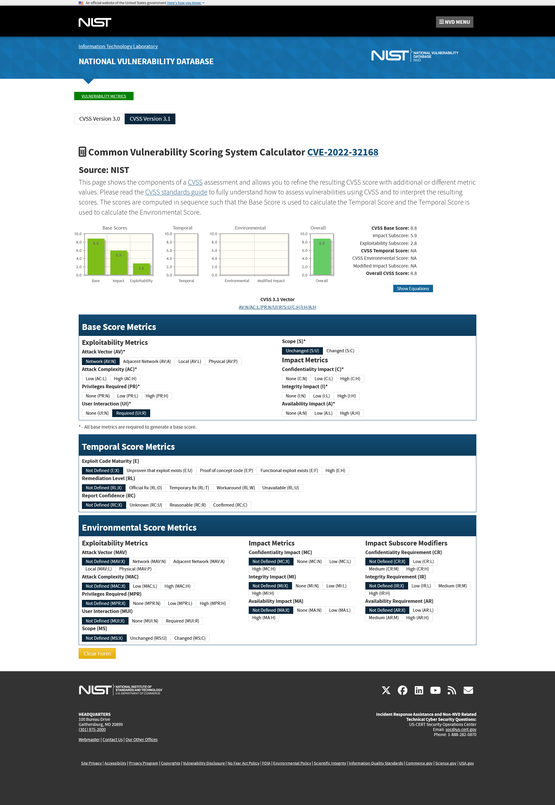

# 🔎 Lab 10 – Performing Vulnerability Scans


---

## 📋 Overview

As a security team member at Structureality Inc., I was tasked with running a credentialed vulnerability scan against a legacy Windows Server 2016 host (MS10) from the Kali management workstation. The lab covered five connected exercises: launching the Greenbone Security Assistant scanner, building a credentialed target with SMB authentication, kicking off the scan task, reviewing in-progress findings, and then taking one of the discovered CVEs through MITRE, NIST, and the CVSS calculator to understand how the severity score is constructed and how environmental factors shift it.

---

## 🎯 Objectives

- Launch the Greenbone Security Assistant and authenticate to the web interface at https://127.0.0.1:9392
- Configure a credentialed scan target using SMB credentials for a Windows Server 2016 host
- Create and start a credentialed vulnerability scan task against that target
- Review in-progress scan results and inspect the detail panel of an individual finding
- Cross-reference a discovered CVE through MITRE and NIST and use the CVSS calculator to model how a single metric changes the overall score

---

## 🛠️ Tools Used

| Tool | Purpose |
|------|---------|
| Greenbone Security Assistant (GSA) | Web-based vulnerability scanner (formerly OpenVAS) used to define targets, run scans, and review reports |
| `gvm-start` | Kali command that boots the GSA backend services and opens the scanner interface in Firefox |
| Firefox | Browser used to interact with the GSA web UI and to view CVE / NVD / CVSS pages on the local network |
| MITRE CVE database | Canonical source for CVE records at `cve.mitre.org`, used to look up CVE-2022-32168 |
| NIST National Vulnerability Database | CVE enrichment and CVSS calculator at `nvd.nist.gov`, used to model severity score changes |

---

## 🗂️ Repository Structure

```
labs/10-vulnerability-scanning/
├── README.md
└── screenshots/
    ├── 01-gvm-start-terminal.png
    ├── 02-new-target-form-filled.png
    ├── 03-new-task-form.png
    ├── 04-task-running-progress.png
    ├── 05-results-tab-severity-sorted.png
    ├── 06-vuln-details-expanded.png
    ├── 07-mitre-cve-2022-32168.png
    ├── 08-nvd-cve-2022-32168-severity.png
    ├── 09-cvss-calculator-default-7.8.png
    ├── 10-cvss-calculator-raised-8.8.png
    └── 11-cvss-calculator-pushed-10.png
```

---

## 🚀 Part 1 – Launching the GSA Scanner

GSA is pre-installed on Kali but does not run by default. The scanner depends on a large feed of vulnerability tests and CVE metadata that has to be downloaded and indexed before any scan can produce useful results. In a normal Kali install I would run `gvm-setup` and `gvm-check-setup` first, which can take 30+ minutes to complete a full feed sync. The lab environment is a closed network, so the feed is already pre-loaded and only the runtime services need to come up.

```bash
gvm-start
```



Here I can see the launcher reporting `Please wait for the GVM services to start.` and then advertising the Web UI at `https://127.0.0.1:9392`. Firefox opens automatically to that URL once the backend is ready. The first load throws a self-signed certificate warning that has to be accepted manually before the login page renders. I signed in as `admin / Pa$$w0rd` to land on the GSA dashboard.

---

## 🎯 Part 2 – Configuring a Credentialed Scan Target

Under Configuration → Targets, I created a new target named `MS10-with-creds` pointed at `10.1.16.2` (the MS10 Windows Server 2016 host on the server subnet). The Credentials for authentication checks block at the bottom of the New Target form is what makes this a credentialed scan rather than an anonymous one. GSA supports four credential types for scan targets: SSH for Linux hosts, SMB for Windows hosts, ESXi for VMware hypervisors, and SNMP for network devices.

I clicked the credential creation icon next to the SMB field and built a new SMB credential called `MS10` with `structureality\jaime` as the username and `Pa$$w0rd` as the password, with Allow insecure use set to Yes so the lab's older SMB negotiation could complete. The credential dropdown then showed `MS10` selected on the New Target form.



Here I can see the completed target definition. Hosts is set to `10.1.16.2` in Manual mode, the Port List defaults to `All IANA assigned TCP`, and the SMB field under Credentials for authentication checks shows the `MS10` credential I just created. SSH, ESXi, and SNMP are left at the default `--` because the target is a Windows host and only SMB authentication is relevant. Saving registers the target so it can be referenced from any subsequent scan task.

---

## 🛰️ Part 3 – Creating and Starting the Scan Task

Under Scans → Tasks, I created a new task named `MS10 Scan with creds` and selected `MS10-with-creds` as the Scan Target. Everything else stayed at default: Min QoD at 70%, Scanner at OpenVAS Default, Scan Config at Full and fast.



Here I can see the task definition before saving. The Scan Targets dropdown is set to `MS10-with-creds` so the scanner will pull both the IP and the SMB credential from that target object when the task starts. Add results to Assets is set to Yes, which means anything discovered will be filed against the host in the GSA Assets database for cross-scan tracking.

After saving, the task appeared in the Tasks list with status `New`. Clicking the green Start arrowhead kicked off the scan. The status moved through `Requested` and `Queued` before settling into a percentage progress indicator.



Here I can see the scan is 6% through and reporting Running status. The lab notes that a full credentialed scan takes over five hours to complete, but partial reports are available almost immediately. The Tasks-by-Status pie chart at the top right shifted from N/A to Running once the task picked up.

---

## 📊 Part 4 – Reviewing the In-Progress Report

GSA distinguishes between Reports (the result of a single scan event) and Results (the cumulative findings across all scans). Under Scans → Reports, I clicked the timestamp for the running MS10 scan to drill into its in-progress report.

The Results tab loaded with `0 of 26` visible, which surprised me until I noticed the active filter at the top: `apply_overrides=0 levels=hml rows=100 min_qod=70 first=1 sort-reverse=severity`. That filter excludes log-level findings and any result below the 70% Quality of Detection threshold, which had filtered out everything the scanner had produced so far. Clicking the Remove all filter settings panel cleared the filter and exposed all 26 in-progress results.



Here I can see the Results tab populated with the discovered vulnerabilities, sorted highest severity first as the lab notes is the default order. The top of the list is dominated by `Services` findings at 10.0 severity, followed by an `OS End of Life Detection` entry also at 10.0, then progressively lower-severity SMB and NETBIOS findings. The columns the lab calls out are all visible: Vulnerability, Severity, QoD, Host (IP and Name), Location (port number), and Created timestamp. The 80% QoD on most rows indicates the scanner has high confidence in those findings rather than relying on inference.

To see what GSA exposes about an individual finding, I clicked on one of the lower-severity entries to expand its details panel.



Here I can see the details panel for `DCE/RPC and MSRPC Services Enumeration` on port 135/tcp. The expansion exposes the standard GSA finding sections: Summary explaining what the check does, Detection Result with the literal scanner output (`A DCE endpoint resolution service seems to be running on this port.`), Detection Method with the NVT identifier and the version of the test that produced the result, Impact describing what an attacker could do with this information, and Solution recommending traffic filtering as the mitigation. The full set of sections that can appear when expanded includes Summary, Insight, Detection Result, Detection Method, Affected Software/OS, Solution, Impact, and References. Exploit Source is not a standard GSA section name, even though the lab quiz lists it as an option.

The Hosts, Ports, Applications, Operating Systems, CVEs, Closed CVEs, TLS Certificates, Error Messages, and User Tags tabs round out the report. Closed CVEs is worth flagging: those are vulnerabilities the scanner probed for but the host responded "not vulnerable" to. As patches are applied to the target and the scan is re-run, items move from CVEs to Closed CVEs, which is how the report doubles as a remediation tracker.

---

## 🧮 Part 5 – Exploring the CVE, NVD, and CVSS References

CVE-2022-32168 is one of the higher-severity findings the scan would surface if it ran to completion. CVE references follow the format `CVE-YYYY-####` where YYYY is the year the record was assigned and #### differentiates the issue. MITRE Corporation maintains the canonical CVE database; NIST runs the National Vulnerability Database which adds CVSS scoring on top of MITRE's records. The two are complementary: MITRE owns the identifier and the description, NIST owns the score and the calculator.

I started at MITRE by visiting `cve.org`, searching for `CVE-2022-32168`, and clicking through to the record.



Here I can see the canonical CVE record with `PUBLISHED` status. The CNA (CVE Numbering Authority) is Mend, who originally reported the issue. The Description reads `Notepad++ versions 8.4.1 and before are vulnerable to DLL hijacking where an attacker can replace the vulnerable dll (UxTheme.dll) with his own dll and run arbitrary code in the context of Notepad++.` That immediately reframes how I read the GSA finding: this is not a Windows kernel issue, it is an application-layer DLL hijacking flaw against Notepad++ specifically. The Notepad++ install on MS10 is what made this CVE flag during the credentialed scan. The MITRE record links out to the patch commit on GitHub but does not include a CVSS score; for that I crossed over to NVD.


Here I can see the NVD enrichment of the same CVE. The Metrics section shows a CVSS 3.x Base Score of `7.8 HIGH` from NIST and a matching `7.8 HIGH` from the CISA Authorized Data Publisher, with the vector string `CVSS:3.1/AV:L/AC:L/PR:N/UI:R/S:U/C:H/I:H/A:H` underneath. Each metric in that vector is one of the eight choices the calculator exposes. The CWE link points back to CWE-427 (Uncontrolled Search Path Element), which is the underlying weakness class that DLL hijacking falls under. The Known Affected Software Configurations section confirms the CPE match is `cpe:2.3:a:notepad-plus-plus` from version 8.3 up to and including 8.4.4. Clicking the `7.8 HIGH` link itself opens the CVSS 3.1 calculator pre-loaded with this CVE's metric selections.



Here I can see the calculator's default state. Attack Vector is set to Local, Attack Complexity to Low, Privileges Required to None, User Interaction to Required, Scope to Unchanged, and Confidentiality / Integrity / Availability all to High. The Overall CVSS Score on the right reads 7.8, the Impact Subscore is 5.9, and the Exploitability Subscore is 1.8. Temporal and Environmental sections sit empty; those are the modifiers an organization layers on top of the Base score when triaging a specific finding in a specific environment. The CVSS Vector printed between the bar charts and the metric selectors is the compact representation: `AV:L/AC:L/PR:N/UI:R/S:U/C:H/I:H/A:H`.

The lab challenges me to find which single Base metric change pushes the Overall score from 7.8 to 8.8. Walking the options one at a time, the answer is changing Attack Vector from Local to Network.



Here I can see the same calculator after flipping Attack Vector from Local (`AV:L`) to Network (`AV:N`). Every other metric stays at the default. The Overall CVSS Score moves from 7.8 to 8.8 and the Exploitability Subscore jumps from 1.8 to 2.8 while the Impact Subscore stays put at 5.9. That single bit, local vs network, is often the difference between a finding that gets patched in the next maintenance window and one that becomes an emergency change. A DLL hijacking issue normally requires local access because the attacker has to plant the rogue DLL on the filesystem first; making it network-exploitable would mean a remote attacker could trigger the DLL load without ever touching the box, which is a different threat model entirely.

The follow-up challenge is to push the Overall score all the way to 10.0. From the 8.8 state that needs two more changes: Scope from Unchanged to Changed, and User Interaction from Required to None. Attack Complexity, Privileges Required, and the three impact metrics are already at their most severe settings.


Here I can see the maximum-severity configuration. The vector reads `AV:N/AC:L/PR:N/UI:N/S:C/C:H/I:H/A:H` and the Overall CVSS Score lands on 10.0. This is what a worm-class vulnerability looks like in CVSS terms: remotely exploitable, low complexity, no authentication, no user interaction, scope-changing (the exploit affects components beyond the vulnerable one), and total compromise of confidentiality, integrity, and availability. CVSS rating bands are Critical (9.0-10.0), High (7.0-8.9), Medium (4.0-6.9), Low (0.1-3.9), and None (0.0), so the original 7.8 lands in High and the maxed-out 10.0 lands at the top of Critical.

---

## 💡 Key Takeaways

- **A vulnerability scanner is only as useful as its feed.** GSA needs a current set of NVTs (Network Vulnerability Tests) and CVE metadata to produce meaningful findings. The lab pre-loaded the feed because the closed network can't reach the public sync servers, but on a real Kali install `gvm-setup` followed by `gvm-check-setup` is the first 30+ minutes of any scan engagement. A scan run against a stale feed misses the vulnerabilities that matter most: the recent ones.
- **Credentialed scans see what uncredentialed scans cannot.** Without credentials the scanner is limited to what an unauthenticated network probe can discover: open ports, banners, and inferences. With SMB credentials on a Windows host, GSA can read the registry, enumerate installed software, check patch state, and verify configurations directly. The lab makes the case for running both in production: the uncredentialed scan models the perspective of an external attacker, the credentialed scan models the perspective of a compromised internal user.
- **CVE, NVD, and CVSS are three separate things in one pipeline.** CVE is the identifier (MITRE assigns the number). NVD is the enrichment (NIST adds CPE matching, CWE classification, and CVSS scoring). CVSS is the scoring methodology (the Base / Temporal / Environmental metric system). Conflating them is common and leads to confused conversations during triage. Knowing which database hosts which piece of information shortens the path from "we have a finding" to "we know what to do about it."
- **CVSS Base scores answer "can this do damage" but Temporal and Environmental modifiers answer "to us, right now."** A CVE rated 9.8 against a system that's not internet-facing and runs as a non-privileged service in a VLAN by itself looks very different from the same CVE on an internet-facing domain controller. Operationalizing CVSS means tuning the modifiers, not just sorting by Base score.
- **Filter defaults bite hard if you don't read them.** The Results tab showing `0 of 26` was not the scanner finding nothing; it was the default filter `levels=hml min_qod=70` excluding log-level findings and anything below the 70% Quality of Detection threshold. The 26 findings were always there. A SOC analyst who doesn't notice the active filter line at the top of a tool's results pane will miss real findings, which is the same failure mode whether the tool is GSA, a SIEM, or a packet capture.

---

## ❓ Comprehensive Questions

**1. GSA (a.k.a. GVM or OpenVAS) can be used to evaluate which of the following?**
All of the above (websites, databases, private network systems, hosts over the internet). GSA is a general-purpose vulnerability scanner that probes any target reachable on the network the scanner sits in, with the appropriate credentials and feed loaded.

**2. What vulnerability scan has the greatest potential to discover system weaknesses?**
A credentialed scan. Authenticated probes can read patch level, registry settings, installed software lists, and service configurations directly rather than inferring them from network responses, which means fewer false negatives and more actionable findings.

**3. What is the default presentation order of findings in a GSA report?**
Highest severity first. The Results tab sorts by the Severity column in descending order so the most damaging findings show up at the top of the page where a triage analyst will see them first.

**4. What site hosts the CVSS for a CVE record?**
`nvd.nist.gov`. MITRE owns the CVE record itself but NIST's National Vulnerability Database provides the CVSS Base score, the calculator, and the vector string for every public CVE.

**5. What is the Rating for a CVSS Overall score of 7.8?**
High. The CVSS 3.1 rating bands are Critical (9.0-10.0), High (7.0-8.9), Medium (4.0-6.9), Low (0.1-3.9), and None (0.0).

---

## 📚 References

- [Greenbone Documentation: Scanning](https://docs.greenbone.net/GSM-Manual/gos-22.04/en/scanning.html)
- [MITRE CVE Database](https://cve.mitre.org/)
- [NIST National Vulnerability Database](https://nvd.nist.gov/)
- [FIRST: CVSS v3.1 Specification Document](https://www.first.org/cvss/v3.1/specification-document)
- [FIRST: CVSS v3.1 Calculator](https://www.first.org/cvss/calculator/3.1)
- CompTIA Security+ Objectives 2.2, 2.3, 4.3, 4.4, 4.9

---

*CompTIA Security+ SY0-701 | CertMaster Learn | Lab 10 of 22*
