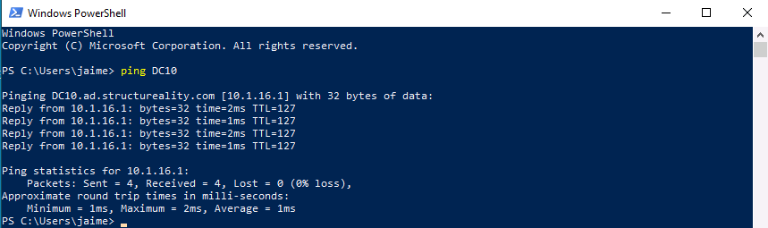
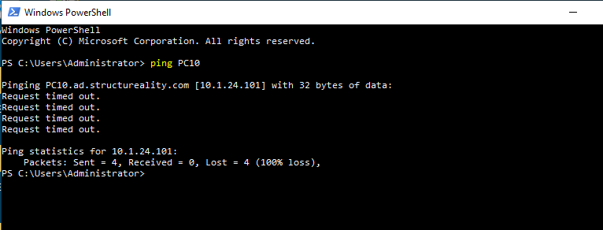
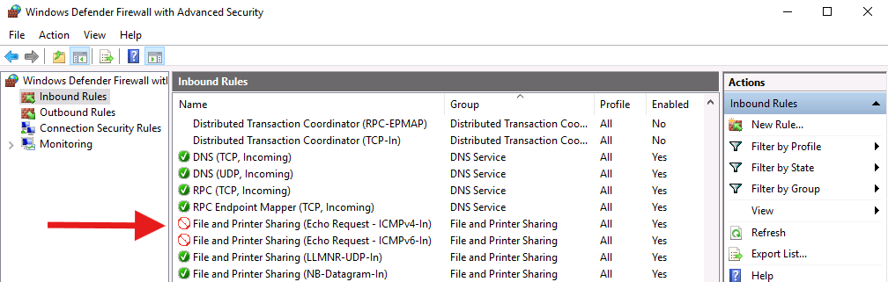
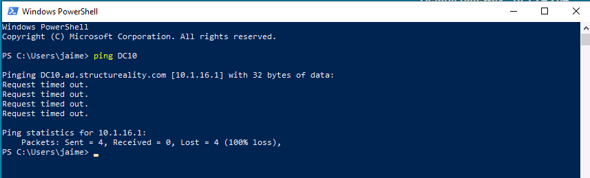
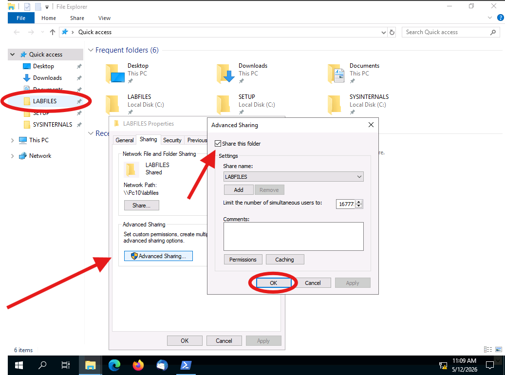
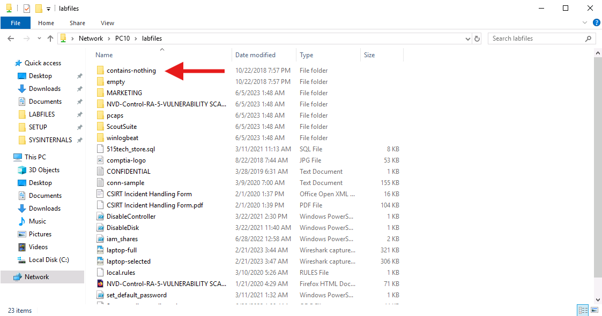
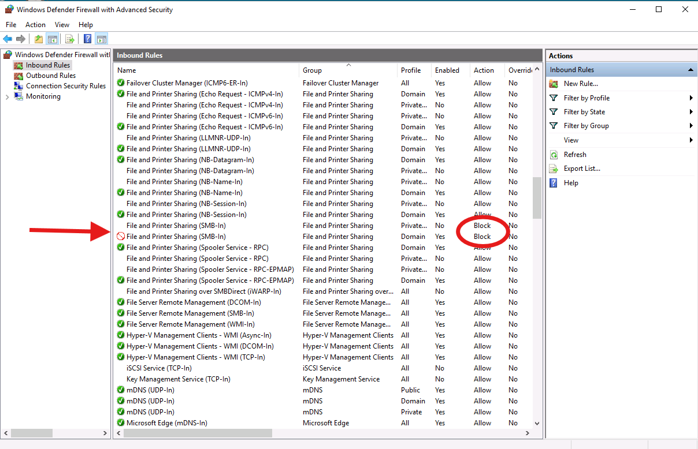
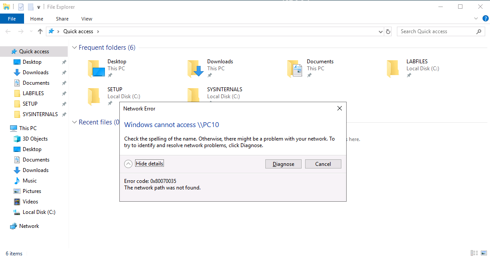

# 🧱 Lab 11 - Implementing a Firewall


---

## 📋 Overview

Two short hardening exercises run back to back on PC10 and DC10. The policy I was working against says ICMP between hosts should be blocked and client systems shouldn't host file shares. The first exercise traces an asymmetric ping result back to a missing firewall rule on DC10 and fixes it with an explicit block. The second exercise creates an SMB share on PC10, proves DC10 can hit it, then blocks the File and Printer Sharing inbound rules on PC10 and confirms the share is no longer reachable.

---

## 🎯 Objectives

- Test bidirectional ICMP connectivity between PC10 and DC10 to identify which host is out of compliance with the no-ping policy
- Configure Windows Defender Firewall on DC10 to block inbound ICMPv4 and ICMPv6 Echo Requests using explicit deny rules
- Create an SMB share on a client system and verify network access from a separate host
- Block File and Printer Sharing on PC10 across both Private and Domain network profiles
- Confirm that explicit block rules override matching allow rules

---

## 🛠️ Tools Used

| Tool | Purpose |
|------|---------|
| Windows Defender Firewall with Advanced Security (`wf.msc`) | Edit inbound rules to block ICMP Echo Requests and SMB-In traffic |
| `ping` | Verify ICMP reachability before and after firewall changes |
| File Explorer | Create the `C:\LABFILES` share and access `\\PC10` from DC10 |

---

## 🗂️ Repository Structure

```
labs/11-implementing-firewall/
├── README.md
└── screenshots/
    ├── 01-pc10-ping-dc10-success.png
    ├── 02-dc10-ping-pc10-timeout.png
    ├── 03-dc10-firewall-icmp-blocked.png
    ├── 04-pc10-ping-dc10-blocked.png
    ├── 05-pc10-labfiles-advanced-sharing.png
    ├── 06-dc10-labfiles-share-access.png
    ├── 07-pc10-firewall-smb-blocked.png
    └── 08-dc10-network-error.png
```

---

## 🛰️ Part 1 - Identifying the ICMP Compliance Gap

Both hosts are in the `ad.structureality.com` domain. The hardening baseline says neither should respond to ICMP Echo Requests. I started on PC10 as Jaime (a Domain Admins member, so local admin on PC10) and pinged DC10 from PowerShell.

```powershell
ping DC10
```



Here I can see four replies from `10.1.16.1` at TTL 127, all under 2ms, 0% loss. DC10 responded, which means DC10 is the host out of compliance. The fact that PC10 can ping at all also tells me PC10's outbound ICMP is permitted, which is normal default behavior.

Next I switched to DC10, signed in as `Structureality\Administrator`, and ran the reverse ping.

```powershell
ping PC10
```



Here I can see four `Request timed out` messages against `10.1.24.101` and 100% packet loss. PC10 is silently dropping the Echo Requests at its firewall, which is exactly what the policy wants. The asymmetry confirmed the gap: PC10 is hardened, DC10 is not.

---

## 🚫 Part 2 - Blocking ICMP on DC10 with an Explicit Deny Rule

The rules that govern ICMP responses live in Windows Defender Firewall with Advanced Security under Inbound Rules. The relevant entries are misleadingly grouped under "File and Printer Sharing" because Echo Request handling has historically been bundled with the SMB stack on Windows, but the rules are the right ones: `File and Printer Sharing (Echo Request - ICMPv4-In)` and `File and Printer Sharing (Echo Request - ICMPv6-In)`.

I opened `wf.msc`, selected Inbound Rules, and walked the two Echo Request rules through Properties → Block the connection → OK. The lab hint specifically called out that disabling an allow rule is not as strong as adding an explicit deny: a block action always wins against any number of permits.



Here I can see both Echo Request rules now show Action `Block` (the red circle icon) instead of the default green check `Allow`. Enabled stays Yes because I want the rule to actively enforce, not sit dormant. The rest of the firewall ruleset is untouched.

Back on PC10, I re-ran `ping DC10` to confirm the change took effect.



Here I can see the same `Request timed out` pattern that DC10 had been getting from PC10 in Part 1. The block is bidirectional in effect: DC10 simply does not send a reply now, so the ping never completes. Both hosts are now consistent with the baseline.

---

## 📁 Part 3 - Hosting a Share on PC10 and Confirming Access

The second exercise tests the policy that client systems shouldn't host file shares. To prove the rule has something to block, I first created a share. On PC10 I right-clicked `C:\LABFILES` in File Explorer, opened Properties → Sharing tab → Advanced Sharing, ticked "Share this folder", and accepted the default share name and permissions.



Here I can see all three pieces of the share creation in one frame: the LABFILES folder pinned to Quick access, the Sharing tab of the Properties window already advertising the Network Path as `\\Pc10\labfiles`, and the Advanced Sharing dialog with "Share this folder" ticked and the share name defaulted to LABFILES. The share is now reachable on the network.

From DC10 I opened File Explorer, typed `\\PC10` into the address bar, and double-clicked `labfiles` to enumerate it.



Here I can see the LABFILES share enumerated from DC10 with 23 items total. The first folder alphabetically is `contains-nothing` (which is the answer to the lab's mid-exercise question), followed by `empty`, `MARKETING`, and the rest. The address bar shows `Network > PC10 > labfiles` which confirms the access is going through the SMB share rather than the local C: drive. The share is accessible from across the network, which is the configuration the policy is supposed to prevent on a client machine like PC10.

---

## 🔒 Part 4 - Blocking File and Printer Sharing on PC10

Back on PC10 I opened `wf.msc` again and located the two `File and Printer Sharing (SMB-In)` rules, one assigned to the Private profile and one to the Domain profile. The Domain profile is the active one on this domain-joined host, so that is the rule that actually enforces against connections from DC10. I right-clicked the Domain entry, set Enabled and Block the connection, then OK.



Here I can see the SMB-In Domain rule now Enabled `Yes` with Action `Block` (the red circle icon). The Private profile SMB-In above it sits configured but disabled, which doesn't affect this scenario because the active profile is Domain. The surrounding green-checked entries are the rest of the File and Printer Sharing group (LLMNR-UDP-In, NB-Datagram-In, NB-Name-In, NB-Session-In, Spooler Service - RPC) which stay Allow because the policy only targets SMB.

From DC10 I retried `\\PC10` in File Explorer. After a one to two minute wait for the SMB connection to time out, Windows surfaced a Network Error.



Here I can see the `Windows cannot access \\PC10` error with error code `0x80070035 - The network path was not found`. Same share, same address bar entry, but the SMB handshake never completes because PC10's firewall drops the inbound connection before port 445 can answer. The LABFILES entry now pinned in DC10's Quick access from the earlier successful access just dead-ends - the cached shortcut still exists, but the underlying network path is gone. The hardening is enforced.

---

## 💡 Key Takeaways

- **Disable is not the same as block.** Disabling an allow rule only removes that one permission. If any other rule in the chain still allows the traffic (and on Windows there are usually several overlapping rules), the communication still goes through. An explicit Block action always wins, regardless of how many Allow rules also match. The DC10 ICMP rules were left Enabled with the Action flipped to Block for exactly this reason.
- **Profile matters.** Windows Defender Firewall applies a different ruleset per network profile (Domain, Private, Public). Only the rule attached to the currently active profile actually enforces. On this domain-joined host the active profile is Domain, so blocking SMB-In on the Domain entry was enough to drop DC10. Hardening for the future though, you'd want to flip the Private and Public entries to Block as well so the rule still enforces if the host ever roams onto a non-domain network.
- **The rule names lie about scope.** "File and Printer Sharing (Echo Request - ICMPv4-In)" sounds like an SMB rule but actually controls ICMP. The grouping is a historical Windows artifact. Reading the rule name and assuming what it does, instead of checking the protocol and port fields, is how this kind of change gets missed during a hardening audit.
- **Asymmetric ping is the cheap canary.** Bidirectional ping testing surfaces firewall drift in seconds. If A can ping B but B can't ping A, the side that drops the reply has a tighter (or different) firewall posture. Useful for catching configuration baseline drift across a fleet without running a full scan.
- **Baseline configuration is the source of truth.** The lab framed both changes as "the policy says X, so I made it match." Risk assessment drives the baseline, the baseline drives the firewall rules. Without a documented baseline a security team is just reacting to alerts instead of enforcing a posture.

---

## ❓ Comprehensive Questions

**1. If a firewall rule is disabled, but the associated communication is still able to occur, what is the reason for this issue?**
One or more other rules must be allowing the communication. Windows Defender Firewall evaluates all matching rules, and any single Allow that matches the traffic will let it through. Disabling one Allow rule among several is rarely enough.

**2. What term refers to a firewall rule that is specifically defined?**
Explicit. An explicit rule is one written intentionally to match specific traffic, in contrast to an implicit rule which catches whatever the explicit rules don't match.

**3. What firewall rule is applied when no other rule matches a communication?**
Implicit. The implicit rule is the default action (typically deny) applied when no explicit rule matches the connection.

**4. What should drive or define the firewall rules implemented by an organization?**
Risk assessment. The threats and impact identified during risk assessment feed the baseline configuration, which then drives the specific rules implemented in the firewall. Frameworks and threat feeds inform that process but don't replace the risk assessment itself.

**5. The primary type of benefit provided by a firewall is?**
Preventive. A firewall stops unwanted traffic from reaching its target in the first place. Detection, deterrence, and correction can be side effects in some configurations, but prevention is the primary control type.

---

## 📚 References

- [Microsoft Docs: Windows Defender Firewall with Advanced Security](https://learn.microsoft.com/en-us/windows/security/operating-system-security/network-security/windows-firewall/)
- [Microsoft Docs: Configure rules with group policy](https://learn.microsoft.com/en-us/windows/security/operating-system-security/network-security/windows-firewall/configure-rules-with-gpo)
- CompTIA Security+ Objectives 3.2, 4.5

---

*CompTIA Security+ SY0-701 | CertMaster Learn | Lab 11 of 22*
