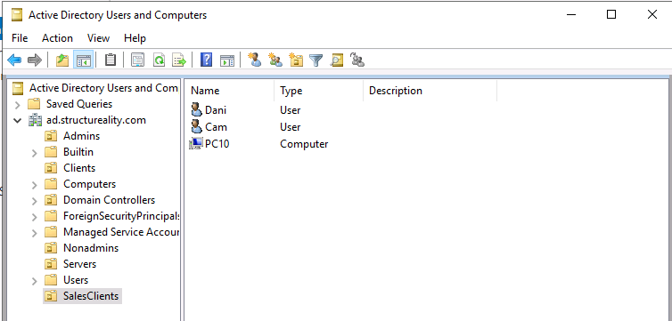
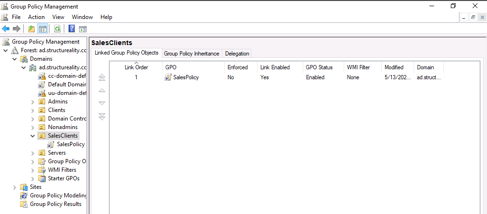
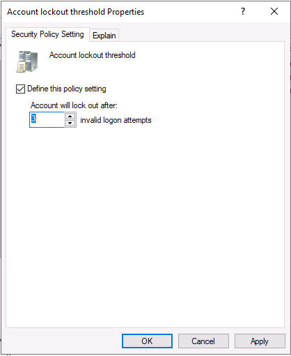
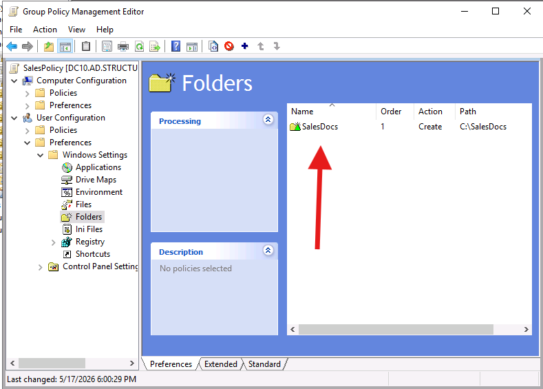
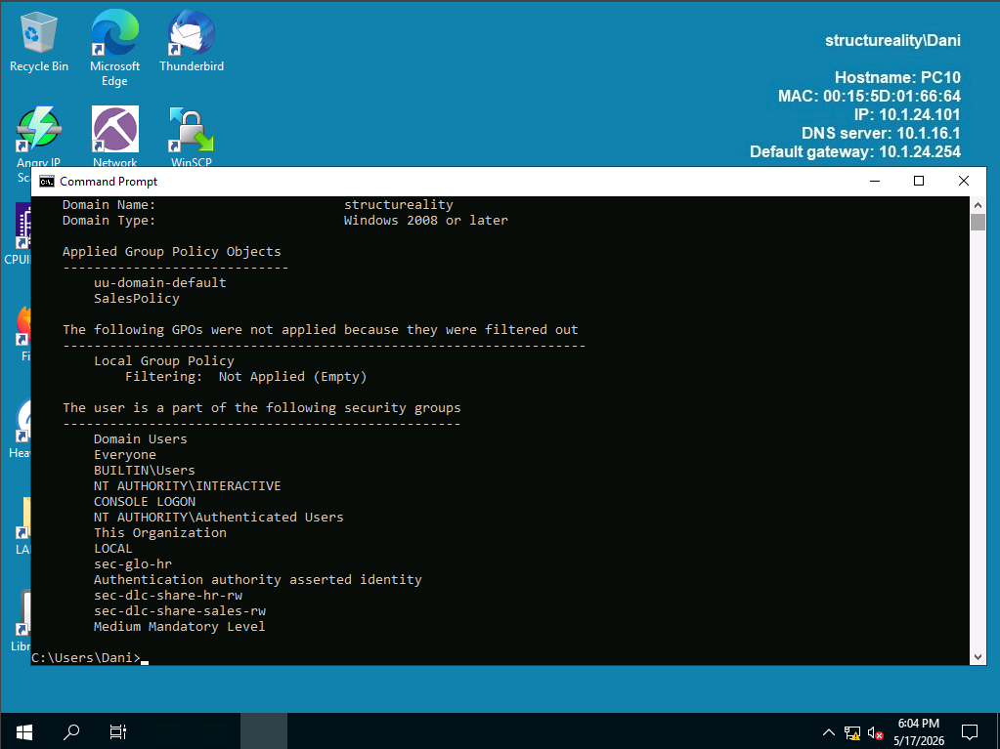
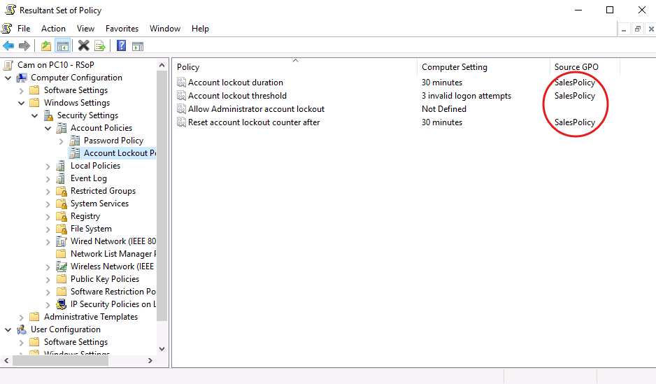
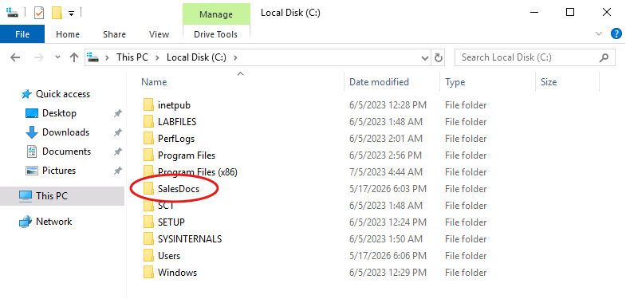
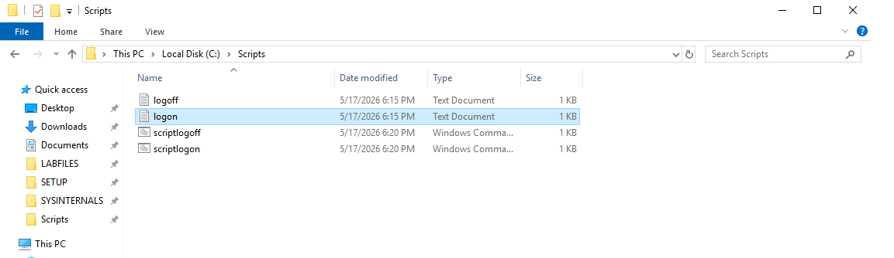
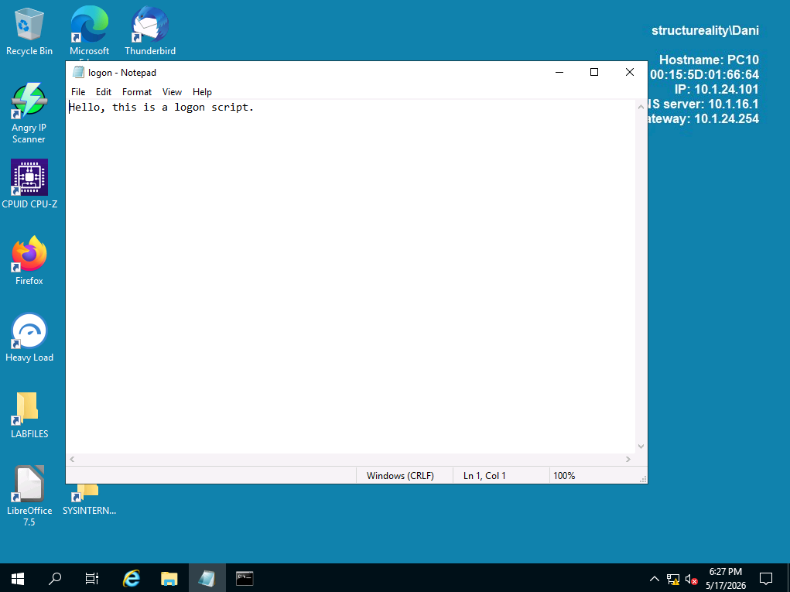

# ⚙️ Lab 12 - Using Group Policy


---

## 📋 Overview

As a security team member at Structureality Inc., I was tasked with using Group Policy to enforce security settings on a newly established sales division. The lab ran through five connected pieces of work: creating a new organizational unit and moving the relevant user, admin, and computer objects into it, creating and linking a GPO to the OU, defining account lockout and folder creation settings, verifying those settings actually reached the target client, and finally wiring logon and logoff scripts into the GPO and watching them fire on the client.

---

## 🎯 Objectives

- Create an Active Directory organizational unit and populate it with user, admin, and computer objects
- Create a Group Policy Object, link it to an OU, and define both Computer Configuration and User Configuration settings
- Use `gpresult /r` and `rsop` to verify which GPOs and which specific settings are reaching a client
- Build a shared scripts repository on a domain controller and reference it via UNC path in GPO script settings
- Configure logon and logoff scripts through Group Policy and confirm they execute on the target client

---

## 🛠️ Tools Used

| Tool | Purpose |
|------|---------|
| Active Directory Users and Computers (ADUC) | Create the SalesClients OU and move Dani, Cam, and PC10 into it |
| Group Policy Management Console (GPMC) | Create the SalesPolicy GPO and link it to the SalesClients OU |
| Group Policy Management Editor | Define account lockout threshold, folder preferences, and logon/logoff scripts |
| `gpresult /r` | Display the GPOs currently applied to a user or computer at a Windows client |
| `rsop` | Open the Resultant Set of Policy report to confirm which GPO is the source of each effective setting |
| File Explorer + SMB share | Host the script files on `\\DC10\scripts` so the GPO can reference them by UNC path |

---

## 🗂️ Repository Structure

```
labs/12-group-policy/
├── README.md
└── screenshots/
    ├── 01-aduc-salesclients-ou-members.png
    ├── 02-gpmc-salespolicy-linked.png
    ├── 03-gpo-account-lockout-3.png
    ├── 04-gpo-folders-preference-salesdocs.png
    ├── 05-pc10-gpresult-dani.png
    ├── 06-pc10-gpresult-cam.png
    ├── 07-pc10-rsop-account-lockout.png
    ├── 08-pc10-salesdocs-created.png
    ├── 09-dc10-scripts-folder.png
    └── 10-pc10-logon-script-popup.png
```

---

## 🏢 Part 1 - Creating the SalesClients OU and Moving Objects In

The sales division needed its own organizational unit so security settings could be scoped to its members without bleeding over to the rest of the domain. From DC10 I opened Server Manager > Tools > Active Directory Users and Computers, right-clicked `ad.structureality.com`, and created a new OU named `SalesClients`. AD objects can only be members of one OU at a time, so moving an account into SalesClients implicitly removes it from wherever it sat before.

I moved three objects into the new OU: `Dani` (a standard user pulled from the Nonadmins container), `Cam` (a domain admin pulled from the Admins container), and `PC10` (the client computer pulled from the Clients container). Each move was right-click > Move > select SalesClients > OK.



Here I can see the SalesClients OU populated with all three objects. Note that ADUC labels Cam as a User type alongside Dani, even though Cam holds Domain Admins membership. That distinction is a group membership concern, not an object-type concern, which is why both show as User in this view.

---

## 🔗 Part 2 - Creating and Linking the SalesPolicy GPO

In Group Policy Management Console I expanded Forest > Domains > ad.structureality.com and right-clicked the new SalesClients OU. `Create a GPO in this domain, and Link it here` is the single-step option that both registers a new GPO in the domain's policy store and links it to the selected scope. I named the new policy `SalesPolicy`.



Here I can see SalesPolicy is the only GPO linked to the SalesClients OU with Link Order 1. The cc-domain-default and uu-domain-default GPOs above are linked at the domain level, which means they apply to every OU below them as well, so the effective policy on SalesClients members is the combined result of those domain-level GPOs plus SalesPolicy.

I then right-clicked SalesPolicy > Edit to open the Group Policy Management Editor and configure two distinct settings: one on the Computer Configuration side and one on the User Configuration side.

The first setting was an account lockout threshold. Under Computer Configuration > Policies > Windows Settings > Security Settings > Account Policies > Account Lockout Policy, I opened the `Account lockout threshold` properties, checked "Define this policy setting", and entered `3` invalid login attempts.



Here I can see the lockout threshold defined at 3 attempts. Windows offers a Suggested Value Changes confirmation after saving this, because setting a threshold also implicitly enables related defaults like the account lockout duration. Accepting the suggested values keeps those companion settings in line with the new threshold.

The second setting used the Preferences node instead of the Policies node. Preferences are looser than policies: they apply once at logon and the user can change them later, while policies enforce continuously. Under User Configuration > Preferences > Windows Settings > Folders I added a new Folder entry with Action set to Create and the Path set to `C:\SalesDocs`.



Here I can see the Folders preference configured. Action `Create` means the folder is created if it doesn't exist but isn't removed if the user later deletes it, which is the right behavior for a starter directory.

---

## 🖥️ Part 3 - Verifying the GPO Reached PC10

I switched to PC10 and rebooted from the sign-in screen. The reboot forces a fresh secure channel to the domain controller and triggers a full GPO refresh, which matters because the SalesPolicy didn't exist when PC10 originally started.

After the reboot I signed in as Dani (the standard user) and opened an unelevated Command Prompt. `gpresult /r` prints the Resultant Set of Policy summary for the current context.



Here I can see the visible portion of the user-context `gpresult /r` output with `uu-domain-default` and `SalesPolicy` both listed under Applied Group Policy Objects. The system info overlay in the top right corner confirms this is PC10 (`10.1.24.101`) and the active user is `structureality\Dani`. The full output also includes security group membership for Dani (Domain Users, Everyone, sec-glo-hr, sec-dlc-share-hr-rw, sec-dlc-share-sales-rw), which is how Group Policy filters which GPO settings actually apply at session time. The COMPUTER SETTINGS section that would normally appear above is absent for Dani because a standard user account does not have the privileges needed to query computer-side policy.

To see the full picture I signed out and signed back in as Cam (the admin). This time I right-clicked Command Prompt and chose Run as administrator. `gpresult /r` from an elevated context returned both the COMPUTER SETTINGS and USER SETTINGS sections.


Here I can see Cam's USER SETTINGS section with the distinguished name `CN=Cam,OU=SalesClients,DC=ad,DC=structureality,DC=com`. That DN string is the proof that AD resolved Cam through the new SalesClients OU rather than the original Admins container. The Applied Group Policy Objects list confirms SalesPolicy is reaching Cam. The title bar reads `Administrator: Command Prompt` (elevated context), which is also what unlocks the COMPUTER SETTINGS section that scrolls above this view but isn't visible here. Cam's security group membership at the bottom includes `BUILTIN\Administrators`, `LocalAdmin`, and `Domain Admins`, which is what gave the elevated `cmd.exe` the rights to query the machine-side policy in the first place.

`gpresult` is great for a fast list, but to confirm exactly which GPO is the Source of a specific effective setting I used `rsop`. The Resultant Set of Policy tool opens an MMC view that mirrors the Group Policy Editor layout, with a Source GPO column showing which policy contributed each setting.



Here I can see the three Account Lockout Policy entries (Account lockout duration, Account lockout threshold, Reset account lockout counter after) all sourced from SalesPolicy. The Allow Administrator account lockout entry has no value in the Source GPO column because I didn't define it in SalesPolicy. RSOP shows the merged final state plus attribution, which is the report you want when troubleshooting why a setting is or isn't being applied to a specific user on a specific computer.

The folder preference side of the GPO had also done its job. File Explorer on PC10 showed `C:\SalesDocs` already present.



Here I can see SalesDocs sitting at the C: drive root. No user action created it - the GPO preference applied at Cam's logon and the folder appeared.

---

## 📜 Part 4 - Building the Logon and Logoff Scripts on DC10

Back on DC10 I built a `C:\scripts` directory, shared it as `\\DC10\scripts` with Everyone Full Control on the share permissions, and populated it with two text files and two `.cmd` wrappers.

The two text files (`logon.txt` and `logoff.txt`) held the messages the lab wanted displayed at session start and end. The two `.cmd` files used `echo` redirection so the file extension stayed `.cmd` rather than `.txt`:

```cmd
echo \\DC10\scripts\logon.txt > c:\scripts\scriptlogon.cmd
echo \\DC10\scripts\logoff.txt > c:\scripts\scriptlogoff.cmd
```

Each `.cmd` file is one line: the UNC path to its matching `.txt` file. When Windows runs the `.cmd` at logon or logoff, it executes that line, which opens the `.txt` in the default handler (Notepad) and surfaces the message.



Here I can see all four files in place. The UNC path reference inside the `.cmd` files matters: defining the script paths as UNC instead of absolute local paths means the GPO works even if a sales user logs in from a different domain-joined computer where `C:\scripts` doesn't exist locally. The script reaches back to DC10 for the actual content.

---

## 🚀 Part 5 - Wiring Scripts into SalesPolicy and Testing on PC10

In the Group Policy Management Editor for SalesPolicy I opened User Configuration > Policies > Windows Settings > Scripts (Logon/Logoff). Double-clicking Logon and adding `\\DC10\scripts\scriptlogon.cmd` attached the script to the logon event. Same process for Logoff with `\\DC10\scripts\scriptlogoff.cmd`.

I also enabled `Display instructions in logoff scripts as they run` under User Configuration > Policies > Administrative Templates > System > Scripts. Without that policy the logoff script runs invisibly behind the sign-out screen, which is fine in production but defeats the lab's verification step.

After rebooting PC10 and signing in as Dani, the logon script fired before the desktop fully loaded.



Here I can see Notepad surfaced by the logon script with the expected message. Closing the Notepad window allows the rest of the logon sequence to finish. Signing out as Dani triggered the logoff script in the same way: a Command Prompt window briefly appeared, then Notepad opened with the logoff message, and only after closing Notepad did the session finish signing out.

---

## 💡 Key Takeaways

- **OU scope drives GPO scope.** A GPO does nothing on its own. It has to be linked to a site, domain, or OU, and the link defines the population that the GPO affects. Moving a user or computer between OUs changes which GPOs apply to it, often without warning to the affected user. This is also how AD admins implement least-privilege configurations: keep the SalesClients GPO tight, keep an Executives GPO tighter, and never link either at the domain root.
- **Computer Configuration and User Configuration are separate halves of every GPO.** Account Lockout lives on the Computer side because it governs the machine's authentication subsystem. Folder preferences and Logon/Logoff scripts live on the User side because they apply per-user at session boundaries. Knowing which half a setting belongs to is half the battle of finding it in the editor.
- **Preferences are not Policies.** Preferences (the green icons) apply once at logon and the user can revert them. Policies (the regular icons) enforce continuously. The lab's SalesDocs folder is a preference, which is why it's marked Action: Create rather than Action: Replace. Hardening settings should generally use Policies, not Preferences, because Preferences can be undone by a user with local write access.
- **`gpresult /r` answers "which GPOs", `rsop` answers "which settings came from where".** Use both. `gpresult` is the fast scan when you're on a remote support call. `rsop` is the full report when you actually need to debug an unexpected effective configuration.
- **UNC over absolute paths for scripts.** A logon script defined as `C:\scripts\scriptlogon.cmd` will fail silently on any client where that local path doesn't exist. A UNC path like `\\DC10\scripts\scriptlogon.cmd` works on every domain-joined client that can reach DC10. The pattern generalizes: any time a GPO references a file, that reference should be reachable from every machine the GPO applies to.

---

## ❓ Comprehensive Questions

**1. What can be set as a member of an OU? (Select all that apply)**
Computers and Users. OUs hold AD object types that can be authenticated and managed by Group Policy. Subnets and VLANs are network-layer concepts tracked in Active Directory Sites and Services, not OUs. Software is deployed *through* a GPO that's linked to an OU but is not itself an OU member.

**2. Which of the following is a true statement?**
A GPO can be linked to an OU. GPOs can be linked to OUs, domains, or sites, and a single OU can have multiple linked GPOs whose settings combine according to processing order. The other options misstate the constraints.

**3. Which of the following is a true statement?**
A GPO can contain settings to affect either users or computers or both. Every GPO has both a Computer Configuration tree and a User Configuration tree, and an administrator can populate either side, both sides, or neither. The half that doesn't apply to a given target (e.g. Computer settings on a user-only target) is simply ignored.

**4. What does the command gpresult do?**
Displays the GPO policies currently affecting the system. `gpresult /r` prints the resultant set of policy summary; it does not edit, block, or update policies. Updates come from `gpupdate`.

**5. What tool can be used to display the effective configuration of a system after any/all GPOs are applied to it?**
Resultant Set of Policy (RSOP). RSOP gives the full effective configuration view with Source GPO attribution per setting. WMI filters scope GPO application; the MMC security snap-in edits local policy; `gpupdate` refreshes policy from AD.

---

## 📚 References

- [Microsoft Docs: Group Policy Management Console](https://learn.microsoft.com/en-us/previous-versions/windows/desktop/gpmc/group-policy-management-console-portal)
- [Microsoft Docs: gpresult command reference](https://learn.microsoft.com/en-us/windows-server/administration/windows-commands/gpresult)
- [Microsoft Docs: Account Lockout Policy](https://learn.microsoft.com/en-us/windows/security/threat-protection/security-policy-settings/account-lockout-policy)
- CompTIA Security+ Objectives 4.5, 4.7

---

*CompTIA Security+ SY0-701 | CertMaster Learn | Lab 12 of 22*
