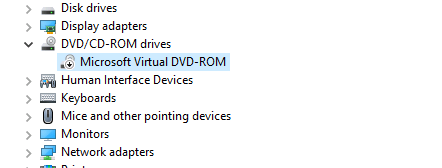
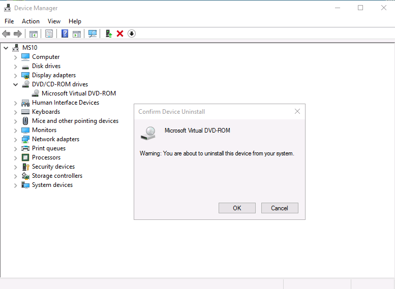
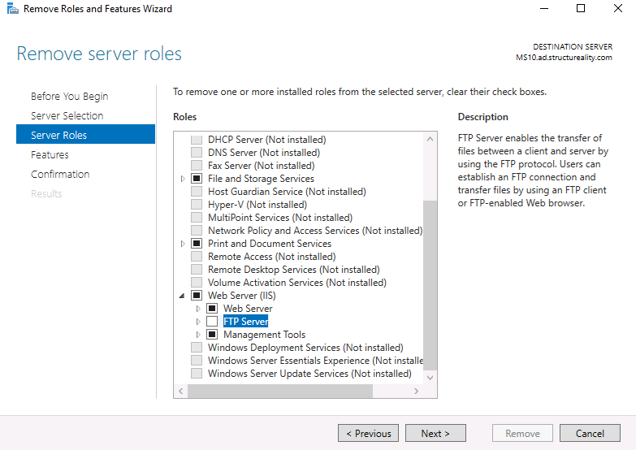

# 🛠️ Lab 13 - Hardening


---

## 📋 Overview

Three short hardening exercises across two machines. As a security team member at Structureality Inc., I was tasked with reducing the attack surface of MS10 (a Windows Server 2016 host) by cleaning up unwanted device drivers and removing unneeded software and roles, then validating on a Kali management workstation how the local `/etc/hosts` file can be used to override DNS resolution either as a defensive control or as the foundation for a name resolution attack.

---

## 🎯 Objectives

- Use Device Manager to scan for hardware changes, update a driver, disable and re-enable a device, and uninstall and reinstall a device driver
- Uninstall a third-party application via Programs and Features
- Remove an insecure Windows Server role (FTP Server) through the Remove Roles and Features Wizard
- Demonstrate that a local `/etc/hosts` entry takes precedence over DNS by breaking and restoring name resolution for `juiceshop.local`
- Confirm that `wget` follows hosts file resolution rather than upstream DNS even when the local entry is wrong

---

## 🛠️ Tools Used

| Tool | Purpose |
|------|---------|
| Device Manager | Manage device drivers on MS10: scan, update, disable, uninstall |
| Programs and Features | Uninstall the CPUID third-party application |
| Server Manager > Remove Roles and Features Wizard | Remove the FTP Server role and its FTP Service feature from MS10 |
| `wget` | Verify HTTP reachability of `juiceshop.local` before and after each `/etc/hosts` edit |
| `nano` | Edit `/etc/hosts` to introduce and then revert a name resolution change |
| `cat` | Inspect the contents of `/etc/hosts` |

---

## 🗂️ Repository Structure

```
labs/13-hardening/
├── README.md
└── screenshots/
    ├── 01-ms10-devmgr-dvdrom-disabled.png
    ├── 02-ms10-devmgr-uninstall-confirm.png
    ├── 03-ms10-remove-roles-ftp-unchecked.png
    ├── 04-ms10-remove-roles-success.png
    ├── 05-kali-hosts-baseline.png
    └── 06-kali-hosts-redirected.png
```

---

## 🔌 Part 1 - Device Driver Management on MS10

Hardening starts with knowing what's attached. The first task was to walk Device Manager through its full lifecycle of actions against a single device: scan for hardware changes, update its driver, disable it, re-enable it, uninstall it, and rescan to see whether it comes back. I used the Microsoft Virtual DVD-ROM under DVD/CD-ROM drives as the target because it's a synthetic device that's safe to cycle.

`Action > Scan for hardware changes` is the manual trigger for the same enumeration that runs automatically at boot and when a USB device is plugged in. It surfaces anything Windows can see on the bus that doesn't already have a corresponding device node.

Updating the driver from `Search automatically for drivers` checks Windows Update for a newer signed driver. In the lab environment the device was already on the latest driver, so the wizard returned the "best driver is already installed" message. In a real hardening engagement, this is the step where you'd find devices stuck on outdated drivers and pull updates from the vendor.

Right-click > Disable device toggles the device off without removing the driver. Windows marks the device with a downward arrow icon in the tree.



Here I can see the Microsoft Virtual DVD-ROM with the downward arrow overlay that indicates the device is disabled. The device node and driver are still installed, just not active. The driver will reload on reboot if it's re-enabled or if a process specifically requests the device class. Disable is the right choice when you want to keep the driver available for fast re-enablement.

Right-click > Uninstall device is the heavier action. It removes the driver and the device node from the running configuration.



Here I can see the Confirm Device Uninstall dialog. After clicking OK, the device disappears from the tree. But on the very next `Scan for hardware changes`, the device reappears - because the underlying virtual hardware is still attached, Windows enumerates it again and re-installs a fresh driver from its driver store. That's the key uninstall caveat: if the device is physically (or virtually) still present, uninstall is only effective until the next hardware scan. Permanent removal requires either physically removing the hardware or disabling it at a lower layer (firmware, hypervisor, group policy). For a maliciously planted driver with no matching hardware, uninstall is permanent because there's nothing for Windows to re-enumerate against.

---

## 📦 Part 2 - Removing Unneeded Applications and Services

System hardening also covers anything sitting in the userland or service layer that's not justified by a business requirement. The lab pointed at two examples on MS10: a third-party utility (CPUID / CPU-Z) and a built-in Windows Server role (FTP Server).

CPUID came off through Control Panel > Programs and Features > right-click > Uninstall. Straightforward, and worth running on any production system as part of routine hygiene. The third-party application inventory is usually where unsanctioned software accumulates.

The FTP role is the more substantive removal. FTP is a plaintext protocol: credentials and file contents both transit the wire unencrypted. There's no version of "secured FTP" - FTPS adds TLS but is a separate, optional add-on that has to be explicitly configured, and the lab's FTP Server role wasn't running it. Leaving the role installed even with no active FTP site is still a hardening violation because the service binaries and listener stubs are on disk and could be enabled by a misconfiguration or an attacker with admin rights.

From Server Manager > Manage > Remove Roles and Features, I clicked through Before You Begin and Server Selection (MS10 was the only server in the pool) and landed on Server Roles. Expanding Web Server (IIS) exposed three sub-roles: Web Server, FTP Server, and Management Tools. I unchecked FTP Server only - the goal was to remove FTP without disturbing the rest of the IIS install.



Here I can see the Server Roles page with FTP Server unchecked under Web Server (IIS). The description pane on the right summarizes what FTP Server does, which is helpful context when you're auditing a role you haven't touched in a while. No dependent-features popup appeared for this removal because FTP Service and FTP Extensibility are bundled inside the FTP Server sub-role rather than being separate dependencies.

After Next through Features and Confirmation, then Remove, the wizard ran the removal and landed on the Results page.


Here I can see the Results page with the warning triangle and "A restart is pending on MS10.ad.structureality.com" message. The role and its FTP Service feature are removed at the configuration level, but the running service binaries are still loaded in memory and will not be fully evicted until the server reboots. This is worth flagging: a hardening change can be configured correctly and still not be enforced at runtime. A scan immediately after this state could still detect FTP listening on port 21 until the box cycles. Production hardening changes need to be paired with scheduled reboot windows or service-restart playbooks, otherwise they create a false sense of security.

---

## 🌐 Part 3 - Manipulating /etc/hosts on Kali

The third exercise moved to Kali to demonstrate that local name resolution beats DNS every time. The `/etc/hosts` file is the first lookup any modern resolver consults before going to a DNS server, by default on every major OS. That makes it both a defensive control (block access to known-bad domains by mapping them to `127.0.0.1` or `0.0.0.0`) and an attacker's foothold (write an entry to redirect a domain to a malicious server).

The baseline test fetched `juiceshop.local` and inspected the existing hosts file.

```bash
wget juiceshop.local
cat /etc/hosts
```


Here I can see `wget` resolving `juiceshop.local` to `203.0.113.228`, connecting on port 80, and saving the response as `index.html` (1987 bytes, 1.94K). The `cat` below confirms the source of that resolution: the lab pre-populated `/etc/hosts` with the line `203.0.113.228 juiceshop.local`. There's no DNS server in this environment serving `juiceshop.local` - the hosts file is what makes the FQDN resolvable at all. That's the first part of the lesson: if I delete this line, `juiceshop.local` becomes unreachable. If I change the IP, traffic goes wherever I point it.

I then edited the file in `nano` and changed the IP to `203.0.113.249`, a non-existent destination. The follow-up `wget juiceshop.local` failed or hung waiting for a response from a server that doesn't answer. This is the "block by bad mapping" attack/defense pattern in its simplest form: replace a real IP with a dead one and the FQDN is functionally unreachable from this host.

After confirming the break, I edited again and set the line back to `203.0.113.228 juiceshop.local` to restore working resolution.


Here I can see `wget` succeeding again now that the IP is back to the working one. The download saved as `index.html.1` rather than overwriting the original because `wget` auto-increments the filename when the target already exists on disk - which is itself a useful detail: `wget` will not silently clobber a file you already fetched, so two `wget` runs of the same URL leave both copies in place for comparison. The `ls` output confirms both files are sitting in the home directory.

The take-home is the precedence: `wget` consulted `/etc/hosts` first and never made it to DNS. Anything that breaks (or rewrites) that file changes name resolution for the entire host with no network-side signal. From a defender's standpoint, monitoring `/etc/hosts` for unauthorized modifications is a basic endpoint integrity control. From an attacker's standpoint, write access to that file is enough to redirect any application that resolves a hostname.

---

## 💡 Key Takeaways

- **Hardening is iterative remove and update, not a single pass.** The lab opened with this point and the FTP removal illustrated why: you can pull a role, but the runtime artifacts persist until a reboot, and the next patch cycle may put surface back. Hardening as a one-time project is a hardening engagement that's going to drift within a quarter.
- **Disable preserves the driver, uninstall removes it - but neither survives the next hardware scan if the device is still attached.** This matters for VMs and any hypervisor-attached device. The only way to keep a virtual device gone is to remove it from the VM definition, or to enforce a group policy that blocks driver installation for that device class.
- **FTP itself is the vulnerability, not its configuration.** Plaintext credentials and plaintext file contents are inherent to the protocol. Hardening checklists that say "secure FTP" usually mean "remove FTP and use SFTP or HTTPS instead." Leaving the role installed but inactive is still a finding because the binaries are on disk.
- **A configured hardening change isn't an enforced one.** The Remove Roles wizard's pending-restart warning is the canonical example. A vulnerability scan run between the change and the reboot will still flag FTP. Hardening changes need a paired verification step that confirms the listener is actually gone, not just that the role is unchecked.
- **`/etc/hosts` is upstream of DNS.** Every common resolver consults it first by default. That's why the hosts file is one of the most common targets for both malware (redirect banking domains) and ad blockers (map known ad servers to 127.0.0.1). Monitoring file integrity on `/etc/hosts` belongs in an endpoint baseline, and on Windows the equivalent file at `C:\Windows\System32\drivers\etc\hosts` deserves the same treatment.

---

## ❓ Comprehensive Questions

**1. What are the two primary aspects of system hardening?**
Update and Remove. Update covers patching, driver refreshes, and policy enforcement. Remove covers unneeded devices, applications, services, accounts, and protocols. The lab itself opens by calling out that real hardening is rarely one-and-done - it's a back-and-forth between the two until the system reaches the target posture.

**2. Which of the following are important aspects that may be performed while hardening a system?**
All of them: installing updates, removing unneeded devices, removing insecure services, adjusting DNS resolution, setting file permissions, uninstalling software, and setting firewall rules. Hardening touches every layer of the system, not just one.

**3. What are the two means by which you can access the Add Roles and Features Wizard within Windows Server?**
Server Manager (Manage menu > Add Roles and Features, or the Dashboard's Quick Start tile) and Programs and Features (the "Turn Windows features on or off" link on Windows Server launches the same wizard rather than the client-OS Windows Features dialog).

**4. Why should you consider altering the hosts file?**
To force the resolution of a FQDN to a specific IP address, to remove a false FQDN to IP mapping, and to prevent the resolution of a specific FQDN. The hosts file is local to the machine, so it cannot be used to distribute mappings publicly - that's what DNS does.

**5. Sometimes a native or default application, device driver, or protocol needs to be removed when hardening a system.**
True. The FTP Server role in this lab is a built-in Windows Server feature, not third-party software, and it still needs to come off because the protocol itself is insecure. Hardening doesn't get to skip native components just because they shipped with the OS.

---

## 📚 References

- [Microsoft Docs: Manage devices with Device Manager](https://learn.microsoft.com/en-us/windows/client-management/device-management-overview)
- [Microsoft Docs: Install or Uninstall Roles, Role Services, or Features](https://learn.microsoft.com/en-us/windows-server/administration/server-manager/install-or-uninstall-roles-role-services-or-features)
- [Linux man page: hosts(5)](https://man7.org/linux/man-pages/man5/hosts.5.html)
- CompTIA Security+ Objectives 2.5, 3.2, 4.1

---

*CompTIA Security+ SY0-701 | CertMaster Learn | Lab 13 of 22*
