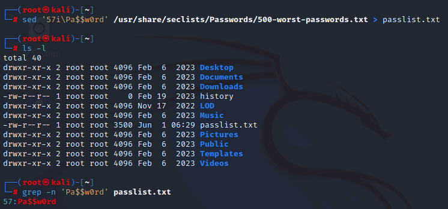
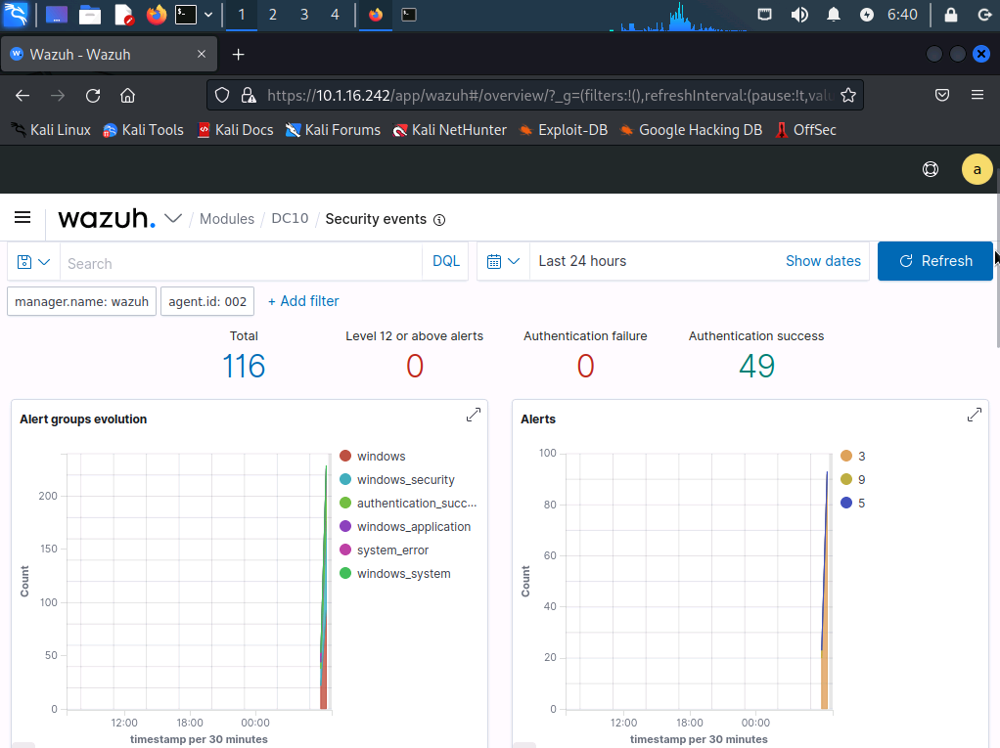
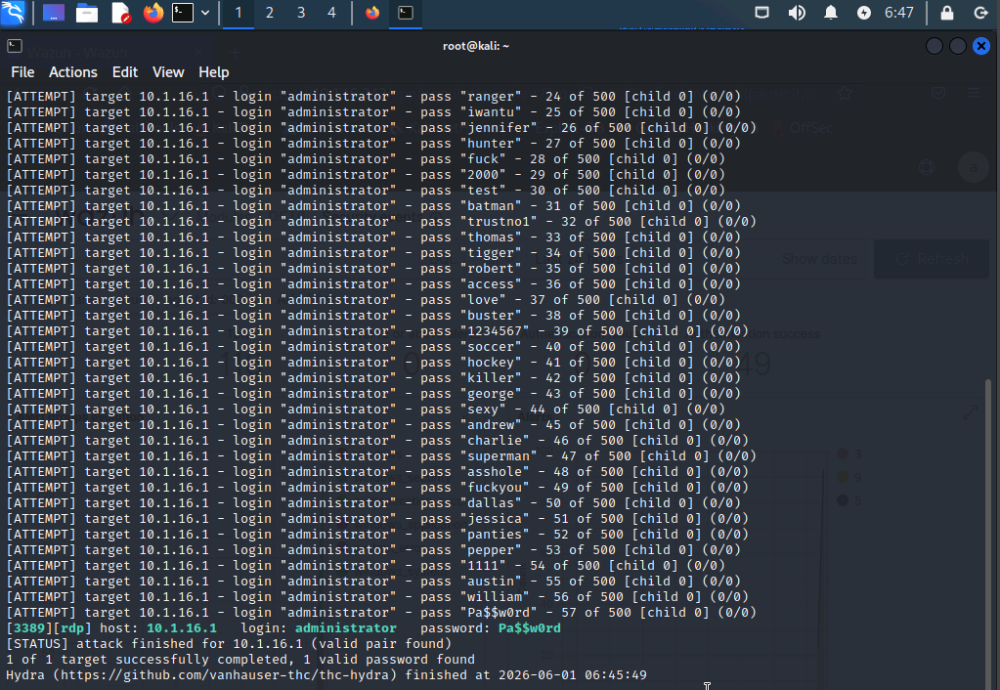
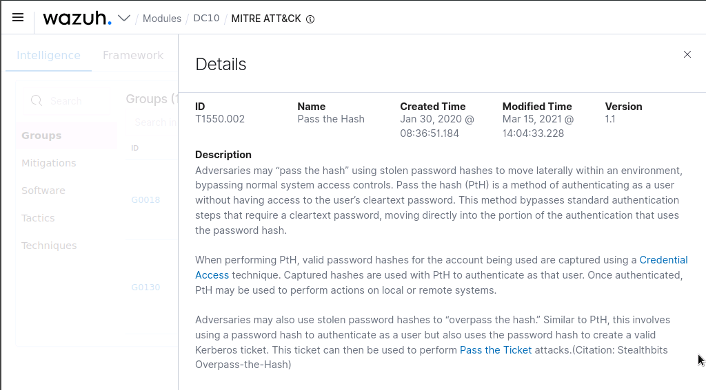
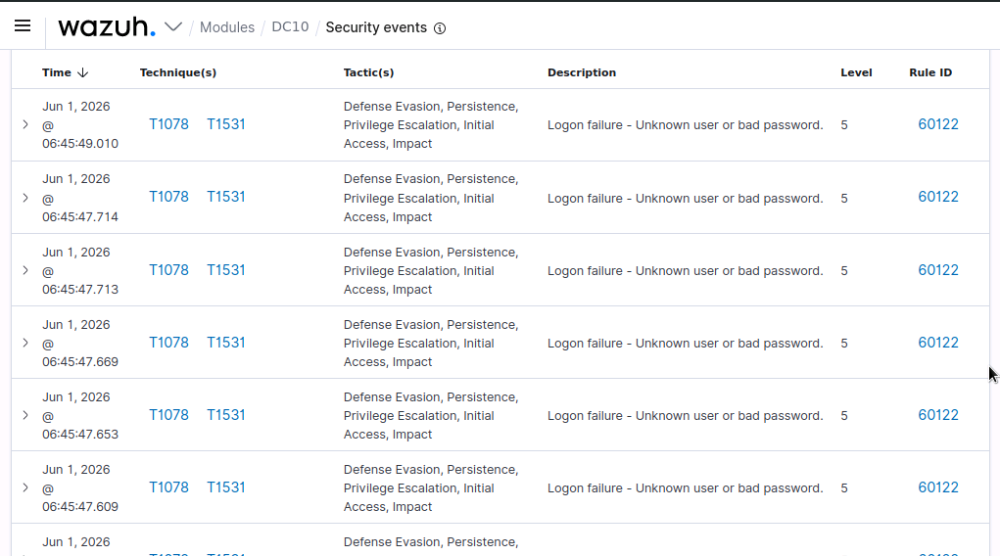
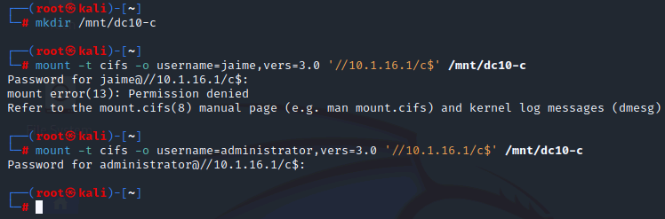
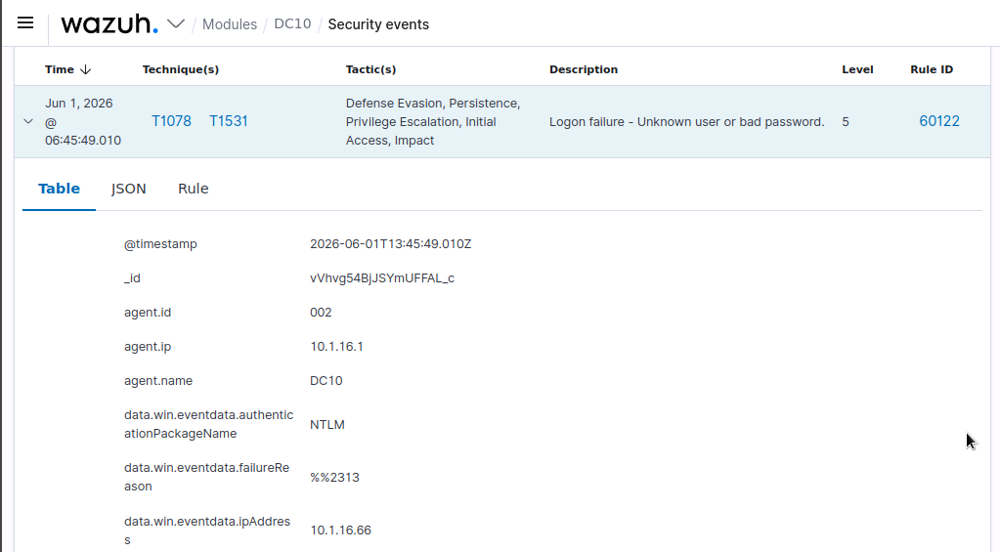
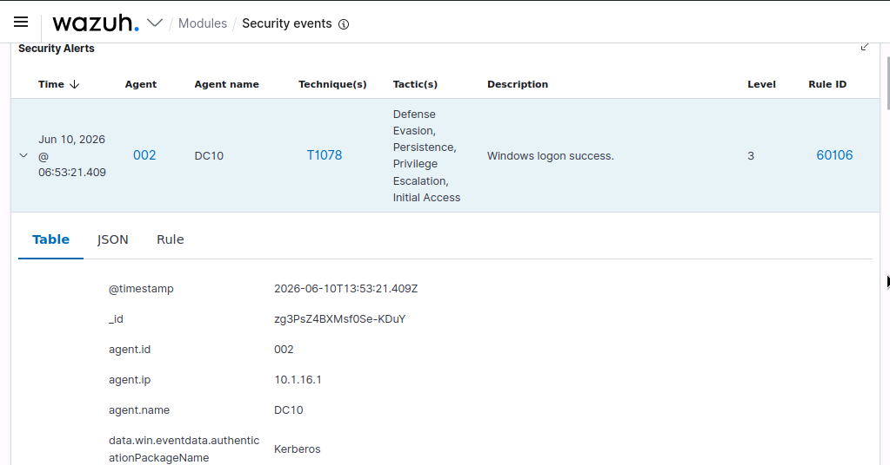
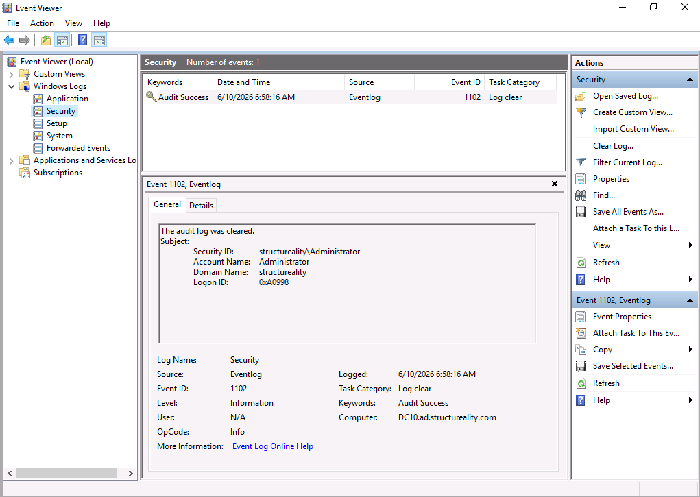

# 🚨 Lab 14 - Incident Response Detection


---

## 📋 Overview

This applied lab covered the detection phase of an incident response plan. Working from a Kali Linux security workstation on Structureality's server subnet, I used wazuh - an open-source platform that functions as a SIEM, an IDS, and a SOAR solution in one - to detect indicators of compromise generated by my own simulated attacks against DC10, a Windows Server 2019 domain controller. I ran two logon-based attacks (a dictionary password-guessing attack over RDP and a pair of administrative share mounts), then cleared a Windows event log to simulate anti-forensics, and confirmed in each case what wazuh detected and how accurately it described the activity.

---

## 🎯 Objectives

- Build a custom password list and run a dictionary-based password-guessing attack with Hydra against the RDP service
- Attempt to mount a Windows administrative share (C$) with both unauthorized and authorized credentials
- Use the wazuh interface to scope Security events to a single agent and locate alerts by Rule ID
- Map detected events to MITRE ATT&CK techniques and recognize when an auto-applied technique is inaccurate
- Clear a Windows Security event log to simulate anti-forensics and confirm wazuh detects the deletion
- Connect this activity to the Detection phase of an incident response plan

---

## 🛠️ Tools Used

| Tool | Purpose |
|------|---------|
| wazuh | Open-source SIEM/IDS/SOAR; reviewed Security events, scoped by agent, searched alerts by Rule ID |
| Hydra | Dictionary-based password-guessing attack against the RDP service on DC10 |
| `mount` (CIFS) | Attempt to mount the DC10 C$ administrative share with unauthorized and authorized accounts |
| `sed` / `grep` / `ls` | Build the custom password list and verify the lab password was inserted at the right line |
| Firefox | Access the wazuh web interface from Kali |
| Event Viewer | Clear the Windows Security log on DC10 to simulate anti-forensic log destruction |

---

## 🗂️ Repository Structure

```
labs/14-incident-response-detection/
├── README.md
└── screenshots/
    ├── 01-kali-passlist-confirm.png
    ├── 02-wazuh-dc10-agent.png
    ├── 03-kali-hydra-rdp.png
    ├── 04-wazuh-rule-92652.png
    ├── 05-wazuh-92652-technique.png
    ├── 06-wazuh-rule-60122.png
    ├── 07-kali-mount-attempts.png
    ├── 08-wazuh-mount-60122.png
    ├── 09-wazuh-mount-60106.png
    ├── 10-dc10-clear-security-log.png
    └── 11-wazuh-rule-63103.png
```

---

## 🧰 Part 1 - Preparing the Attack and Accessing wazuh

The lab front-loads the attack preparation on purpose: wazuh needs several minutes to bring all of its components online, so building the attack tooling first gives the platform time to finish loading. The first task built the wordlist Hydra would use.

```bash
sed '57i\Pa$$w0rd' /usr/share/seclists/Passwords/500-worst-passwords.txt > passlist.txt
ls -l
grep -n 'Pa$$w0rd' passlist.txt
```

The `sed` command inserts the real lab password (`Pa$$w0rd`) at line 57 of SecLists' `500-worst-passwords.txt` file and writes the result to `/root/passlist.txt`. The source file is a known weak-password dictionary; on its own it would never contain the lab's password, so the password is seeded into it at a known position. `grep -n` confirms the placement and returns `57:Pa$$w0rd`.



Here I can see the wordlist built and verified, with `grep -n` returning `57:Pa$$w0rd` to confirm the lab password sits at line 57. That position matters for the next step: with Hydra throttled to a single connection at a time, the attack runs in list order, so it will make exactly 57 attempts and the 57th will succeed. A predictable result makes the resulting detection easy to find in wazuh.

With the wordlist ready, I opened Firefox and browsed to `https://10.1.16.242`. The browser flagged the self-signed certificate, which is expected in a lab environment, so I accepted the risk and continued, then logged in as `admin`.

wazuh aggregates events from every host running a wazuh agent. This environment has agents on DC10 and PC10. From the Security events page I used Explore agent and selected DC10, scoping the view to just the domain controller I was about to attack.



Here I can see the Security events page scoped to the DC10 (002) agent. The default time window is Last 24 hours, and the Total counter climbs each time I select Refresh. A domain controller is a noisy log source - Active Directory generates a steady stream of logon and logoff events on its own - so the real skill the lab builds is finding the handful of attack-related events buried inside that normal traffic.

---

## 🔑 Part 2 - Password-Guessing Attack over RDP

With wazuh watching DC10, I ran the password-guessing attack from the Kali terminal.

```bash
hydra -t 1 -V -f -l administrator -P passlist.txt rdp://10.1.16.1
```

`-t 1` holds Hydra to one connection at a time so the attempts run in list order, `-V` prints every attempt as it happens, `-f` stops the run on the first valid credential pair, `-l administrator` sets the single target account, and `-P passlist.txt` supplies the wordlist. Because the password sits at line 57, Hydra logs 56 failures and then reports the 57th attempt as a hit, then exits.



Here I can see Hydra working through the list against the RDP service on 10.1.16.1 and reporting the valid `administrator` password on the 57th attempt before terminating.

Back in wazuh, a Refresh pushed the Total up by at least 57 and incremented both the Authentication failure and Authentication success counters. Searching the events for `92652` isolated the alert for the successful logon.


Here I can see Rule ID 92652 isolated by the search. The Security Alerts row carries the columns the lab walks through: Technique(s) `T1550.002`, Tactic(s) Defense Evasion and Lateral Movement, the rule description "Successful Remote Logon Detected - NTLM authentication, possible pass-the-hash attack," Level 6, and Rule ID 92652. That description text is what gives away why wazuh applied the Pass-the-Hash technique tag in the first place - the rule itself reads any NTLM remote logon success as a possible PtH event, which is exactly where the mislabel comes from when the actual cause was a dictionary attack.

Clicking the technique reference on that row (`T1550.002`) opens the MITRE ATT&CK detail page for the technique wazuh associated with the event.



Here I can see the technique detail page. wazuh tagged the event as **Pass the Hash** (T1550.002), and recognizing why that tag is wrong is the point of the exercise. I ran a dictionary password-guessing attack: Hydra submitted plaintext password guesses until one worked. Pass the Hash is a different attack entirely - it steals an authentication hash or token from an already-authenticated client and replays it from another machine, never guessing or learning the plaintext password. The Windows logon event simply matched the conditions of wazuh's default Pass-the-Hash rule, so the platform applied that label. The Technique, Tactic, Description, and Level fields are rule-based inferences, not confirmed facts. An analyst has to read the raw log data to establish what actually happened.

Changing the search to `60122` showed the other side of the same attack: the failed guesses.



Here I can see multiple Rule ID 60122 entries, each described as "Logon failure - Unknown user or bad password." These are the wrong passwords Hydra tried before the hit. On its own each one is unremarkable, the kind of event a busy environment produces all day. As a tight burst ending in a success, they are the real indicator of a password-guessing attack.

---

## 📂 Part 3 - Mounting the C$ Administrative Share

The second logon attack targeted the hidden C$ administrative share on DC10. C$ exposes the entire C: drive and is restricted to administrators, so a successful remote mount of it is a marker for lateral movement and unauthorized data access. I tested it twice from the Kali terminal - once with an account that should be rejected, once with one that should succeed.

```bash
mkdir /mnt/dc10-c
mount -t cifs -o username=jaime,vers=3.0 '//10.1.16.1/c$' /mnt/dc10-c
mount -t cifs -o username=administrator,vers=3.0 '//10.1.16.1/c$' /mnt/dc10-c
```

The lab's vanilla command (`mount -o username=... //10.1.16.1/c$ /mnt/dc10-c`) failed for me with an `mount error(113)` and a "could not find suitable address" message, even with port 445 reachable. Forcing SMB dialect 3.0 and single-quoting the UNC path (so the shell doesn't chew on the `$`) was the fix - Windows Server 2019 prefers SMB3 and skipping the dialect negotiation dance got the auth handshake to complete. The first mount used the `jaime` account and failed with `Permission denied` (error 13) - jaime is a standard user without rights to reach an administrative share. The second used `administrator` with the same `Pa$$w0rd` password and mounted successfully.



Here I can see both mount attempts in the terminal: the jaime attempt rejected, and the administrator attempt completing without error. Same password, different account - the deciding factor is authorization, not authentication.

Switching back to wazuh, searching `60122` surfaced the logon failures. The list returned a mix of the earlier hydra failures and the new jaime mount rejection - the wazuh rule applies the same technique mapping to every logon failure it sees, so any of these rows answers the lab's question about the technique codes.



Here I can see one of the Rule ID 60122 logon failures expanded. The Technique(s) column lists two MITRE ATT&CK reference codes, **T1078** and **T1531**, which are what the lab question asks for. T1078 (Valid Accounts) is a reasonable tag for an authentication attempt; T1531 (Account Access Removal) fits the activity far less well, which is another reminder that the auto-applied technique mapping is a starting hypothesis and not a conclusion. The expanded fields confirm the event source: `data.win.eventdata.authenticationPackageName` is NTLM and `failureReason` 2313 is the Windows code for "unknown user name or bad password."

Searching `60106` surfaced the matching success.



Here I can see Rule ID 60106, the logon success event generated by the administrator mount. Detection caught both halves of the activity - the rejected probe and the successful access - which is exactly what an analyst needs to reconstruct what an intruder attempted and what they actually obtained. The expanded fields also flag a forensic detail worth pointing out: `data.win.eventdata.authenticationPackageName` on this success is `Kerberos`, while the earlier failures showed `NTLM`. SMB negotiates Kerberos first when a valid domain account is in play and falls back to NTLM otherwise, so the auth package logged is itself a tell about which side of the negotiation succeeded.

---

## 🧹 Part 4 - Detecting Anti-Forensics: Clearing the Security Log

The second exercise covered anti-forensics: the actions an intruder takes to mask, hide, or destroy evidence of their activity. The classic example is clearing event logs. On DC10 I signed in as `Structureality\Administrator` and used Event Viewer to clear the entire Security log (Windows Logs > Security > Clear log).



Here I can see DC10's Security log right after the clear ran. The single entry that remains is **Event ID 1102**, the canonical "The audit log was cleared" record that Windows writes the moment a clear happens. The General tab spells out the Subject - the `structureality\Administrator` account I signed in with - so even the act of wiping the log generates a forensic artifact naming who did it. From an attacker's point of view the clear is meant to destroy the local record of the prior logon attacks, but the wazuh agent has already shipped those events off-host, and as the next screenshot shows, this same 1102 event is also what triggers the SIEM's anti-forensics alert.

Back on Kali, in the wazuh interface, searching `63103` surfaced the alert for the log clearing.


Here I can see Rule ID 63103, the alert wazuh raised for the cleared log. The Technique column lists **T1070** (Indicator Removal) under the **Defense Evasion** tactic, and the Description field reads "The audit log was cleared" - the same wording Windows itself used for the Event 1102 record on DC10. This is also a contrast worth noting: the technique mapping here is accurate, where the 92652 alert in Part 2 mislabeled a dictionary attack as Pass the Hash. The expanded `data.win.logFileCleared` fields name the Administrator account in the `structureality` domain with logon ID `0x9fa82`, which ties straight back to the Subject section of the 1102 record in shot 10. The detail that makes centralized logging worth the effort is exactly this: clearing a Windows log is itself a logged event, and the wazuh agent on DC10 had already shipped the earlier attack events to the wazuh server before the log was wiped. The intruder destroyed the local copy, but the evidence had already left the machine, and the act of destroying it generated a fresh alert naming who did it.

---

## 💡 Key Takeaways

- **Detection is the precondition for every other phase of incident response.** You cannot contain, eradicate, or recover from something you never became aware of. Detection is the recording of events into logs, the automated analysis of those logs, and the notification of responders. wazuh handles all three roles in this lab, acting as SIEM, IDS, and SOAR at once.
- **A SIEM's automatic technique tagging is a hypothesis, not a verdict.** wazuh labeled a plaintext dictionary attack as Pass the Hash, and tagged a failed share mount partly as Account Access Removal. The Technique, Tactic, Description, and Level fields come from default rules matching log patterns. An analyst confirms what happened against the raw event data before acting on it.
- **Attacks show up as patterns, not single events.** One failed logon is noise. Fifty-six failed logons in seconds followed by one success is a password-guessing attack. The IoC is the volume and sequence, which is why a SIEM that can count and correlate matters more than one that just stores logs.
- **Administrative shares are a lateral-movement vector worth watching.** A successful remote mount of C$ hands an attacker the full C: drive. Testing the share with an unauthorized account and then an authorized one showed detection catches both the probe and the success, so an investigation can separate what was attempted from what landed.
- **Clearing logs is anti-forensics that backfires against centralized logging.** The clear action is itself recorded, and the wazuh agent had already forwarded the prior events off the host. Destroying the local log destroyed a copy, not the evidence, and triggered its own Defense Evasion alert in the process.

---

## ❓ Comprehensive Questions

**1. What sources can be used by wazuh to detect suspicious activity?**
All of the listed sources: OS logs, application logs, network equipment logs, and cloud logs. wazuh is not limited to Windows event logs. It ingests logs from Linux and Unix hosts, from applications, from network devices, and from cloud services. The broader the set of sources feeding it, the more activity it can analyze and correlate.

**2. What was the MITRE ATT&CK tactic identified by wazuh related to the deletion of an audit log?**
Defense Evasion. Clearing a log is an attempt to remove evidence and stay undetected, which is exactly the behavior the Defense Evasion tactic describes.

**3. The phase of an incident response plan that creates a record of events or notifies security personnel about violations is?**
Detection. Detection covers the recording of events into logs, the automated analysis of those logs, and the notification of significant incidents to security staff. Without detection, nothing downstream in incident response can begin.

**4. Once the security team is made aware of a potentially violating incident, what is the next phase in incident response?**
Analysis. After detection raises awareness of a possible incident, analysis is where the team investigates the alert to confirm whether it is a genuine incident and to scope what actually happened.

**5. Potential signs of security breaches or malicious activities within an IT infrastructure are known as?**
IoCs (Indicators of Compromise). Also called observables, IoCs are the artifacts - failed logons, unexpected share mounts, cleared audit logs - that suggest an intrusion and give responders something concrete to detect and investigate.

---

## 📚 References

- [wazuh Documentation](https://documentation.wazuh.com/)
- [MITRE ATT&CK: Use Alternate Authentication Material - Pass the Hash (T1550.002)](https://attack.mitre.org/techniques/T1550/002/)
- [MITRE ATT&CK: Valid Accounts (T1078)](https://attack.mitre.org/techniques/T1078/)
- [MITRE ATT&CK: Indicator Removal - Clear Windows Event Logs (T1070.001)](https://attack.mitre.org/techniques/T1070/001/)
- [Hydra - Kali Tools](https://www.kali.org/tools/hydra/)
- CompTIA Security+ Objectives 2.4, 3.2, 4.4, 4.5, 4.8, 4.9

---

*CompTIA Security+ SY0-701 | CertMaster Learn | Lab 14 of 22*
